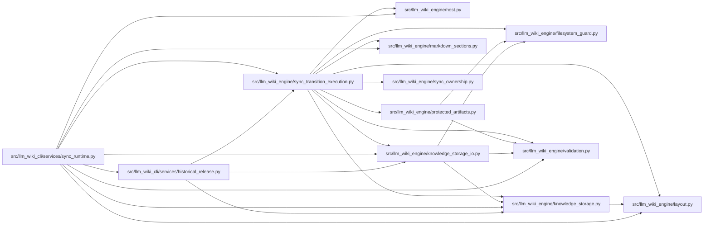

# sync_transition_execution Module

**Path:** `src/llm_wiki_engine/sync_transition_execution.py`

## Description

Guarded execution of source-page moves, with retained failure recovery data.

## Imports

| Source | Symbols |
|--------|---------|
| `.layout` | `DEFAULT_LAYOUT` |
| `__future__` | `annotations` |
| `collections.abc` | `Iterator` |
| `contextlib` | `contextmanager` |
| `hashlib` | `hashlib` |
| `json` | `json` |
| `llm_wiki_engine.filesystem_guard` | `atomic_write_guarded_bytes`, `atomic_write_private_bytes`, `ensure_guarded_directory`, `guarded_tree_manifest`, `remove_guarded_tree`, `unlink_guarded_bytes` |
| `llm_wiki_engine.host` | `emit` |
| `llm_wiki_engine.knowledge_storage` | `MAX_EXPANDED_BYTES`, `KnowledgeStorageError` |
| `llm_wiki_engine.knowledge_storage_io` | `StorageReadSession`, `read_guarded` |
| `llm_wiki_engine.markdown_sections` | `normalize_markdown` |
| `llm_wiki_engine.protected_artifacts` | `ProtectedArtifactStore` |
| `llm_wiki_engine.sync_ownership` | `PageTransitionError` |
| `llm_wiki_engine.validation` | `portable_path_key` |
| `pathlib` | `Path` |
| `stat` | `stat` |
| `typing` | `Any` |
| `uuid` | `uuid` |

## Local dependency map

<!-- Auto-generated local dependency summary. Do not edit by hand. -->

```mermaid
flowchart LR
    n0["src/llm_wiki_cli/services/historical_release.py"]
    n1["src/llm_wiki_cli/services/sync_runtime.py"]
    n2["src/llm_wiki_engine/filesystem_guard.py"]
    n3["src/llm_wiki_engine/host.py"]
    n4["src/llm_wiki_engine/knowledge_storage.py"]
    n5["src/llm_wiki_engine/knowledge_storage_io.py"]
    n6["src/llm_wiki_engine/layout.py"]
    n7["src/llm_wiki_engine/markdown_sections.py"]
    n8["src/llm_wiki_engine/protected_artifacts.py"]
    n9["src/llm_wiki_engine/sync_ownership.py"]
    n10["src/llm_wiki_engine/sync_transition_execution.py"]
    n11["src/llm_wiki_engine/validation.py"]
    n0 --> n4
    n0 --> n5
    n0 --> n10
    n1 --> n0
    n1 --> n3
    n1 --> n4
    n1 --> n5
    n1 --> n6
    n1 --> n7
    n1 --> n10
    n1 --> n11
    n4 --> n6
    n5 --> n2
    n5 --> n4
    n5 --> n11
    n8 --> n2
    n8 --> n11
    n10 --> n2
    n10 --> n3
    n10 --> n4
    n10 --> n5
    n10 --> n6
    n10 --> n7
    n10 --> n8
    n10 --> n9
    n10 --> n11
    click n0 "../modules/historical_release.md"
    click n1 "../modules/sync_runtime.md"
    click n2 "../modules/filesystem_guard.md"
    click n3 "../modules/host.md"
    click n4 "../modules/knowledge_storage.md"
    click n5 "../modules/knowledge_storage_io.md"
    click n6 "../modules/layout.md"
    click n7 "../modules/markdown_sections.md"
    click n8 "../modules/protected_artifacts.md"
    click n9 "../modules/sync_ownership.md"
    click n10 "../modules/sync_transition_execution.md"
    click n11 "../modules/validation.md"
```

### Internal neighbors

| Direction | Module |
|---|---|
| Inbound | [historical_release](../modules/historical_release.md) |
| Inbound | [sync_runtime](../modules/sync_runtime.md) |
| Outbound | [filesystem_guard](../modules/filesystem_guard.md) |
| Outbound | [host](../modules/host.md) |
| Outbound | [knowledge_storage](../modules/knowledge_storage.md) |
| Outbound | [knowledge_storage_io](../modules/knowledge_storage_io.md) |
| Outbound | [layout](../modules/layout.md) |
| Outbound | [markdown_sections](../modules/markdown_sections.md) |
| Outbound | [protected_artifacts](../modules/protected_artifacts.md) |
| Outbound | [sync_ownership](../modules/sync_ownership.md) |
| Outbound | [validation](../modules/validation.md) |

## Classes

| Class | Line | Bases | Description |
|-------|------|-------|-------------|
| [PageTransitionExecution](../entities/PageTransitionExecution.md) | 142 | — | Keep rename originals until the surrounding generation/commit succeeds. |

## Functions

| Function | Signature | Decorators | Description |
|----------|-----------|------------|-------------|
| `preview_maintenance_preimages` | `(live_wiki: Path, staged_wiki: Path, plan, *, max_bytes: int = MAX_EXPANDED_BYTES, guarded_pages: frozenset[str] = frozenset()) -> Iterator[dict[str, bytes]]` | `@contextmanager` | Verify the prior owners' live Markdown before and after simulating their transfer. |
| `_capture_preview_page` | `(live, staged_root, relative, description, max_bytes)` | — | — |
| `_bounded_page_digest` | `(path: Path, size: int)` | — | Hash a regular file at its expected size, holding at most one chunk and its identity. |
| `assert_no_pending_page_moves` | `(wiki_dir: Path) -> None` | — | — |
| `_decode` | `(content: bytes) -> str` | — | — |
