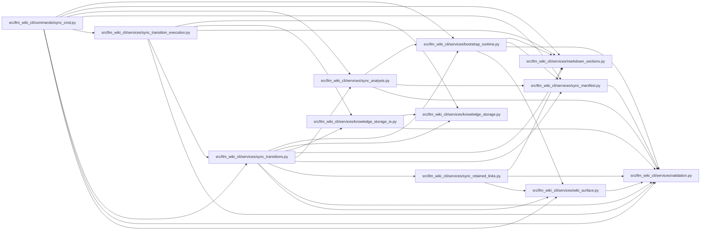

# sync_transitions Module

**Path:** `src/llm_wiki_cli/services/sync_transitions.py`

## Description

Read-only ownership and filesystem preflight for entity/module page writes.

## Imports

| Source | Symbols |
|--------|---------|
| `.bootstrap_runtime` | `_module_name_from_path` |
| `.knowledge_storage` | `MAX_EXPANDED_BYTES`, `KnowledgeStorageError` |
| `.knowledge_storage_io` | `StorageReadSession` |
| `.markdown_sections` | `normalize_markdown` |
| `.sync_analysis` | `SyncOwnershipError`, `_recorded_entity_pages` |
| `.sync_manifest` | `ManifestPageSource`, `SyncManifest` |
| `.sync_retained_links` | `repair_retained_page_links` |
| `.validation` | `portable_path_key` |
| `.wiki_surface` | `PageKind`, `WikiSurfaceError`, `canonical_path` |
| `__future__` | `annotations` |
| `collections` | `Counter` |
| `dataclasses` | `dataclass`, `field` |
| `pathlib` | `Path` |
| `stat` | `stat` |
| `typing` | `Mapping` |

## Local dependency map

<!-- Auto-generated local dependency summary. Do not edit by hand. -->

### Internal neighbors

| Direction | Module |
|---|---|
| Inbound | [sync_cmd](../modules/sync_cmd.md) |
| Inbound | [sync_transition_execution](../modules/sync_transition_execution.md) |
| Outbound | [bootstrap_runtime](../modules/bootstrap_runtime.md) |
| Outbound | [knowledge_storage](../modules/knowledge_storage.md) |
| Outbound | [knowledge_storage_io](../modules/knowledge_storage_io.md) |
| Outbound | [markdown_sections](../modules/markdown_sections.md) |
| Outbound | [sync_analysis](../modules/sync_analysis.md) |
| Outbound | [sync_manifest](../modules/sync_manifest.md) |
| Outbound | [sync_retained_links](../modules/sync_retained_links.md) |
| Outbound | [validation](../modules/validation.md) |
| Outbound | [wiki_surface](../modules/wiki_surface.md) |

## Classes

| Class | Line | Bases | Description |
|-------|------|-------|-------------|
| [PageTransitionError](../entities/PageTransitionError.md) | 22 | `SyncOwnershipError` | The intended page writes cannot preserve verified ownership. |
| [PageTransition](../entities/PageTransition.md) | 27 | — | — |
| [StagedPageMove](../entities/StagedPageMove.md) | 51 | — | — |
| [RetainedPageRepair](../entities/RetainedPageRepair.md) | 58 | — | — |
| [PageTransitionPlan](../entities/PageTransitionPlan.md) | 66 | — | — |
| [_Ownership](../entities/Ownership.md) | 131 | — | — |

## Functions

| Function | Signature | Decorators | Description |
|----------|-----------|------------|-------------|
| `_retained_page_repairs` | `(wiki_dir: Path, transitions: list[PageTransition], prior: _Ownership, existing: Mapping[str, tuple[str, bool]], deleted_source_paths: frozenset[str]) -> tuple[RetainedPageRepair, ...]` | — | — |
| `_page_path` | `(scope: str, page: str) -> str` | — | — |
| `_prior_ownership` | `(manifest: SyncManifest) -> _Ownership` | — | — |
| `_existing_pages` | `(wiki_dir: Path) -> dict[str, tuple[str, bool]]` | — | Inventory names and file kinds without reading content or following links. |
| `_current_pages` | `(inventory: Mapping[str, Mapping], module_pages: Mapping[str, str], entity_pages: Mapping[tuple[str, str, int], str]) -> dict[ManifestPageSource, str]` | — | — |
| `plan_page_transitions` | `(wiki_dir: Path, manifest: SyncManifest, inventory: Mapping[str, Mapping], *, module_page_map: Mapping[str, str], entity_occurrence_page_map: Mapping[tuple[str, str, int], str], refresh_sources: frozenset[str] = frozenset(), moved_entities: Mapping[str, tuple[str, str]] \| None = None, deleted_source_paths: frozenset[str] = frozenset()) -> PageTransitionPlan` | — | Plan every live source-owned page using supplied names, without mutations. |
| `find_missing_source_pages` | `(wiki_dir: Path, manifest: SyncManifest, inventory: Mapping[str, Mapping], *, module_page_map: Mapping[str, str], entity_occurrence_page_map: Mapping[tuple[str, str, int], str], refresh_sources: frozenset[str] = frozenset(), moved_entities: Mapping[str, tuple[str, str]] \| None = None) -> dict[str, ManifestPageSource]` | — | Find missing canonical paths without inventing source changes or ownership. |
