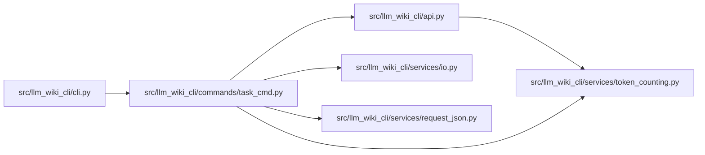

# task_cmd Module

**Path:** `src/llm_wiki_cli/commands/task_cmd.py`

## Description

Adapts explicit task requests and optional profiles to canonical task context. Workspace roots, counter configuration and full-inventory permission are operator options. A response that cannot fit emits no partial context, and read proposals remain data for the host to consider.

## Imports

| Source | Symbols |
|--------|---------|
| `..` | `api` |
| `..services.io` | `write_text_output`, `write_utf8_stdout` |
| `..services.request_json` | `load_request` |
| `..services.token_counting` | `LocalTokenizerCounter` |
| `json` | `json` |
| `sys` | `sys` |

## Local dependency map

<!-- Auto-generated local dependency summary. Do not edit by hand. -->

### Internal neighbors

| Direction | Module |
|---|---|
| Inbound | [cli](../modules/cli.md) |
| Outbound | [api](../modules/api.md) |
| Outbound | [io](../modules/io.md) |
| Outbound | [request_json](../modules/request_json.md) |
| Outbound | [token_counting](../modules/token_counting.md) |

## Functions

| Function | Signature | Decorators | Description |
|----------|-----------|------------|-------------|
| `run` | `(args)` | — | — |