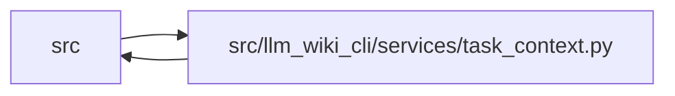

# task_context Module

**Path:** `src/llm_wiki_cli/services/task_context.py`

## Description

Composes explicit task requirements on one captured source/wiki basis. Exact declarations and graph observations retain citations, bounds and uncertainty; omitted evidence remains a requirement gap. The v3 allocator counts the complete canonical response. Saved contexts reconcile through one fresh read without asserting semantic approval or task completion.

## Imports

| Source | Symbols |
|--------|---------|
| `.` | `context_packet`, `context_service` |
| `..config` | `DEFAULT_WIKI_DIR`, `validate_path`, `validate_source_root` |
| `.change_selection` | `select_changes` |
| `.context_budget` | `_accounted_render`, `fit_payload`, `validate_request` |
| `.documentation_query_builder` | `build_documentation_query_service_from_view`, `normalize_supplied_paths` |
| `.io` | `first_unsafe_path_component` |
| `.knowledge_consumption` | `load_knowledge_read_view` |
| `.knowledge_envelope` | `hash_source_snapshot` |
| `.knowledge_loader` | `KnowledgeStateLoadError` |
| `.request_json` | `_pairs`, `_constant` |
| `.search_service` | `SEARCH_KINDS`, `page_records`, `search_records` |
| `.source_snapshot` | `SourceSnapshotError` |
| `.task_context_v2` | `build_scoped_task_read`, `validate_scoped_bindings` |
| `.task_contract` | `FACETS`, `MAX_SELECTORS`, `TASK_RESULT_SCHEMA`, `TASK_REQUEST_SCHEMA_V2`, `TASK_RESULT_SCHEMA_V2`, `TaskContext`, `normalize_task_request` |
| `.task_evidence` | `coverage`, `declaration_records`, `match_declarations`, `observe_requirement`, `query_service` |
| `.token_counting` | `EstimatedCounter`, `TokenCounter` |
| `.wiki_surface_index` | `evaluate_surface_index` |
| `.workflow_profile` | `SCOPES`, `WorkflowPolicy`, `WorkflowProfile`, `WorkflowRequestError`, `canonical_json`, `content_id` |
| `__future__` | `annotations` |
| `collections.abc` | `Callable`, `Mapping` |
| `dataclasses` | `dataclass`, `replace` |
| `json` | `json` |
| `pathlib` | `Path` |
| `types` | `SimpleNamespace` |
| `typing` | `Any` |

## Local dependency map

<!-- Auto-generated local dependency summary. Do not edit by hand. -->

> Module-level dependencies exceed the generated-diagram limits, so the diagram and table below group them by top-level package. Counts report the number of module neighbors in each package.

### Internal neighbors

| Direction | Module |
|---|---|
| Inbound | `src` (3) |
| Outbound | `src` (19) |

> All 21 module neighbor(s) are summarized by package because the module-level view exceeds the 12-node limit.

## Classes

| Class | Line | Bases | Description |
|-------|------|-------|-------------|
| [TaskCancelledError](../entities/TaskCancelledError.md) | 42 | `RuntimeError` | The trusted host cancelled before a task result was published. |
| [TaskRead](../entities/TaskRead.md) | 47 | — | Private ownership retained only by an explicit bounded session. |

## Functions

| Function | Signature | Decorators | Description |
|----------|-----------|------------|-------------|
| `_counter` | `(settings, supplied)` | — | — |
| `_cancel` | `(check)` | — | — |
| `_paths` | `(request)` | — | — |
| `plan_source_read` | `(request, settings, source_root)` | — | — |
| `_followups` | `(requirements, observed, settings)` | — | — |
| `_result_body` | `(request, profile, basis, plan, anchors, work, observations, facts, packet, accounting)` | — | — |
| `_empty_render` | `(request, profile, counter, basis, plan, anchors, work, observations, facts)` | — | — |
| `build_task_read` | `(request: Mapping[str, Any], *, src_dir: str = '.', wiki_dir: str = DEFAULT_WIKI_DIR, profile: WorkflowProfile \| Mapping[str, Any] \| None = None, policy: WorkflowPolicy \| None = None, counter: TokenCounter \| None = None, allow_external_src: bool = False, source_selection: str \| Path \| None = None, helper_cache_dir: str \| None = None, cancelled: Callable[[], bool] \| None = None, _reused_capture: packets.CapturedContextRead \| None = None, _defer_scoped_validation: bool = False, _wiki_byte_budget: int \| None = None) -> TaskRead` | — | — |
| `_read_once` | `(request, profile, counter, source_root, wiki_root, allow_external, source_selection, helper_cache, cancelled, attempt, reused_capture = None)` | `@packets._guarded_capture` | — |
| `build_task_context` | `(request: Mapping[str, Any], **kwargs) -> TaskContext` | — | — |
| `reconcile_task_context` | `(rendered: str, request: Mapping[str, Any], **options) -> dict[str, Any]` | — | — |
| `_result_fields` | `(value, keys, label)` | — | — |
| `_validate_task_claims` | `(payload, normalized, settings)` | — | Check semantic bindings that a self-consistent content hash cannot prove. |
| `validate_task_context` | `(rendered, request, *, profile = None, policy = None, counter = None)` | — | Check the task envelope separately from the unchanged embedded packet. |