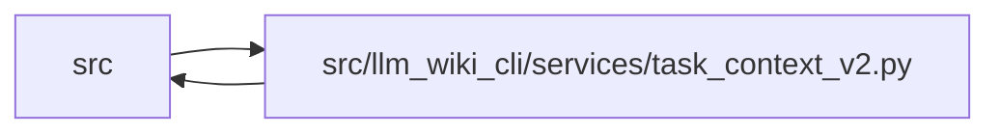

# task_context_v2 Module

**Path:** `src/llm_wiki_cli/services/task_context_v2.py`

## Description

Composes opt-in task v2 using indexed native reads and independently captured source. It reuses the source extractor, graph query, requirement coverage and output-accounting owners while carrying explicit source and storage receipts. A scoped result omits legacy whole-validity packets, preserves unknown and incomplete outcomes, and rechecks the consumed inputs before publication.

## Imports

| Source | Symbols |
|--------|---------|
| `.` | `context_packet`, `context_service` |
| `..config` | `DEFAULT_WIKI_DIR`, `validate_path`, `validate_source_root` |
| `.change_selection` | `select_changes` |
| `.context_budget` | `_accounted_render` |
| `.dependencies` | `analyze_dependencies` |
| `.documentation_query_builder` | `assemble_documentation_query_service` |
| `.extraction_service` | `InventoryResult` |
| `.knowledge_envelope` | `ConsumedInput`, `hash_source_snapshot` |
| `.knowledge_storage` | `KnowledgeStorageError`, `_concept_aliases`, `digest` |
| `.knowledge_storage_access` | `ScopedKnowledgeRead`, `capture_knowledge_slice` |
| `.knowledge_storage_io` | `ReadObservation`, `StorageReadSession` |
| `.markdown_sections` | `parse_markdown_document` |
| `.section_ownership` | `observe_page_sections` |
| `.source_selection` | `validate_persisted_source_selection_identity` |
| `.source_snapshot` | `SourceSnapshot`, `build_source_snapshot` |
| `.task_context` | `TaskRead`, `_LIVE_FACETS`, `_NATIVE_FACETS`, `_cancel`, `_counter`, `_result_body`, `plan_source_read`, `_result_fields` |
| `.task_contract` | `TASK_RESULT_SCHEMA_V2`, `TaskContext`, `normalize_task_request` |
| `.task_evidence` | `declaration_records`, `observe_requirement` |
| `.validation` | `is_portable_relative_path` |
| `.workflow_profile` | `WorkflowRequestError`, `canonical_json`, `content_id` |
| `__future__` | `annotations` |
| `collections.abc` | `Mapping` |
| `dataclasses` | `dataclass` |
| `pathlib` | `Path` |
| `re` | `re` |
| `types` | `SimpleNamespace` |
| `typing` | `Any` |

## Local dependency map

<!-- Auto-generated local dependency summary. Do not edit by hand. -->

> Module-level dependencies exceed the generated-diagram limits, so the diagram and table below group them by top-level package. Counts report the number of module neighbors in each package.

### Internal neighbors

| Direction | Module |
|---|---|
| Inbound | `src` (1) |
| Outbound | `src` (21) |

> All 21 module neighbor(s) are summarized by package because the module-level view exceeds the 12-node limit.

## Classes

| Class | Line | Bases | Description |
|-------|------|-------|-------------|
| [ScopedTaskState](../entities/ScopedTaskState.md) | 195 | — | — |

## Functions

| Function | Signature | Decorators | Description |
|----------|-----------|------------|-------------|
| `_source_receipt` | `(snapshot: SourceSnapshot \| None) -> dict[str, Any] \| None` | — | — |
| `_source_capture` | `(root, paths, scope, settings, source_selection, helper_cache_dir)` | — | — |
| `_native_key` | `(selector: str) -> str` | — | — |
| `_native_selectors` | `(request) -> list[str]` | — | — |
| `_storage_receipt` | `(native: ScopedKnowledgeRead \| None, *, status: str, reason: str \| None) -> dict[str, Any]` | — | — |
| `_native_observation` | `(native, requirement, snapshot, paths, scope, limit)` | — | — |
| `build_scoped_task_read` | `(request, *, src_dir = '.', wiki_dir = DEFAULT_WIKI_DIR, profile = None, policy = None, counter = None, allow_external_src = False, source_selection = None, helper_cache_dir = None, cancelled = None, _defer_validation = False, _wiki_byte_budget = None)` | `@packets._guarded_capture` | — |
| `validate_scoped_bindings` | `(payload, normalized, profile)` | — | Validate portable scope and consumed-input bindings, without claiming authenticity. |