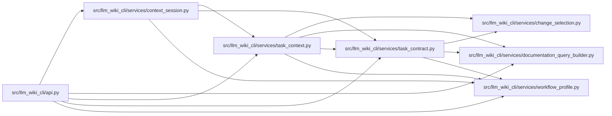

# task_contract Module

**Path:** `src/llm_wiki_cli/services/task_contract.py`

## Description

Defines versioned task requests and detached canonical results. Normalization validates bounded text, exact coordinates, requirements and profile settings before workspace access. Provider task and request identities derive from normalized content; a host task label supplies attribution without granting authority.

## Imports

| Source | Symbols |
|--------|---------|
| `.change_selection` | `validate_changes` |
| `.documentation_query_builder` | `normalize_concept_coordinate`, `normalize_supplied_paths` |
| `.workflow_profile` | `WorkflowPolicy`, `WorkflowProfile`, `WorkflowRequestError`, `bounded_text`, `canonical_json`, `content_id`, `exact_fields`, `normalize_profile` |
| `__future__` | `annotations` |
| `collections.abc` | `Mapping` |
| `dataclasses` | `dataclass` |
| `json` | `json` |
| `types` | `MappingProxyType` |
| `typing` | `Any` |

## Local dependency map

<!-- Auto-generated local dependency summary. Do not edit by hand. -->

### Internal neighbors

| Direction | Module |
|---|---|
| Inbound | [api](../modules/api.md) |
| Inbound | [context_session](../modules/context_session.md) |
| Inbound | [task_context](../modules/task_context.md) |
| Outbound | [change_selection](../modules/change_selection.md) |
| Outbound | [documentation_query_builder](../modules/documentation_query_builder.md) |
| Outbound | [workflow_profile](../modules/workflow_profile.md) |

## Classes

| Class | Line | Bases | Description |
|-------|------|-------|-------------|
| [TaskContext](../entities/TaskContext.md) | 106 | — | Detached canonical task output; unsuccessful budgets contain no context. |

## Functions

| Function | Signature | Decorators | Description |
|----------|-----------|------------|-------------|
| `coordinate` | `(kind: str, value: object) -> str` | — | — |
| `_array` | `(value: object, field: str) -> list` | — | — |
| `normalize_task_request` | `(request: Mapping[str, Any], *, profile: WorkflowProfile \| Mapping[str, Any] \| None = None, policy: WorkflowPolicy \| None = None) -> tuple[dict[str, Any], WorkflowProfile]` | — | — |