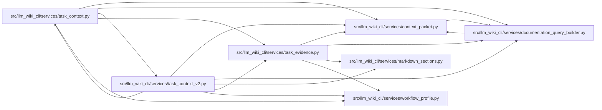

# task_evidence Module

**Path:** `src/llm_wiki_cli/services/task_evidence.py`

## Description

Selects source contracts and qualified query observations from an existing capture. Exact owner and occurrence coordinates preserve ambiguity, declaration kinds and signature grouping. Canonical fact identities deduplicate equivalent declarations, and requirement coverage refers only to evidence actually emitted.

## Imports

| Source | Symbols |
|--------|---------|
| `.` | `context_packet` |
| `.documentation_query_builder` | `build_documentation_query_service_from_view` |
| `.markdown_sections` | `parse_markdown_document` |
| `.workflow_profile` | `content_id` |
| `__future__` | `annotations` |
| `collections` | `Counter` |
| `typing` | `Any` |

## Local dependency map

<!-- Auto-generated local dependency summary. Do not edit by hand. -->

### Internal neighbors

| Direction | Module |
|---|---|
| Inbound | [task_context](../modules/task_context.md) |
| Inbound | [task_context_v2](../modules/task_context_v2.md) |
| Outbound | [context_packet](../modules/context_packet.md) |
| Outbound | [documentation_query_builder](../modules/documentation_query_builder.md) |
| Outbound | [markdown_sections](../modules/markdown_sections.md) |
| Outbound | [workflow_profile](../modules/workflow_profile.md) |

## Functions

| Function | Signature | Decorators | Description |
|----------|-----------|------------|-------------|
| `declaration_records` | `(inventory)` | — | Index extractor-owned contracts without re-parsing source code. |
| `match_declarations` | `(records, selector)` | — | — |
| `query_service` | `(captured, limit)` | — | — |
| `observe_requirement` | `(captured, service, records, requirement, *, scope, limit)` | — | — |
| `coverage` | `(requirements, observations, facts)` | — | — |