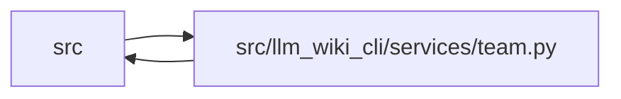

# team Module

**Path:** `src/llm_wiki_cli/services/team.py`

## Description

Shared team policy and conservative wiki conflict resolution.

## Imports

| Source | Symbols |
|--------|---------|
| `..config` | `DEFAULT_WIKI_DIR` |
| `.bootstrap_runtime` | `build_entity_occurrence_page_map`, `build_module_page_map`, `_generate_index_md`, `build_entity_occurrence_page_map`, `build_module_page_map`, `build_entity_occurrence_page_map`, `build_entity_page_map`, `build_module_page_map`, `_generate_module_md`, `build_entity_occurrence_page_map`, `build_module_page_map`, `_build_relationships`, `_generate_entity_md`, `build_entity_occurrence_page_map`, `build_module_page_map`, `_generate_docker_md`, `build_module_page_map` |
| `.extraction_service` | `get_docker_inventory`, `get_docker_inventory`, `get_inventory_result` |
| `.io` | `read_md`, `write_json_atomic`, `write_md` |
| `.plugins` | `PluginError`, `iter_components` |
| `.source_selection` | `with_source_selection_generation_input`, `SourceSelectionError`, `resolve_source_selection`, `validate_persisted_source_selection_identity` |
| `.source_snapshot` | `SourceSnapshot`, `build_source_snapshot`, `capture_source_selection_inputs` |
| `.sync_manifest` | `SyncManifest`, `MANIFEST_STATE_UNAVAILABLE`, `SyncManifest`, `prune_manifest_for_source_selection`, `retained_concept_page_paths`, `MANIFEST_VERSION`, `SyncManifest`, `SyncManifestError`, `SyncManifest` |
| `.validation` | `require_exact_fields`, `require_string_list` |
| `__future__` | `annotations` |
| `copy` | `deepcopy` |
| `dataclasses` | `dataclass` |
| `functools` | `lru_cache` |
| `json` | `json` |
| `pathlib` | `Path` |
| `re` | `re` |
| `typing` | `TYPE_CHECKING`, `Any` |

## Local dependency map

<!-- Auto-generated local dependency summary. Do not edit by hand. -->

> Module-level dependencies exceed the generated-diagram limits, so the diagram and table below group them by top-level package. Counts report the number of module neighbors in each package.

### Internal neighbors

| Direction | Module |
|---|---|
| Inbound | `src` (4) |
| Outbound | `src` (9) |

> All 13 module neighbor(s) are summarized by package because the module-level view exceeds the 12-node limit.

## Classes

| Class | Line | Bases | Description |
|-------|------|-------|-------------|
| [TeamConfigError](../entities/TeamConfigError.md) | 65 | `ValueError` | Raised when `.llm-wiki/team.json` is invalid. |
| [TeamConventionRequest](../entities/TeamConventionRequest.md) | 70 | — | Inputs needed to check wiki files against team conventions. |

## Functions

| Function | Signature | Decorators | Description |
|----------|-----------|------------|-------------|
| `default_team_config` | `(wiki_dir: str = DEFAULT_WIKI_DIR) -> dict[str, Any]` | — | — |
| `team_config_path` | `(root: str \| Path = '.') -> Path` | — | — |
| `write_default_team_config` | `(wiki_dir: str = DEFAULT_WIKI_DIR, *, root: str \| Path = '.') -> Path` | — | — |
| `_reject_unknown_keys` | `(data: dict[str, Any], allowed: set[str], scope: str) -> None` | — | — |
| `_ensure_string_list` | `(value: Any, field: str) -> list[str]` | — | — |
| `validate_team_config` | `(data: Any) -> dict[str, Any]` | — | — |
| `load_team_config` | `(*, required: bool = False, root: str \| Path = '.') -> dict[str, Any] \| None` | — | — |
| `team_prompt_template_default` | `(root: str \| Path = '.') -> str \| None` | — | — |
| `_issue` | `(category: str, message: str, *, path: str \| None = None, target: str \| None = None) -> dict[str, str \| None]` | — | — |
| `_section_pattern` | `(section: str) -> re.Pattern[str]` | `@lru_cache(maxsize=None)` | — |
| `_has_section` | `(content: str, section: str) -> bool` | — | — |
| `_plugin_refs_by_type` | `(root: str \| Path = '.') -> dict[str, set[str]]` | — | — |
| `check_plugin_requirements` | `(config: dict[str, Any], *, root: str \| Path = '.') -> list[dict[str, str \| None]]` | — | — |
| `check_team_conventions` | `(request: TeamConventionRequest) -> list[dict[str, str \| None]]` | — | — |
| `build_team_issues` | `(wiki_dir: str \| Path, src_dir: str, inventory: dict, pages: list[Path], *, require_config: bool = False, root: str \| Path = '.', docker_inventory: dict \| None = None) -> list[dict[str, str \| None]]` | — | — |
| `has_conflict_markers` | `(text: str) -> bool` | — | — |
| `_existing_page_entries` | `(directory: Path, extra_key: str) -> list[dict[str, str]]` | — | — |
| `_index_content` | `(wiki_dir: Path, inventory: dict) -> str` | — | — |
| `_manifest_content` | `(inventory: dict, src_dir: str, *, wiki_dir: Path \| None = None, surfaces: dict[str, dict] \| None = None, generation_inputs: dict[str, object] \| None = None, previous_manifest: SyncManifest \| None = None, source_snapshot: SourceSnapshot \| None = None) -> str` | — | — |
| `_conflict_variants` | `(text: str) -> tuple[str, str]` | — | — |
| `_manifest_resolution_state_from_conflict` | `(text: str) -> tuple[dict[str, dict] \| None, dict[str, object] \| None, SyncManifest \| None, str]` | — | — |
| `_manifest_state_from_conflict` | `(text: str) -> tuple[dict[str, dict] \| None, dict[str, object] \| None, str]` | — | Return the compatibility three-field manifest-conflict view. |
| `_module_content` | `(page_stem: str, inventory: dict) -> tuple[str \| None, str]` | — | — |
| `_entity_content` | `(page_stem: str, inventory: dict) -> tuple[str \| None, str]` | — | — |
| `_infrastructure_content` | `(page_stem: str, inventory: dict, src_dir: str, *, source_snapshot: SourceSnapshot \| None = None) -> tuple[str \| None, str]` | — | — |
| `_merge_conflicted_log` | `(text: str) -> str` | — | — |
| `_resolution_for_path` | `(rel_path: str, path: Path, wiki_dir: Path, inventory: dict, src_dir: str, *, source_snapshot: SourceSnapshot \| None = None) -> tuple[str \| None, str]` | — | — |
| `resolve_conflicts` | `(wiki_dir: str \| Path, src_dir: str, *, write: bool = False, source_selection: str \| Path \| None = None) -> dict[str, Any]` | — | — |
