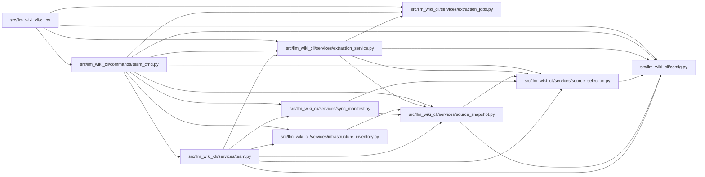

# team_cmd Module

**Path:** `src/llm_wiki_cli/commands/team_cmd.py`

## Description

_Auto-generated from `src/llm_wiki_cli/commands/team_cmd.py`._

## Imports

| Source | Symbols |
|--------|---------|
| `..config` | `DEFAULT_WIKI_DIR`, `validate_path`, `validate_source_root` |
| `..services` | `team` |
| `..services.extraction_jobs` | `extraction_job_request_from_args` |
| `..services.extraction_service` | `get_docker_inventory`, `get_inventory_result` |
| `..services.infrastructure_inventory` | `get_yaml_infrastructure_inventory` |
| `..services.source_selection` | `resolve_source_selection`, `validate_persisted_source_selection_identity` |
| `..services.source_snapshot` | `SourceSnapshot`, `build_source_snapshot`, `capture_source_selection_inputs` |
| `..services.sync_manifest` | `SyncManifest`, `SyncManifestError` |
| `__future__` | `annotations` |
| `json` | `json` |
| `pathlib` | `Path` |
| `sys` | `sys` |

## Local dependency map

<!-- Auto-generated local dependency summary. Do not edit by hand. -->

### Internal neighbors

| Direction | Module |
|---|---|
| Inbound | [cli](../modules/cli.md) |
| Outbound | [config](../modules/config.md) |
| Outbound | [extraction_jobs](../modules/extraction_jobs.md) |
| Outbound | [extraction_service](../modules/extraction_service.md) |
| Outbound | [infrastructure_inventory](../modules/infrastructure_inventory.md) |
| Outbound | [source_selection](../modules/source_selection.md) |
| Outbound | [source_snapshot](../modules/source_snapshot.md) |
| Outbound | [sync_manifest](../modules/sync_manifest.md) |
| Outbound | [team](../modules/team.md) |

## Functions

| Function | Signature | Decorators | Description |
|----------|-----------|------------|-------------|
| `_render_issues_text` | `(title: str, issues: list[dict]) -> str` | — | — |
| `_render_conflicts_text` | `(result: dict) -> str` | — | — |
| `_print_payload` | `(payload: dict, output_format: str, *, conflict: bool = False) -> None` | — | — |
| `_run_init` | `(args) -> None` | — | — |
| `_preflight_team_source_selection` | `(src_dir: str, wiki_dir: str \| Path, source_selection: str \| Path \| None, *, include_tests = None) -> tuple[SourceSnapshot, SyncManifest \| None]` | — | — |
| `_run_check` | `(args) -> None` | — | — |
| `_finish_check` | `(wiki_dir: str, src_dir: str, output_format: str, issues: list) -> None` | — | — |
| `_run_resolve_conflicts` | `(args) -> None` | — | — |
| `run` | `(args) -> None` | — | — |
