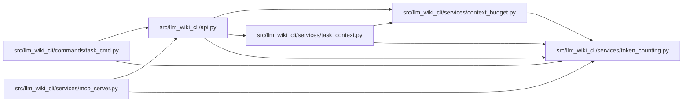

# token_counting Module

**Path:** `src/llm_wiki_cli/services/token_counting.py`

## Description

Provides the host counter contract, a labelled UTF-8 size estimate, and an exact
counter loaded from explicit local tokenizer JSON. Exact counting disables saved
padding and truncation, excludes special-token chat framing, and identifies the
tokenizer bytes by their hash. Loading stays local and does not discover or run
repository-provided counter code.

## Imports

| Source | Symbols |
|--------|---------|
| `__future__` | `annotations` |
| `hashlib` | `hashlib` |
| `pathlib` | `Path` |
| `typing` | `Protocol` |

## Local dependency map

<!-- Auto-generated local dependency summary. Do not edit by hand. -->

### Internal neighbors

| Direction | Module |
|---|---|
| Inbound | [api](../modules/api.md) |
| Inbound | [task_cmd](../modules/task_cmd.md) |
| Inbound | [context_budget](../modules/context_budget.md) |
| Inbound | [mcp_server](../modules/mcp_server.md) |
| Inbound | [task_context](../modules/task_context.md) |

## Classes

| Class | Line | Bases | Description |
|-------|------|-------|-------------|
| [TokenCounter](../entities/TokenCounter.md) | 10 | `Protocol` | — |
| [EstimatedCounter](../entities/EstimatedCounter.md) | 17 | — | — |
| [LocalTokenizerCounter](../entities/LocalTokenizerCounter.md) | 25 | — | Count raw text using immutable local tokenizer JSON, without framing. |