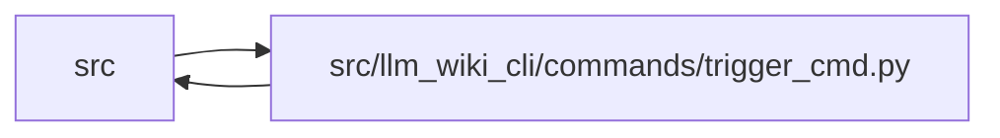

# trigger_cmd Module

**Path:** `src/llm_wiki_cli/commands/trigger_cmd.py`

## Description

_Auto-generated from `src/llm_wiki_cli/commands/trigger_cmd.py`._

## Imports

| Source | Symbols |
|--------|---------|
| `..config` | `DEFAULT_WIKI_DIR`, `IDE_AGENTS`, `validate_path`, `validate_source_root` |
| `..services` | `circuit_breaker` |
| `..services.extraction_service` | `filter_source_diff`, `get_call_graph`, `get_inventory_result`, `print_inventory_failures` |
| `..services.lockfile` | `LockAcquisitionError`, `WikiLock` |
| `..services.metrics` | `record_event` |
| `..services.plugins` | `PluginError` |
| `..services.secure_file` | `write_private_text` |
| `..services.source_selection` | `resolve_source_selection`, `validate_persisted_source_selection_identity` |
| `..services.source_snapshot` | `SourceSnapshot`, `build_source_snapshot`, `capture_source_selection_inputs` |
| `..services.sync_manifest` | `SyncManifest` |
| `..services.team` | `TeamConfigError`, `team_prompt_template_default` |
| `.generate_prompt_cmd` | `_build_prompt`, `_redact_prompt_artifact` |
| `__future__` | `annotations` |
| `json` | `json` |
| `math` | `math` |
| `os` | `os` |
| `pathlib` | `Path` |
| `subprocess` | `subprocess` |
| `sys` | `sys` |
| `time` | `time` |

## Local dependency map

<!-- Auto-generated local dependency summary. Do not edit by hand. -->

> Module-level dependencies exceed the generated-diagram limits, so the diagram and table below group them by top-level package. Counts report the number of module neighbors in each package.

### Internal neighbors

| Direction | Module |
|---|---|
| Inbound | `src` (1) |
| Outbound | `src` (12) |

> All 13 module neighbor(s) are summarized by package because the module-level view exceeds the 12-node limit.

## Functions

| Function | Signature | Decorators | Description |
|----------|-----------|------------|-------------|
| `run` | `(args)` | — | — |
| `_run_sync` | `(args)` | — | Core sync logic, executed inside the concurrency lock. |
| `_preflight_trigger_source_selection` | `(args, src_dir: str, wiki_dir: str) -> SourceSnapshot` | — | — |
| `_trigger_source_snapshot` | `(args, src_dir: str, diff_text: str \| None) -> SourceSnapshot \| None` | — | — |
| `_record_trigger_start` | `(args, wiki_dir) -> None` | — | — |
| `_record_trigger_finish` | `(args, wiki_dir, started: float, *, exit_code: int \| None, breaker_result: str) -> None` | — | — |
| `_record_trigger_failure` | `(args, wiki_dir, started: float, *, exit_code: int) -> None` | — | — |
| `_is_breaker_open` | `() -> bool` | — | — |
| `_validated_trigger_source` | `(args) -> str` | — | — |
| `_fetch_last_commit_diff` | `(args, wiki_dir, src_dir: str, started: float) -> str \| None` | — | — |
| `_filter_trigger_diff` | `(args, wiki_dir: str, src_dir: str, started: float, diff_text: str \| None, *, source_snapshot: SourceSnapshot \| None = None) -> str \| None` | — | — |
| `_skip_large_diff` | `(args, wiki_dir, started: float, diff_text: str) -> bool` | — | — |
| `_build_sync_prompt` | `(args, wiki_dir, src_dir: str, started: float, diff_text: str, *, source_snapshot: SourceSnapshot \| None = None) -> str \| None` | — | — |
| `_skip_large_prompt` | `(args, wiki_dir, started: float, prompt: str) -> bool` | — | — |
| `_write_prompt_file` | `(prompt: str) -> Path` | — | — |
| `_run_agent` | `(args, wiki_dir, started: float, prompt_file: Path) -> None` | — | — |
| `_agent_command` | `(agent: str, prompt_file: Path) -> list[str] \| None` | — | — |
| `_execute_agent_command` | `(args, cmd: list[str], prompt_file: Path, timeout: int)` | — | — |
| `_max_prompt_bytes` | `(args) -> int` | — | — |
| `_lock_wait_seconds` | `() -> float` | — | — |
