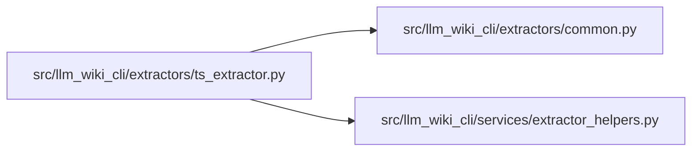

# ts_extractor Module

**Path:** `src/llm_wiki_cli/extractors/ts_extractor.py`

## Description

TypeScript AST extractor for agent-wiki-cli.

Implements :class:`~llm_wiki_cli.extractors.ExtractorProtocol` by delegating
to a bundled Node.js script (``ts_scripts/extract.js``) that uses ``ts-morph``
for TypeScript AST traversal.

Requirements
------------
* Node.js (``node``) on PATH.
* TypeScript dependencies prepared with ``llm-wiki prepare-extractors``.

## Imports

| Source | Symbols |
|--------|---------|
| `..services.extractor_helpers` | `ENV_EXTRACTOR_TIMEOUT`, `extractor_timeout_seconds`, `get_prepared_typescript_root` |
| `.common` | `TYPESCRIPT_FAMILY_EXTENSIONS`, `chunk_source_files_for_cli`, `discover_source_files`, `filter_bundled_inventory`, `inventory_language_for_path` |
| `__future__` | `annotations` |
| `json` | `json` |
| `pathlib` | `Path` |
| `shutil` | `shutil` |
| `subprocess` | `subprocess` |
| `sys` | `sys` |

## Local dependency map

<!-- Auto-generated local dependency summary. Do not edit by hand. -->

### Internal neighbors

| Direction | Module |
|---|---|
| Outbound | [common](../modules/common.md) |
| Outbound | [extractor_helpers](../modules/extractor_helpers.md) |

## Classes

| Class | Line | Bases | Description |
|-------|------|-------|-------------|
| [TypeScriptExtractor](../entities/TypeScriptExtractor.md) | 37 | — | Extractor for TypeScript source files using a Node.js/ts-morph subprocess. |
