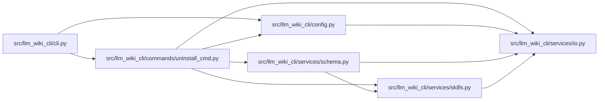

# uninstall_cmd Module

**Path:** `src/llm_wiki_cli/commands/uninstall_cmd.py`

## Description

_Auto-generated from `src/llm_wiki_cli/commands/uninstall_cmd.py`._

## Imports

| Source | Symbols |
|--------|---------|
| `..config` | `DEFAULT_WIKI_DIR`, `validate_path` |
| `..services.io` | `read_md`, `write_md` |
| `..services.schema` | `ALL_SCHEMA_FILES`, `CONSTRAINT_END`, `CONSTRAINT_START`, `strip_wiki_block` |
| `..services.skills` | `KNOWN_INSTALL_TARGETS`, `REFERENCE_SKILL_ID`, `reference_skill_state` |
| `pathlib` | `Path` |
| `shutil` | `shutil` |

## Local dependency map

<!-- Auto-generated local dependency summary. Do not edit by hand. -->

### Internal neighbors

| Direction | Module |
|---|---|
| Inbound | [cli](../modules/cli.md) |
| Outbound | [config](../modules/config.md) |
| Outbound | [io](../modules/io.md) |
| Outbound | [services_schema](../modules/services_schema.md) |
| Outbound | [skills](../modules/skills.md) |

## Functions

| Function | Signature | Decorators | Description |
|----------|-----------|------------|-------------|
| `_confirm` | `(prompt: str) -> bool` | — | Ask for y/n confirmation. |
| `_remove_hooks` | `(dry_run: bool = False) -> int` | — | Remove llm-wiki hooks, but only if they contain our signature. |
| `_clean_agent_schemas` | `(dry_run: bool = False) -> int` | — | Remove the LLM Wiki constraint block from agent schema files. |
| `_remove_wiki_dir` | `(wiki_dir: Path, dry_run: bool = False) -> bool` | — | Remove the wiki directory tree. |
| `_remove_reference_skill` | `(dry_run: bool = False) -> int` | — | Remove installed wiki-reference skill copies, but only unmodified ones. |
| `_remove_runtime_artifacts` | `(dry_run: bool = False) -> int` | — | Remove local runtime artifacts created by llm-wiki. |
| `run` | `(args)` | — | — |
