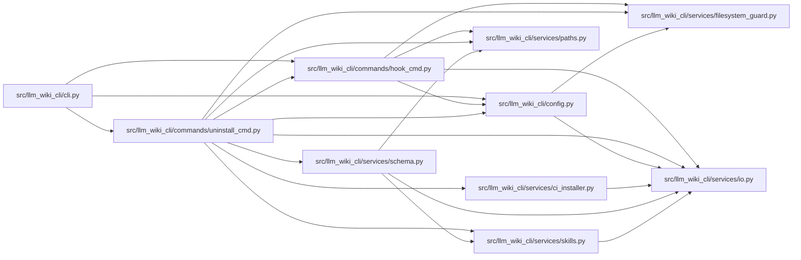

# uninstall_cmd Module

**Path:** `src/llm_wiki_cli/commands/uninstall_cmd.py`

## Description

_Auto-generated from `src/llm_wiki_cli/commands/uninstall_cmd.py`._

## Imports

| Source | Symbols |
|--------|---------|
| `..config` | `DEFAULT_WIKI_DIR`, `get_agent_config_path`, `validate_path` |
| `..services.ci_installer` | `MANAGED_WORKFLOW_PATH`, `is_unmodified_managed_workflow` |
| `..services.filesystem_guard` | `GuardedTreeManifest`, `atomic_write_guarded_bytes`, `guarded_tree_manifest`, `remove_guarded_tree`, `unlink_guarded_bytes`, `windows_object_identity` |
| `..services.io` | `first_unsafe_path_component` |
| `..services.paths` | `display_project_path` |
| `..services.schema` | `ALL_SCHEMA_FILES`, `CONSTRAINT_END`, `CONSTRAINT_START`, `ManagedSchemaBlockError`, `ManagedSchemaBlockState`, `ManagedSchemaPathError`, `classify_managed_schema_block`, `decode_managed_document_bytes`, `encode_managed_document_text`, `require_safe_schema_path`, `strip_wiki_block` |
| `..services.skills` | `BUNDLED_SKILLS_ROOT`, `KNOWN_INSTALL_TARGETS`, `REFERENCE_SKILL_ID`, `ReferenceSkillReason`, `ReferenceSkillState`, `verify_reference_skill` |
| `.hook_cmd` | `is_managed_hook_content` |
| `dataclasses` | `dataclass` |
| `hashlib` | `hashlib` |
| `pathlib` | `Path` |
| `stat` | `stat` |
| `sys` | `sys` |
| `unicodedata` | `unicodedata` |

## Local dependency map

<!-- Auto-generated local dependency summary. Do not edit by hand. -->

### Internal neighbors

| Direction | Module |
|---|---|
| Inbound | [cli](../modules/cli.md) |
| Outbound | [hook_cmd](../modules/hook_cmd.md) |
| Outbound | [config](../modules/config.md) |
| Outbound | [ci_installer](../modules/ci_installer.md) |
| Outbound | [filesystem_guard](../modules/filesystem_guard.md) |
| Outbound | [io](../modules/io.md) |
| Outbound | [paths](../modules/paths.md) |
| Outbound | [services_schema](../modules/services_schema.md) |
| Outbound | [skills](../modules/skills.md) |

## Classes

| Class | Line | Bases | Description |
|-------|------|-------|-------------|
| [UnsafeUninstallPathError](../entities/UnsafeUninstallPathError.md) | 58 | `ValueError` | Raised when an uninstall-owned path could escape the project tree. |
| [_HookInspection](../entities/HookInspection.md) | 63 | — | Immutable hook ownership evidence collected before mutation. |
| [_SchemaCleanup](../entities/SchemaCleanup.md) | 74 | — | One verified managed-schema cleanup prepared before mutation. |
| [_RuntimeArtifactInspection](../entities/RuntimeArtifactInspection.md) | 84 | — | One runtime path classified without following unsafe entries. |
| [_WikiRemovalInspection](../entities/WikiRemovalInspection.md) | 95 | — | Safe root-level evidence for an optional wiki-tree removal. |
| [_ReferenceSkillInspection](../entities/ReferenceSkillInspection.md) | 108 | — | One managed-reference tree classified for the uninstall preview. |
| [_CiWorkflowInspection](../entities/CiWorkflowInspection.md) | 121 | — | Managed CI ownership evidence collected before confirmation. |

## Functions

| Function | Signature | Decorators | Description |
|----------|-----------|------------|-------------|
| `_normalized_path_key` | `(path: Path) -> tuple[str, ...]` | — | Return a case-stable absolute key without following path aliases. |
| `_same_path_identity` | `(first: Path, second: Path) -> bool` | — | Return whether two spellings identify the same local path. |
| `_path_contains` | `(ancestor: Path, descendant: Path) -> bool` | — | Return whether ``descendant`` is lexically inside ``ancestor``. |
| `_confirm` | `(prompt: str) -> bool` | — | Ask for y/n confirmation. |
| `_require_safe_hook_path` | `(path: Path) -> Path` | — | Reject a hook path containing a symlink, reparse, or traversal. |
| `_preflight_hooks` | `() -> tuple[_HookInspection, ...]` | — | Inspect every known hook without following an unsafe path. |
| `_validate_hook_plan` | `(plan: tuple[_HookInspection, ...]) -> None` | — | Ensure hook ownership evidence is still current before unlinking. |
| `_remove_hooks` | `(dry_run: bool = False, *, plan: tuple[_HookInspection, ...] \| None = None) -> int` | — | Remove llm-wiki hooks, but only from one safe ownership snapshot. |
| `_preflight_agent_schemas` | `() -> tuple[_SchemaCleanup, ...]` | — | Validate every possible managed schema and stage safe removals. |
| `_validate_schema_plan` | `(plan: tuple[_SchemaCleanup, ...]) -> None` | — | Ensure schema cleanup evidence is still current before writing. |
| `_clean_agent_schemas` | `(dry_run: bool = False, *, plan: tuple[_SchemaCleanup, ...] \| None = None) -> int` | — | Remove the LLM Wiki constraint block from agent schema files. |
| `_wiki_tree_manifest` | `(wiki_dir: Path) -> GuardedTreeManifest` | — | Capture every removable tree entry without following nested links. |
| `_preflight_wiki_removal` | `(wiki_dir: Path, *, requested: bool) -> _WikiRemovalInspection` | — | Classify the optional wiki root without opening redirected targets. |
| `_remove_wiki_dir` | `(wiki_dir: Path, dry_run: bool = False, *, plan: _WikiRemovalInspection \| None = None) -> bool` | — | Remove the wiki directory tree. |
| `_preflight_reference_skills` | `() -> tuple[_ReferenceSkillInspection, ...]` | — | Capture exact managed-reference states for the uninstall preview. |
| `_validate_reference_plan` | `(plan: tuple[_ReferenceSkillInspection, ...]) -> None` | — | Reject any managed-reference state change after confirmation. |
| `_remove_reference_skill` | `(dry_run: bool = False, *, plan: tuple[_ReferenceSkillInspection, ...] \| None = None) -> int` | — | Remove installed wiki-reference skill copies, but only exact-current ones. |
| `_runtime_artifact_paths` | `(wiki_dir: Path) -> tuple[Path, ...]` | — | Return unique runtime paths, including the resolved local config path. |
| `_preflight_runtime_artifacts` | `(wiki_dir: Path, *, wiki_removal: bool = False, preserved_reference_roots: tuple[Path, ...] = ()) -> tuple[_RuntimeArtifactInspection, ...]` | — | Classify present runtime paths before any uninstall mutation. |
| `_validate_runtime_plan` | `(plan: tuple[_RuntimeArtifactInspection, ...], wiki_dir: Path, *, wiki_removal: bool = False, preserved_reference_roots: tuple[Path, ...] = ()) -> None` | — | Reject runtime path changes after the uninstall preview. |
| `_remove_runtime_artifacts` | `(wiki_dir: Path, dry_run: bool = False, *, plan: tuple[_RuntimeArtifactInspection, ...] \| None = None, wiki_removal: bool = False, preserved_reference_roots: tuple[Path, ...] = ()) -> int` | — | Remove local runtime artifacts created by llm-wiki. |
| `_preflight_ci_workflow` | `() -> _CiWorkflowInspection` | — | Capture dedicated CI workflow ownership for the uninstall preview. |
| `_remove_ci_workflow` | `(dry_run: bool = False, *, plan: _CiWorkflowInspection \| None = None) -> int` | — | Remove the dedicated CI workflow only from its previewed checksum. |
| `run` | `(args)` | — | — |
