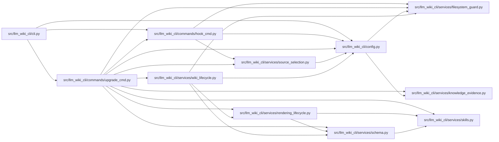

# upgrade_cmd Module

**Path:** `src/llm_wiki_cli/commands/upgrade_cmd.py`

## Description

llm-wiki upgrade — refresh all framework-managed artifacts in place.

Replaces the uninstall → init → install-hook cycle with a single idempotent
command that:
1. Replaces the agent constraint block with the latest version
2. Ensures wiki directory structure is complete
3. Reinstalls git hooks
4. Optionally switches agents

## Imports

| Source | Symbols |
|--------|---------|
| `..config` | `AGENT_CHOICES`, `AgentConfigInspection`, `AgentConfigState`, `CLI_AGENTS`, `DEFAULT_WIKI_DIR`, `PathValidationError`, `config_requires_manual_recovery`, `get_agent_config_path`, `inspect_config`, `require_committed_config`, `require_config_inspection_unchanged`, `require_safe_config_path`, `validate_path`, `write_config` |
| `..services.filesystem_guard` | `atomic_write_guarded_bytes`, `ensure_guarded_directory`, `guarded_tree_manifest`, `remove_guarded_tree`, `unlink_guarded_bytes`, `windows_object_identity` |
| `..services.knowledge_evidence` | `formatted_json_bytes` |
| `..services.rendering_lifecycle` | `reference_recovery_command`, `select_render_profile` |
| `..services.schema` | `SCHEMA_FILENAMES`, `ManagedSchemaBlockError`, `ManagedSchemaBlockState`, `ManagedSchemaPathError`, `SchemaRenderProfile`, `build_schema_content`, `build_upgraded_schema_content`, `classify_managed_schema_block`, `decode_managed_document_bytes`, `encode_managed_document_text`, `installed_skill_block_contents`, `require_managed_schema_profile`, `require_replaceable_managed_schema`, `require_safe_schema_path`, `strip_wiki_block` |
| `..services.skills` | `REFERENCE_SKILL_ID`, `ReferenceSkillState`, `_provision_reference_skill_guarded`, `skills_install_dir`, `verify_reference_skill` |
| `..services.source_selection` | `SourceSelectionError`, `resolve_source_selection` |
| `..services.wiki_lifecycle` | `WikiScaffoldPathError`, `provision_wiki_scaffold`, `require_safe_wiki_scaffold` |
| `.hook_cmd` | `_build_ide_post_commit`, `_build_validation_pre_commit`, `_install_hook`, `is_managed_hook_content`, `require_hook_installable`, `require_safe_hook_arguments`, `require_safe_hook_paths` |
| `__future__` | `annotations` |
| `dataclasses` | `dataclass` |
| `pathlib` | `Path` |
| `shutil` | `shutil` |
| `sys` | `sys` |
| `typing` | `Callable` |

## Local dependency map

<!-- Auto-generated local dependency summary. Do not edit by hand. -->

### Internal neighbors

| Direction | Module |
|---|---|
| Inbound | [cli](../modules/cli.md) |
| Outbound | [hook_cmd](../modules/hook_cmd.md) |
| Outbound | [config](../modules/config.md) |
| Outbound | [filesystem_guard](../modules/filesystem_guard.md) |
| Outbound | [knowledge_evidence](../modules/knowledge_evidence.md) |
| Outbound | [rendering_lifecycle](../modules/rendering_lifecycle.md) |
| Outbound | [services_schema](../modules/services_schema.md) |
| Outbound | [skills](../modules/skills.md) |
| Outbound | [source_selection](../modules/source_selection.md) |
| Outbound | [wiki_lifecycle](../modules/wiki_lifecycle.md) |

## Classes

| Class | Line | Bases | Description |
|-------|------|-------|-------------|
| [StructureUpgradeResult](../entities/StructureUpgradeResult.md) | 95 | — | Paths created while refreshing the framework-owned wiki structure. |
| [SchemaCleanupReceipt](../entities/SchemaCleanupReceipt.md) | 108 | — | Reversible source-schema mutation held until cleanup is committed. |
| [ReferenceCleanupOutcome](../entities/ReferenceCleanupOutcome.md) | 117 | — | Whether source-reference cleanup completed and schema must roll back. |
| [SourceCleanupOutcome](../entities/SourceCleanupOutcome.md) | 126 | — | Result of one recorded-source cleanup transaction. |

## Functions

| Function | Signature | Decorators | Description |
|----------|-----------|------------|-------------|
| `_decode_schema_bytes` | `(data: bytes) -> str` | — | Decode one immutable schema snapshot without rewriting surrounding bytes. |
| `_require_replaceable_schema_path` | `(path: str \| Path) -> tuple[Path, str, bytes \| None]` | — | Read one coherent schema snapshot and preflight its managed markers. |
| `_resolve_agent` | `(args, wiki_dir: str, inspection: AgentConfigInspection \| None = None) -> str` | — | Resolve agent: CLI --agent flag > persisted config > error. |
| `_upgrade_schema` | `(agent: str, wiki_dir: str, *, render_profile: SchemaRenderProfile, quality_hints: bool = True, issue_reporting: bool = False, source_selection: str \| Path \| None = None) -> tuple[str, bytes \| None]` | — | Atomically write the target schema without cleaning any source path. |
| `_clean_old_schema` | `(old_agent: str \| None, new_agent: str, *, pre_mutation_check: Callable[[], None] \| None = None) -> SchemaCleanupReceipt \| None` | — | Clean the source schema and return a receipt for guarded rollback. |
| `_restore_old_schema` | `(receipt: SchemaCleanupReceipt \| None) -> None` | — | Restore an already-cleaned source schema without overwriting new bytes. |
| `_preflight_cleanup_agent` | `(source_agent: str \| None, active_agent: str) -> None` | — | Reject an unsafe or malformed recorded switch source before mutation. |
| `_target_cleanup_is_ready` | `(agent: str, *, target_profile: SchemaRenderProfile, target_schema_bytes: bytes \| None, require_target_reference: bool) -> bool` | — | Revalidate the committed target immediately before source destruction. |
| `_cleanup_config_is_current` | `(wiki_dir: str, committed_config: dict) -> bool` | — | Keep destructive cleanup bound to the exact pending config commit. |
| `_cleanup_recorded_source` | `(active_agent: str, source_agent: str \| None, *, wiki_dir: str, committed_config: dict, remove_references: bool, target_profile: SchemaRenderProfile, target_schema_bytes: bytes \| None, require_target_reference: bool) -> SourceCleanupOutcome` | — | Clean only the source explicitly recorded by the switch transaction. |
| `_migrate_reference_skill` | `(old_agent: str \| None, new_agent: str, *, target_current: bool, target_profile: SchemaRenderProfile, target_schema_bytes: bytes \| None, pre_mutation_check: Callable[[], None] \| None = None) -> ReferenceCleanupOutcome` | — | Remove only a verified-current source after a usable target commit. |
| `_upgrade_dirs` | `(wiki_dir: str) -> StructureUpgradeResult` | — | Ensure all standard wiki subdirectories and tracking files exist. |
| `_upgrade_hooks` | `(agent: str, wiki_dir: str, *, force: bool = False, source_selection: str \| Path \| None = None, post_commit_before: bytes \| None, validation_before: bytes \| None, refresh_validation: bool) -> None` | — | Reinstall git hooks for the resolved agent. |
| `run` | `(args)` | — | — |
