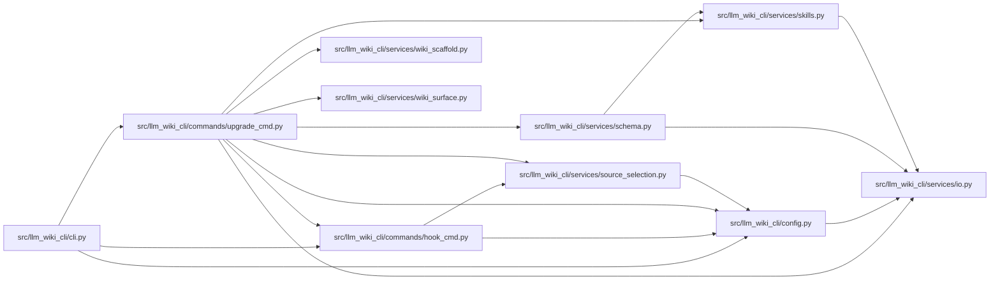

# upgrade_cmd Module

**Path:** `src/llm_wiki_cli/commands/upgrade_cmd.py`

## Description

llm-wiki upgrade — refresh all framework-managed artifacts in place.

Replaces the uninstall → init → install-hook cycle with a single idempotent
command that:
1. Replaces the agent constraint block with the latest version
2. Ensures wiki directory structure is complete
3. Reinstalls git hooks
4. Optionally switches agents

## Imports

| Source | Symbols |
|--------|---------|
| `..config` | `AGENT_CHOICES`, `CLI_AGENTS`, `DEFAULT_WIKI_DIR`, `get_agent_config_path`, `read_config`, `validate_path`, `write_config` |
| `..services.io` | `read_md`, `write_md` |
| `..services.schema` | `CONSTRAINT_START`, `SCHEMA_FILENAMES`, `build_schema_content`, `refresh_skill_blocks`, `replace_schema_block`, `strip_skill_blocks`, `strip_wiki_block` |
| `..services.skills` | `REFERENCE_SKILL_ID`, `SkillsError`, `install_reference_skill`, `reference_skill_state`, `skills_install_dir` |
| `..services.source_selection` | `SourceSelectionError`, `resolve_source_selection` |
| `..services.wiki_scaffold` | `INITIAL_WIKI_INDEX_MARKDOWN`, `INITIAL_WIKI_LOG_MARKDOWN` |
| `..services.wiki_surface` | `iter_directory_kinds` |
| `.hook_cmd` | `HOOK_SIGNATURE`, `_build_ide_post_commit`, `_build_validation_pre_commit`, `_install_hook` |
| `__future__` | `annotations` |
| `dataclasses` | `dataclass` |
| `pathlib` | `Path` |
| `shutil` | `shutil` |
| `sys` | `sys` |

## Local dependency map

<!-- Auto-generated local dependency summary. Do not edit by hand. -->

### Internal neighbors

| Direction | Module |
|---|---|
| Inbound | [cli](../modules/cli.md) |
| Outbound | [hook_cmd](../modules/hook_cmd.md) |
| Outbound | [config](../modules/config.md) |
| Outbound | [io](../modules/io.md) |
| Outbound | [services_schema](../modules/services_schema.md) |
| Outbound | [skills](../modules/skills.md) |
| Outbound | [source_selection](../modules/source_selection.md) |
| Outbound | [wiki_scaffold](../modules/wiki_scaffold.md) |
| Outbound | [wiki_surface](../modules/wiki_surface.md) |

## Classes

| Class | Line | Bases | Description |
|-------|------|-------|-------------|
| [StructureUpgradeResult](../entities/StructureUpgradeResult.md) | 64 | — | Paths created while refreshing the framework-owned wiki structure. |

## Functions

| Function | Signature | Decorators | Description |
|----------|-----------|------------|-------------|
| `_read_agent_config` | `(wiki_dir: str) -> str \| None` | — | Read the agent name persisted by `llm-wiki init`. |
| `_resolve_agent` | `(args, wiki_dir: str) -> str` | — | Resolve agent: CLI --agent flag > persisted config > error. |
| `_upgrade_schema` | `(agent: str, wiki_dir: str, old_agent: str \| None, *, quality_hints: bool = True, issue_reporting: bool = False, source_selection: str \| Path \| None = None) -> str` | — | Replace or migrate the agent schema constraint block. |
| `_migrate_reference_skill` | `(old_agent: str \| None, new_agent: str) -> None` | — | Move the wiki-reference skill when an agent switch changes its home. |
| `_upgrade_dirs` | `(wiki_dir: str) -> StructureUpgradeResult` | — | Ensure all standard wiki subdirectories and tracking files exist. |
| `_upgrade_hooks` | `(agent: str, wiki_dir: str, *, force: bool = False, source_selection: str \| Path \| None = None) -> None` | — | Reinstall git hooks for the resolved agent. |
| `run` | `(args)` | — | — |
