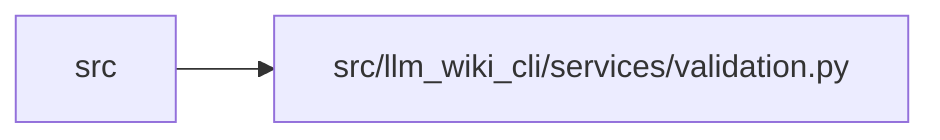

# validation Module

**Path:** `src/llm_wiki_cli/services/validation.py`

## Description

Shared, side-effect-free validators for service-layer contracts.

The helpers in this module deliberately receive caller-owned exceptions.  That
keeps domain-specific exception types and established diagnostic text at the
service boundary while ensuring the underlying acceptance rules cannot drift.

## Imports

| Source | Symbols |
|--------|---------|
| `__future__` | `annotations` |
| `collections.abc` | `Callable`, `Container`, `Iterable`, `Mapping`, `MutableMapping`, `Sequence` |
| `datetime` | `datetime`, `timedelta` |
| `math` | `math` |
| `os` | `os` |
| `pathlib` | `Path`, `PurePosixPath` |
| `posixpath` | `posixpath` |
| `re` | `re` |
| `typing` | `Any`, `TypeVar` |
| `unicodedata` | `unicodedata` |
| `uuid` | `uuid` |

## Local dependency map

<!-- Auto-generated local dependency summary. Do not edit by hand. -->

> Module-level dependencies exceed the generated-diagram limits, so the diagram and table below group them by top-level package. Counts report the number of module neighbors in each package.

### Internal neighbors

| Direction | Module |
|---|---|
| Inbound | `src` (49) |

> All 49 module neighbor(s) are summarized by package because the module-level view exceeds the 12-node limit.

## Classes

| Class | Line | Bases | Description |
|-------|------|-------|-------------|
| [SharedValidationError](../entities/SharedValidationError.md) | 47 | `ValueError` | Raised when a caller uses a shared validator without a domain adapter. |

## Functions

| Function | Signature | Decorators | Description |
|----------|-----------|------------|-------------|
| `format_field_differences` | `(missing: Iterable[object], unknown: Iterable[object]) -> str` | — | Render deterministic exact-field differences. |
| `_default_path_error` | `(value: object) -> SharedValidationError` | — | — |
| `require_portable_path_component` | `(component: str, *, context: str \| None = None, defer_non_nfc_error: bool = False, reject_delete_character: bool = True, utf8_error: Exception \| None = None, control_error: Exception \| None = None, non_nfc_error: Exception \| None = None, nonportable_error: Exception \| None = None, reserved_error: Exception \| None = None) -> str` | — | Return a portable path component or raise a caller-owned exception. |
| `is_portable_path_component` | `(component: str) -> bool` | — | Return whether *component* is portable on every supported filesystem. |
| `require_portable_relative_path` | `(value: object, *, normalize_backslashes: bool = False, normalize_posix_spelling: bool = False, required_suffix: str \| None = None, defer_non_nfc_error: bool = False, reject_delete_character: bool = True, text_error: Exception \| None = None, relative_error: Exception \| None = None, escape_error: Exception \| None = None, traversal_error: Exception \| None = None, separator_error: Exception \| None = None, utf8_error: Exception \| None = None, control_error: Exception \| None = None, non_nfc_error: Exception \| None = None, nonportable_error: Exception \| None = None, reserved_error: Exception \| None = None, collision_seen: MutableMapping[str, str] \| None = None, collision_error: Callable[[str, str], Exception] \| None = None) -> str` | — | Return a canonical portable relative path. |
| `require_repository_relative_path` | `(value: object, *, text_error: Exception, posix_error: Exception, normalized_error: Exception, absolute_error: Exception \| None = None, separator_error: Exception \| None = None, control_error: Exception \| None = None, reject_delete_character: bool = False, control_after_normalization: bool = False, leading_backslash_is_absolute: bool = False, normalize_posix_spelling: bool = False, portability_error: Exception \| None = None) -> str` | — | Return one strict repository-relative path with tiered diagnostics. |
| `is_portable_relative_path` | `(value: object, *, normalize_backslashes: bool = False) -> bool` | — | Return whether *value* is a canonical portable relative path. |
| `normalize_legacy_portable_relative_path` | `(value: object, *, text_error: Exception \| None = None, absolute_error: Exception \| None = None, traversal_error: Exception \| None = None, empty_error: Exception \| None = None, invalid_error: Exception \| None = None, reject_dot_prefixed_absolute: bool = False) -> str \| None` | — | Normalize a legacy observational path, returning ``None`` if unsafe. |
| `normalize_optional_portable_relative_path` | `(value: object) -> str \| None` | — | Normalize legacy observational spelling and return ``None`` if unsafe. |
| `normalize_observational_posix_path` | `(value: object) -> str \| None` | — | Normalize display-only path metadata without asserting path safety. |
| `portable_path_key` | `(value: str) -> str` | — | Return the collision key used by normalizing/case-insensitive filesystems. |
| `path_is_under` | `(path: str, prefix: str) -> bool` | — | Return whether a slash-delimited path is inside a non-empty prefix. |
| `path_is_under_scope` | `(path: str, scope_root: str) -> bool` | — | Return whether a native-spelled path is inside an optional scope root. |
| `path_is_within` | `(path: Path, root: Path) -> bool` | — | Return whether *path* is equal to or lexically below *root*. |
| `paths_overlap` | `(left: Path, right: Path) -> bool` | — | Return whether either lexical path is equal to or below the other. |
| `resolved_paths_equal` | `(left: str \| Path, right: str \| Path) -> bool` | — | Return whether two path spellings resolve to the same location. |
| `path_is_in_top_level_directory` | `(path: Path, root: Path, directory: str) -> bool` | — | Return whether a path is inside one named top-level root directory. |
| `posix_path_text` | `(value: object) -> str` | — | Render path-like display text with portable separators. |
| `resolve_workspace_path` | `(workspace_root: Path, relative: str, *, escape_error: Exception) -> Path` | — | Resolve *relative* below *workspace_root* and reject symlink escapes. |
| `resolve_portable_workspace_path` | `(workspace_root: Path, relative: str \| Path, *, path_error: Exception, escape_error: Exception, traversal_error: Exception \| None = None) -> Path` | — | Resolve one strict portable relative path below *workspace_root*. |
| `require_safe_base_path` | `(path: Path, *, error: Exception) -> None` | — | Reject ambiguous filesystem base paths. |
| `require_existing_directory` | `(path: Path, *, error: Exception) -> None` | — | Require an existing directory while preserving caller diagnostics. |
| `require_existing_file` | `(path: Path, *, error: Exception) -> Path` | — | Require an existing regular file while preserving caller diagnostics. |
| `portable_page_component` | `(value: object, *, fallback: str = 'page') -> str` | — | Return a generated wiki page component portable on supported filesystems. |
| `require_nonempty_text` | `(value: object, *, error: Exception, trim_error: Exception \| None = None, normalize: bool = False, require_trimmed: bool = False, reject_control_characters: bool = True, reject_delete_character: bool = False) -> str` | — | Return non-empty text under an explicit normalization policy. |
| `require_bounded_text` | `(value: object, *, maximum: int, error: Exception, minimum: int = 1, control_error: Exception \| None = None, require_trimmed: bool = False, reject_control_characters: bool = True, reject_delete_character: bool = True) -> str` | — | Return text within inclusive bounds under an explicit scalar policy. |
| `require_no_control_characters` | `(value: object, *, error: Exception, reject_delete_character: bool = False) -> str` | — | Return text without ASCII controls, optionally including DEL. |
| `contains_control_character` | `(value: str, *, reject_delete_character: bool = False) -> bool` | — | Return whether text contains an ASCII control selected by policy. |
| `require_trimmed_text` | `(value: object, *, error: Exception, reject_control_characters: bool = True) -> str` | — | Return non-empty text with canonical surrounding whitespace. |
| `require_trimmed_text_list` | `(value: object, *, error: Exception, item_error: Exception \| None = None, duplicate_error: Exception \| None = None, sort: bool = False, require_trimmed_items: bool = True, reject_control_characters: bool = True, reject_duplicates: bool = False, container_type: type[object] \| tuple[type[object], ...] = list) -> list[str]` | — | Return text items from a caller-selected sequence container. |
| `require_string` | `(value: object, *, error: Exception, utf8_error: Exception \| None = None) -> str` | — | Return a string, optionally requiring UTF-8-encodable scalar text. |
| `require_mapping` | `(value: object, *, error: Exception, require_string_keys: bool = False, key_error: Exception \| None = None, require_utf8_keys: bool = False, utf8_key_error: Exception \| None = None) -> Mapping[str, Any]` | — | Return a mapping with optional JSON string/scalar key requirements. |
| `require_sequence` | `(value: object, *, error: Exception, container_type: type[object] \| tuple[type[object], ...] = Sequence, reject_mapping: bool = False) -> Sequence[Any]` | — | Return a non-text sequence from caller-selected container types. |
| `require_list` | `(value: object, *, error: Exception) -> list[Any]` | — | Return a concrete list without accepting other sequence types. |
| `require_bool` | `(value: object, *, error: Exception) -> bool` | — | Return a strict boolean value. |
| `require_int` | `(value: object, *, error: Exception) -> int` | — | Return a strict integer (booleans are not integers here). |
| `require_nonnegative_int` | `(value: object, *, error: Exception) -> int` | — | Return a strict non-negative integer (booleans are not integers here). |
| `nonnegative_int_or_none` | `(value: object) -> int \| None` | — | Return a strict non-negative integer, or ``None`` for other values. |
| `require_positive_int` | `(value: object, *, invalid_error: Exception, zero_error: Exception \| None = None) -> int` | — | Return a strict positive integer. |
| `require_int_at_least` | `(value: object, *, minimum: int, error: Exception) -> int` | — | Return a strict integer at or above a caller-selected lower bound. |
| `require_bounded_int` | `(value: object, *, minimum: int, maximum: int, invalid_error: Exception, bounds_error: Exception \| None = None) -> int` | — | Return a strict integer within inclusive caller-selected bounds. |
| `require_bounded_integral_number` | `(value: object, *, invalid_error: Exception, minimum: int \| None = None, maximum: int \| None = None, bounds_error: Exception \| None = None, zero_error: Exception \| None = None) -> int` | — | Return an int or finite integral float within optional inclusive bounds. |
| `positive_int_or_none` | `(value: object) -> int \| None` | — | Return a strict positive integer, or ``None`` for any other value. |
| `coerce_nonnegative_int` | `(value: object, *, error: Exception) -> int` | — | Coerce an integer-like value and require a non-negative result. |
| `coerce_positive_int` | `(value: object, *, error: Exception) -> int` | — | Coerce an integer-like value and require a positive result. |
| `coerce_trimmed_text` | `(value: object) -> str` | — | Return legacy display text: ``None`` becomes empty, all else is stripped. |
| `trimmed_text_or_none` | `(value: object, *, error: Exception \| None = None) -> str \| None` | — | Return stripped optional text under an explicit invalid-value policy. |
| `filtered_trimmed_text_list` | `(value: object, *, limit: int \| None = None) -> list[str]` | — | Normalize a loose observational sequence of text. |
| `bool_or_none` | `(value: object) -> bool \| None` | — | Return a strict boolean, or ``None`` for any other value. |
| `require_string_list` | `(value: object, *, error: Exception) -> list[str]` | — | Return the caller's concrete list after strict string-item validation. |
| `require_string_tuple` | `(value: object, *, error: Exception, item_error: Exception \| None = None, minimum: int = 0, maximum: int \| None = None, container_type: type[object] \| tuple[type[object], ...] = Sequence, item_parser: Callable[[object], str] \| None = None) -> tuple[str, ...]` | — | Return parsed strings from a bounded, caller-selected sequence. |
| `require_mapping_tuple` | `(value: object, *, error: Exception, item_error: Exception \| None = None, container_type: type[object] \| tuple[type[object], ...] = Sequence) -> tuple[Mapping[str, Any], ...]` | — | Return mapping items from a caller-selected non-text sequence. |
| `require_mapping_list` | `(value: object, *, error: Exception, item_error: Exception \| None = None, require_string_keys: bool = False) -> list[Mapping[str, Any]]` | — | Return the caller's list after strict mapping-item validation. |
| `require_choice` | `(value: object, choices: Iterable[str], *, text_error: Exception, choice_error: Callable[[frozenset[str]], Exception], reject_control_characters: bool = True) -> str` | — | Return trimmed text from one closed set. |
| `require_exact_choice` | `(value: object, choices: Iterable[str], *, error: Exception) -> str` | — | Return an exact string member without trimming or normalization. |
| `require_enum_value` | `(value: object, enum_type: Callable[[str], _EnumValue], *, text_error: Exception, choice_error: Callable[[], Exception]) -> _EnumValue` | — | Return one exact string-backed enum member with caller diagnostics. |
| `require_member` | `(value: object, choices: Container[object], *, error: Exception) -> object` | — | Return an exact collection member using the collection's own semantics. |
| `require_sha256` | `(value: object, *, digest_error: Exception, text_error: Exception \| None = None, reject_control_characters: bool = True, allow_empty: bool = False) -> str` | — | Return a canonical ``sha256:<lowercase hex>`` digest. |
| `require_uuid` | `(value: object, *, text_error: Exception, uuid_error: Exception, canonical_error: Exception, reject_control_characters: bool = True) -> str` | — | Return a canonical lowercase, hyphenated UUID. |
| `is_canonical_uuid` | `(value: object) -> bool` | — | Return whether *value* is a canonical lowercase, hyphenated UUID. |
| `parse_utc_timestamp` | `(value: object, *, string_error: Exception, timestamp_error: Exception, require_z: bool = False, reject_control_characters: bool = True, control_error: Exception \| None = None, z_error: Exception \| None = None, utc_error: Exception \| None = None) -> tuple[str, datetime]` | — | Return the original timestamp and its timezone-aware UTC value. |
| `require_exact_fields` | `(value: object, *, allowed: Iterable[str], required: Iterable[str], mapping_error: Exception, missing_error: _ErrorFactory, unknown_error: _ErrorFactory, invalid_error: Callable[[tuple[str, ...], tuple[str, ...]], Exception] \| None = None, stringify_keys: bool = False, unknown_first: bool = False) -> None` | — | Require an exact/allowed mapping shape with caller-owned diagnostics. |
