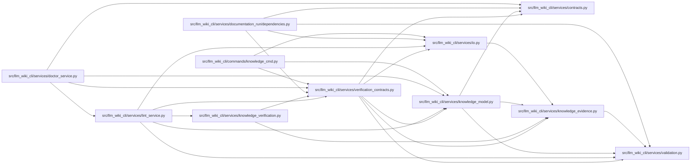

# verification_contracts Module

**Path:** `src/llm_wiki_cli/services/verification_contracts.py`

## Description

Pure, application-owned machine-verification contracts.

Verification is deliberately separate from semantic authorship and human
review.  Checkers consume only an already validated :class:`KnowledgeIndex`
and explicit, pre-evaluated anchors supplied by the caller.  They never read
files, discover source, load plugins, import document-selected code, or invoke
helpers, subprocesses, networks, containers, or language models.

The only filesystem operations in this module are the fixed-name receipt
loader and atomic writer.  Loading a receipt validates recorded evidence but
never executes a checker.  Receipt validity is evaluated against live anchors;
it is not stored as a timeless boolean.

## Imports

| Source | Symbols |
|--------|---------|
| `.contracts` | `VERIFICATION_RECEIPT_SCHEMA_VERSION` |
| `.io` | `first_unsafe_path_component`, `write_bytes_atomic` |
| `.knowledge_evidence` | `formatted_json_bytes`, `hash_json` |
| `.knowledge_model` | `KnowledgeIndex`, `RelationshipKind`, `Resolution`, `TargetClass`, `knowledge_index_to_payload`, `parse_knowledge_index` |
| `.validation` | `require_exact_fields`, `require_bounded_text`, `require_list`, `require_mapping`, `require_nonnegative_int`, `require_sha256`, `require_string` |
| `__future__` | `annotations` |
| `collections.abc` | `Callable`, `Mapping`, `Sequence` |
| `dataclasses` | `dataclass`, `field` |
| `enum` | `Enum` |
| `json` | `json` |
| `os` | `os` |
| `pathlib` | `Path` |
| `re` | `re` |
| `stat` | `stat` |
| `types` | `MappingProxyType` |

## Local dependency map

<!-- Auto-generated local dependency summary. Do not edit by hand. -->

### Internal neighbors

| Direction | Module |
|---|---|
| Inbound | [knowledge_cmd](../modules/knowledge_cmd.md) |
| Inbound | [doctor_service](../modules/doctor_service.md) |
| Inbound | [documentation_run_dependencies](../modules/documentation_run_dependencies.md) |
| Inbound | [knowledge_verification](../modules/knowledge_verification.md) |
| Inbound | [lint_service](../modules/lint_service.md) |
| Outbound | [services_contracts](../modules/services_contracts.md) |
| Outbound | [io](../modules/io.md) |
| Outbound | [knowledge_evidence](../modules/knowledge_evidence.md) |
| Outbound | [knowledge_model](../modules/knowledge_model.md) |
| Outbound | [validation](../modules/validation.md) |

## Classes

| Class | Kind | Line | Bases / Target | Description |
|-------|------|------|----------------|-------------|
| [VerificationContractError](../entities/VerificationContractError.md) | Class | 75 | `ValueError` | Base error for verification inputs, checkers, and receipts. |
| [UnknownVerificationCheckerError](../entities/UnknownVerificationCheckerError.md) | Class | 79 | `VerificationContractError` | Raised before execution when a requested checker is not registered. |
| [VerificationReceiptError](../entities/VerificationReceiptError.md) | Class | 87 | `VerificationContractError` | Field-specific failure for a verification receipt. |
| [VerificationResult](../entities/VerificationResult.md) | Enum | 96 | `str`, `Enum` | A recorded checker result at one evaluated snapshot. |
| [VerificationInvalidationReason](../entities/VerificationInvalidationReason.md) | Enum | 103 | `str`, `Enum` | Reasons a syntactically valid receipt is not current. |
| [VerificationDiagnostic](../entities/VerificationDiagnostic.md) | Class | 115 | — | One bounded, path-safe machine diagnostic. |
| [DiagnosticCoverage](../entities/DiagnosticCoverage.md) | Class | 139 | — | Disclosure for deterministic diagnostic truncation. |
| [VerificationCheckResult](../entities/VerificationCheckResult.md) | Class | 187 | — | Normalized output from one application-owned checker. |
| [VerificationContext](../entities/VerificationContext.md) | Class | 244 | — | All already evaluated inputs available to pure checkers. |
| [CheckerContract](../entities/CheckerContract.md) | Class | 417 | — | One immutable application-owned checker registration. |
| [VerificationReceipt](../entities/VerificationReceipt.md) | Class | 453 | — | Deterministic recorded evidence from one explicit verification run. |
| [VerificationReceiptEvaluation](../entities/VerificationReceiptEvaluation.md) | Class | 537 | — | Live validity of one recorded receipt against current anchors. |

## Functions

| Function | Signature | Decorators | Description |
|----------|-----------|------------|-------------|
| `build_artifact_verification_context` | `(knowledge: KnowledgeIndex, *, knowledge_hash: str, surface_index_hash: str, evaluated_envelope_hash: str, governance_hash: str \| None = None, scope_locator: str \| None = None, artifact_integrity: bool = True, artifact_diagnostics: Sequence[VerificationDiagnostic] = ()) -> VerificationContext` | — | Build the canonical receipt context for one committed artifact set. |
| `_bounded_result` | `(checker_id: str, checker_version: str, *, passed: bool, diagnostics: Sequence[VerificationDiagnostic]) -> VerificationCheckResult` | — | — |
| `_artifact_integrity_checker` | `(context: VerificationContext) -> VerificationCheckResult` | — | — |
| `_internal_links_checker` | `(context: VerificationContext) -> VerificationCheckResult` | — | — |
| `checker_registry` | `() -> Mapping[str, CheckerContract]` | — | Return the immutable application-owned checker registry. |
| `checker_contract` | `(checker_id: str) -> CheckerContract` | — | Return one registered checker or fail closed. |
| `_selected_contracts` | `(checker_ids: Sequence[str] \| None) -> tuple[CheckerContract, ...]` | — | — |
| `run_verification` | `(context: VerificationContext, checker_ids: Sequence[str] \| None = None) -> tuple[VerificationCheckResult, ...]` | — | Explicitly run selected pure checkers over supplied inputs. |
| `build_verification_receipt` | `(context: VerificationContext, checks: Sequence[VerificationCheckResult]) -> VerificationReceipt` | — | Build a deterministic receipt without reading or writing files. |
| `verify` | `(context: VerificationContext, checker_ids: Sequence[str] \| None = None) -> VerificationReceipt` | — | Run selected checkers and return their deterministic in-memory receipt. |
| `verification_receipt_to_payload` | `(value: VerificationReceipt \| object) -> dict[str, object]` | — | Validate and return a normalized JSON-compatible receipt payload. |
| `serialize_verification_receipt` | `(value: VerificationReceipt \| object) -> bytes` | — | Serialize one receipt deterministically with a trailing newline. |
| `validate_verification_receipt` | `(value: VerificationReceipt \| object) -> VerificationReceipt` | — | Strictly validate a receipt model or decoded JSON object. |
| `deserialize_verification_receipt` | `(content: bytes) -> VerificationReceipt` | — | Decode canonical UTF-8 JSON while rejecting duplicate object keys. |
| `verification_receipt_path` | `(wiki_dir: str \| Path) -> Path` | — | Return the fixed disposable receipt path. |
| `load_verification_receipt` | `(wiki_dir: str \| Path, *, missing_ok: bool = True) -> VerificationReceipt \| None` | — | Load the fixed receipt without following a receipt symlink. |
| `write_verification_receipt` | `(wiki_dir: str \| Path, receipt: VerificationReceipt \| object) -> Path` | — | Atomically replace the fixed receipt with deterministic bytes. |
| `verify_and_write_receipt` | `(wiki_dir: str \| Path, context: VerificationContext, checker_ids: Sequence[str] \| None = None) -> VerificationReceipt` | — | Run, fully build, then atomically write one receipt. |
| `evaluate_verification_receipt` | `(receipt: VerificationReceipt \| object, context: VerificationContext) -> VerificationReceiptEvaluation` | — | Compute live validity without executing any checker. |
| `load_and_evaluate_verification_receipt` | `(wiki_dir: str \| Path, context: VerificationContext, *, missing_ok: bool = True) -> VerificationReceiptEvaluation \| None` | — | Load and evaluate a receipt without running its recorded checkers. |
| `_receipt_to_payload` | `(receipt: VerificationReceipt) -> dict[str, object]` | — | — |
| `_parse_check` | `(checker_key: str, value: object, field_name: str) -> VerificationCheckResult` | — | — |
| `_parse_diagnostic` | `(value: object, field_name: str) -> VerificationDiagnostic` | — | — |
| `_parse_coverage` | `(value: object, field_name: str) -> DiagnosticCoverage` | — | — |
| `_read_regular_receipt` | `(path: Path, *, missing_ok: bool) -> bytes \| None` | — | — |
| `_normalized_anchor_mapping` | `(value: Mapping[str, str], field_name: str) -> Mapping[str, str]` | — | — |
| `_receipt_anchor_mapping` | `(value: object, field_name: str) -> Mapping[str, str]` | — | — |
| `_checker_id` | `(value: object, field_name: str) -> str` | — | — |
| `_checker_version` | `(value: object, field_name: str) -> str` | — | — |
| `_machine_code` | `(value: object, field_name: str) -> str` | — | — |
| `_diagnostic_subject` | `(value: object, field_name: str) -> str` | — | — |
| `_scope_uid` | `(value: object, field_name: str) -> str` | — | — |
| `_portable_text` | `(value: object, field_name: str, *, maximum: int) -> str` | — | — |
| `_sha256` | `(value: object, field_name: str) -> str` | — | — |
| `_receipt_hash` | `(value: object, field_name: str) -> str` | — | — |
| `_object` | `(value: object, field_name: str) -> Mapping[str, object]` | — | — |
| `_array` | `(value: object, field_name: str) -> list[object]` | — | — |
| `_string` | `(value: object, field_name: str) -> str` | — | — |
| `_nonnegative_int` | `(value: object, field_name: str) -> int` | — | — |
| `_exact_fields` | `(value: Mapping[str, object], field_name: str, required: set[str], *, optional: set[str] \| None = None) -> None` | — | — |
