# verify Module

**Path:** `src/llm_wiki_cli/services/documentation_run/verify.py`

## Description

Documentation-run verify services.

## Imports

| Source | Symbols |
|--------|---------|
| `..knowledge_consumption` | `load_knowledge_read_view` |
| `..knowledge_projection` | `project_knowledge` |
| `.contracts` | `*` |
| `.dependencies` | `*` |
| `.integrity` | `*` |
| `.record` | `*` |
| `.refresh` | `*` |
| `.schema` | `*` |
| `.workspace` | `*` |
| `__future__` | `annotations` |

## Local dependency map

```mermaid
flowchart LR
    n0["src/llm_wiki_cli/services/documentation_run/__init__.py"]
    n1["src/llm_wiki_cli/services/documentation_run/contracts.py"]
    n2["src/llm_wiki_cli/services/documentation_run/dependencies.py"]
    n3["src/llm_wiki_cli/services/documentation_run/export.py"]
    n4["src/llm_wiki_cli/services/documentation_run/integrity.py"]
    n5["src/llm_wiki_cli/services/documentation_run/record.py"]
    n6["src/llm_wiki_cli/services/documentation_run/refresh.py"]
    n7["src/llm_wiki_cli/services/documentation_run/schema.py"]
    n8["src/llm_wiki_cli/services/documentation_run/verify.py"]
    n9["src/llm_wiki_cli/services/documentation_run/workspace.py"]
    n10["src/llm_wiki_cli/services/knowledge_consumption.py"]
    n11["src/llm_wiki_cli/services/knowledge_projection.py"]
    n0 --> n1
    n0 --> n2
    n0 --> n3
    n0 --> n4
    n0 --> n5
    n0 --> n6
    n0 --> n7
    n0 --> n8
    n0 --> n9
    n1 --> n2
    n1 --> n7
    n2 --> n10
    n3 --> n1
    n3 --> n2
    n3 --> n4
    n3 --> n5
    n3 --> n6
    n3 --> n7
    n3 --> n8
    n3 --> n9
    n4 --> n1
    n4 --> n2
    n4 --> n7
    n4 --> n9
    n5 --> n1
    n5 --> n2
    n5 --> n4
    n5 --> n6
    n5 --> n7
    n5 --> n9
    n6 --> n1
    n6 --> n2
    n6 --> n4
    n6 --> n7
    n6 --> n9
    n6 --> n10
    n7 --> n1
    n7 --> n2
    n8 --> n1
    n8 --> n2
    n8 --> n4
    n8 --> n5
    n8 --> n6
    n8 --> n7
    n8 --> n9
    n8 --> n10
    n8 --> n11
    n9 --> n1
    n9 --> n2
    n9 --> n7
    n11 --> n10
    click n0 "../modules/documentation_run___init__.md"
    click n1 "../modules/documentation_run_contracts.md"
    click n2 "../modules/documentation_run_dependencies.md"
    click n3 "../modules/export.md"
    click n4 "../modules/integrity.md"
    click n5 "../modules/record.md"
    click n6 "../modules/refresh.md"
    click n7 "../modules/documentation_run_schema.md"
    click n8 "../modules/verify.md"
    click n9 "../modules/workspace.md"
    click n10 "../modules/knowledge_consumption.md"
    click n11 "../modules/knowledge_projection.md"
```

<!-- Auto-generated local dependency summary. Do not edit by hand. -->

### Internal neighbors

| Direction | Module |
|---|---|
| Inbound | [documentation_run___init__](../modules/documentation_run___init__.md) |
| Inbound | [export](../modules/export.md) |
| Outbound | [documentation_run_contracts](../modules/documentation_run_contracts.md) |
| Outbound | [documentation_run_dependencies](../modules/documentation_run_dependencies.md) |
| Outbound | [integrity](../modules/integrity.md) |
| Outbound | [record](../modules/record.md) |
| Outbound | [refresh](../modules/refresh.md) |
| Outbound | [documentation_run_schema](../modules/documentation_run_schema.md) |
| Outbound | [workspace](../modules/workspace.md) |
| Outbound | [knowledge_consumption](../modules/knowledge_consumption.md) |
| Outbound | [knowledge_projection](../modules/knowledge_projection.md) |

## Functions

| Function | Signature | Decorators | Description |
|----------|-----------|------------|-------------|
| `verify_documentation_run` | `(workspace: str \| Path, *, advance: bool = True) -> DocumentationVerificationReport` | — | Run deterministic lifecycle checks and optionally advance review state. |
| `_documentation_projection_policy` | `(run: DocumentationRun) -> tuple[str, str \| None]` | — | — |
| `_assert_documentation_export_projection_policy` | `(run: DocumentationRun, *, knowledge_mode: str \| None, knowledge_public_repository_identity: str \| None) -> tuple[str, str \| None]` | — | — |
| `_load_documentation_knowledge_projection` | `(wiki_root: Path, *, knowledge_mode: str, knowledge_public_repository_identity: str \| None)` | — | — |
| `_documentation_projection_evidence` | `(*, knowledge_mode: str, knowledge_public_repository_identity: str \| None, projection) -> dict[str, Any]` | — | — |
