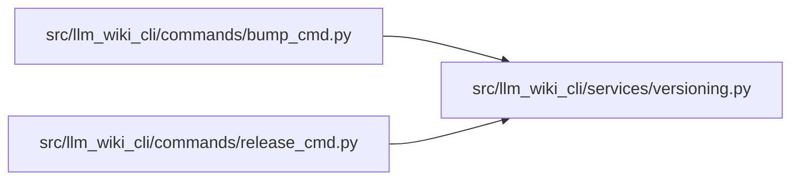

# versioning Module

**Path:** `src/llm_wiki_cli/services/versioning.py`

## Description

_Auto-generated from `src/llm_wiki_cli/services/versioning.py`._

## Imports

| Source | Symbols |
|--------|---------|
| `__future__` | `annotations` |
| `pathlib` | `Path` |
| `re` | `re` |
| `tomli` | `tomllib` |
| `tomllib` | `tomllib` |

## Local dependency map

<!-- Auto-generated local dependency summary. Do not edit by hand. -->

### Internal neighbors

| Direction | Module |
|---|---|
| Inbound | [bump_cmd](../modules/bump_cmd.md) |
| Inbound | [release_cmd](../modules/release_cmd.md) |

### External packages

| Language | Used packages | Undeclared packages |
|---|---:|---:|
| python | 1 | 0 |

## Functions

| Function | Signature | Decorators | Description |
|----------|-----------|------------|-------------|
| `find_version_file` | `(root: str = '.') -> Path \| None` | — | Auto-detect the version file in a project root. |
| `read_version` | `(path: Path) -> str \| None` | — | Parse X.Y.Z version from a detected file. |
| `write_version` | `(path: Path, new_version: str) -> None` | — | Update the version string in-place, preserving file format. |
| `_read_pyproject_version` | `(text: str) -> str \| None` | — | — |
| `_write_pyproject_version` | `(text: str, new_version: str, path: Path) -> str` | — | — |
| `_table_bounds` | `(text: str, table_name: str) -> tuple[int, int] \| None` | — | — |
| `_table_body` | `(text: str, table_name: str) -> str \| None` | — | — |
| `_static_version_from_body` | `(body: str) -> str \| None` | — | — |
| `_replace_static_version_line` | `(body: str, new_version: str) -> tuple[str, bool]` | — | — |
| `_project_version_is_dynamic` | `(body: str) -> bool` | — | — |
| `bump_patch` | `(version: str) -> str` | — | 0.1.5 -> 0.1.6 |
| `bump_minor` | `(version: str) -> str` | — | 0.1.6 -> 0.2.0 |
