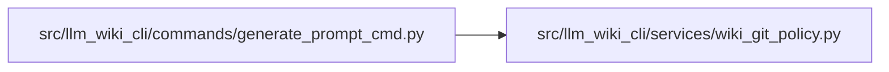

# wiki_git_policy Module

**Path:** `src/llm_wiki_cli/services/wiki_git_policy.py`

## Description

Read-only Git policy for handing generated wiki files to version control.

Git itself is the authority for this decision.  The source-inventory ignore
matcher intentionally implements only the subset of ignore semantics needed by
repository scans; it cannot account for repository-local excludes, configured
global excludes, linked worktrees, or paths which are already in the index.

The classifier is deliberately fail-closed.  Only an explicit ``included``
result permits callers to consider Git handoff guidance, and that result is not
itself authorization to stage or commit anything.

## Imports

| Source | Symbols |
|--------|---------|
| `__future__` | `annotations` |
| `dataclasses` | `dataclass` |
| `enum` | `Enum` |
| `os` | `os` |
| `pathlib` | `Path` |
| `subprocess` | `subprocess` |

## Local dependency map

<!-- Auto-generated local dependency summary. Do not edit by hand. -->

### Internal neighbors

| Direction | Module |
|---|---|
| Inbound | [generate_prompt_cmd](../modules/generate_prompt_cmd.md) |

## Classes

| Class | Kind | Line | Bases / Target | Description |
|-------|------|------|----------------|-------------|
| [WikiGitDisposition](../entities/WikiGitDisposition.md) | Enum | 42 | `str`, `Enum` | Whether Git permits wiki handoff instructions for a path. |
| [WikiGitPolicy](../entities/WikiGitPolicy.md) | Class | 51 | — | A bounded, non-sensitive result from local Git policy evaluation. |
| [_GitResult](../entities/GitResult.md) | Class | 67 | — | — |

## Functions

| Function | Signature | Decorators | Description |
|----------|-----------|------------|-------------|
| `classify_wiki_git_policy` | `(wiki_dir: str \| Path, *, cwd: Path \| None = None, timeout: float = _DEFAULT_TIMEOUT_SECONDS) -> WikiGitPolicy` | — | Classify the configured wiki path using the effective Git ignore rules. |
| `_indeterminate` | `(reason: str, *, repository_root: Path \| None = None, wiki_path: str \| None = None) -> WikiGitPolicy` | — | — |
| `_run_git` | `(root: Path, *arguments: str, timeout: float) -> _GitResult` | — | — |
