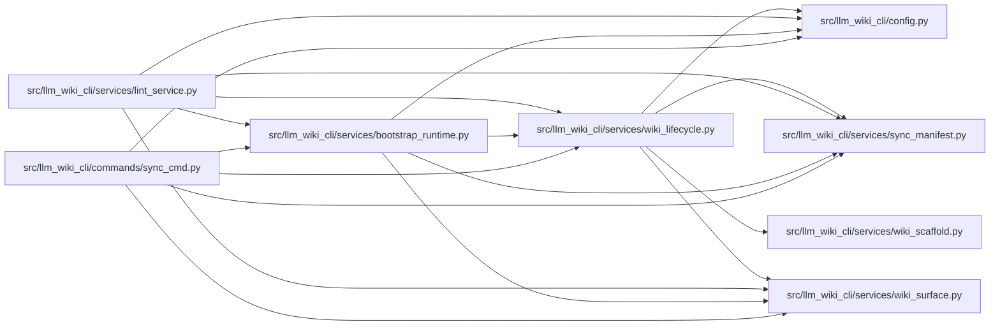

# wiki_lifecycle Module

**Path:** `src/llm_wiki_cli/services/wiki_lifecycle.py`

## Description

Read-only classification for wiki bootstrap, sync, and migration routing.

## Imports

| Source | Symbols |
|--------|---------|
| `..config` | `AGENT_CHOICES` |
| `.sync_manifest` | `MANIFEST_FILENAME` |
| `.wiki_scaffold` | `INITIAL_WIKI_INDEX_MARKDOWN`, `INITIAL_WIKI_LOG_MARKDOWN` |
| `.wiki_surface` | `iter_page_kinds` |
| `__future__` | `annotations` |
| `enum` | `Enum` |
| `json` | `json` |
| `os` | `os` |
| `pathlib` | `Path` |
| `shlex` | `shlex` |
| `subprocess` | `subprocess` |
| `typing` | `Union` |

## Local dependency map

<!-- Auto-generated local dependency summary. Do not edit by hand. -->

### Internal neighbors

| Direction | Module |
|---|---|
| Inbound | [sync_cmd](../modules/sync_cmd.md) |
| Inbound | [bootstrap_runtime](../modules/bootstrap_runtime.md) |
| Inbound | [lint_service](../modules/lint_service.md) |
| Outbound | [config](../modules/config.md) |
| Outbound | [sync_manifest](../modules/sync_manifest.md) |
| Outbound | [wiki_scaffold](../modules/wiki_scaffold.md) |
| Outbound | [wiki_surface](../modules/wiki_surface.md) |

## Classes

| Class | Kind | Line | Bases / Target | Description |
|-------|------|------|----------------|-------------|
| [WikiLifecycleState](../entities/WikiLifecycleState.md) | Enum | 22 | `str`, `Enum` | One unambiguous lifecycle route for a wiki target. |

## Functions

| Function | Signature | Decorators | Description |
|----------|-----------|------------|-------------|
| `_uses_windows_command_line` | `() -> bool` | — | Return whether lifecycle guidance should use Windows CLI quoting. |
| `_render_recovery_command` | `(arguments: list[str]) -> str` | — | Render a copy-pasteable recovery command for the current platform. |
| `is_pristine_wiki_target` | `(wiki_dir: Union[str, Path]) -> bool` | — | Return whether a target is absent, empty, or the exact init scaffold. |
| `classify_wiki_lifecycle` | `(wiki_dir: Union[str, Path]) -> WikiLifecycleState` | — | Classify a target without reading source code or mutating the wiki. |
| `bootstrap_guidance` | `(*, src_dir: str, wiki_dir: Union[str, Path]) -> str` | — | Return a path-safe first-use bootstrap command. |
| `migration_guidance` | `(*, src_dir: str, wiki_dir: Union[str, Path]) -> str` | — | Return a path-safe migration preview command. |
| `sync_guidance` | `(*, src_dir: str, wiki_dir: Union[str, Path]) -> str` | — | Return a path-safe manifest-seeding sync command. |
