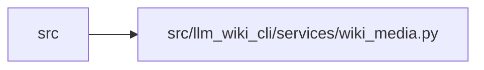

# wiki_media Module

**Path:** `src/llm_wiki_cli/services/wiki_media.py`

## Description

Media reference parsing for wiki pages and agent-owned assets.

## Imports

| Source | Symbols |
|--------|---------|
| `__future__` | `annotations` |
| `bisect` | `bisect_right` |
| `dataclasses` | `dataclass` |
| `html.parser` | `HTMLParser` |
| `os` | `os` |
| `pathlib` | `Path` |
| `re` | `re` |
| `typing` | `Iterator`, `Mapping`, `Optional`, `Union` |
| `urllib.parse` | `unquote`, `urlsplit` |

## Local dependency map

<!-- Auto-generated local dependency summary. Do not edit by hand. -->

> Module-level dependencies exceed the generated-diagram limits, so the diagram and table below group them by top-level package. Counts report the number of module neighbors in each package.

### Internal neighbors

| Direction | Module |
|---|---|
| Inbound | `src` (12) |

> All 12 module neighbor(s) are summarized by package because the module-level view exceeds the 12-node limit.

## Classes

| Class | Line | Bases | Description |
|-------|------|-------|-------------|
| [MediaReference](../entities/MediaReference.md) | 40 | — | — |
| [MarkdownLinkTarget](../entities/MarkdownLinkTarget.md) | 52 | — | — |
| [AssetIndex](../entities/AssetIndex.md) | 62 | — | — |
| [_HtmlMediaParser](../entities/HtmlMediaParser.md) | 71 | `HTMLParser` | — |

## Functions

| Function | Signature | Decorators | Description |
|----------|-----------|------------|-------------|
| `strip_fenced_code_blocks` | `(content: str) -> str` | — | Blank fenced code blocks while preserving line count. |
| `mask_fenced_code_blocks` | `(content: str) -> str` | — | Blank fenced code blocks without changing character offsets. |
| `_mask_inline_code_spans` | `(content: str) -> str` | — | Blank matched backtick code spans without changing offsets or newlines. |
| `_is_escaped_backtick_run` | `(content: str, offset: int) -> bool` | — | — |
| `mask_markdown_code` | `(content: str) -> str` | — | Blank fenced and inline Markdown code while preserving offsets. |
| `iter_mermaid_click_targets` | `(content: str) -> Iterator[MarkdownLinkTarget]` | — | Yield URL-bearing ``click`` directives from explicit Mermaid fences. |
| `_fence_marker` | `(line: str) -> Optional[tuple[str, int]]` | — | — |
| `_blank_line` | `(line: str) -> str` | — | — |
| `_mask_line` | `(line: str) -> str` | — | — |
| `_iter_fenced_blocks` | `(content: str) -> Iterator[tuple[str, int, int]]` | — | Yield ``(info, body_start, body_end)`` using the established policy. |
| `iter_markdown_link_targets` | `(content: str) -> Iterator[MarkdownLinkTarget]` | — | Yield inline markdown link/image targets with balanced parenthesis support. |
| `_scan_markdown_target` | `(content: str, start: int) -> Optional[tuple[str, int]]` | — | — |
| `split_srcset_candidates` | `(value: str) -> list[str]` | — | — |
| `normalize_markdown_link_target` | `(raw_target: str) -> str` | — | Return a markdown link target without optional title text. |
| `contains_uri_authority_userinfo` | `(value: str) -> bool` | — | Detect authority userinfo without scanning URI query/fragment values. |
| `_uri_candidate_contains_authority_userinfo` | `(candidate: str) -> bool` | — | — |
| `local_link_path` | `(raw_target: str) -> Optional[str]` | — | Return the path component for a local link target, or None if ignored. |
| `media_type_for_path` | `(path: str) -> Optional[str]` | — | — |
| `is_media_target` | `(raw_target: str) -> bool` | — | — |
| `collect_media_references` | `(page_path: Union[str, Path], page_rel: str, content: str) -> list[MediaReference]` | — | — |
| `_reference_definitions` | `(content: str) -> dict[str, str]` | — | — |
| `_reference_label` | `(label: str) -> str` | — | — |
| `collect_media_references_by_page` | `(wiki_dir: Union[str, Path], content_by_page: Mapping[str, str]) -> dict[str, list[MediaReference]]` | — | — |
| `build_asset_index` | `(wiki_dir: Union[str, Path], content_by_page: Optional[Mapping[str, str]] = None, references_by_page: Optional[Mapping[str, list[MediaReference]]] = None) -> AssetIndex` | — | — |
| `asset_relative_path` | `(wiki_dir: Union[str, Path], reference: MediaReference) -> Optional[str]` | — | — |
| `is_assets_path` | `(path: str) -> bool` | — | — |
| `is_unrecognized_asset_warning_path` | `(path: str) -> bool` | — | — |
| `is_symlink_escape` | `(wiki_dir: Union[str, Path], reference: MediaReference) -> bool` | — | — |
| `_absolute_normalized` | `(path: Path) -> Path` | — | — |
| `expected_page_for_asset` | `(wiki_dir: Union[str, Path], asset_rel: str) -> Optional[str]` | — | — |
| `_read_pages` | `(wiki: Path) -> dict[str, str]` | — | — |
| `_asset_files` | `(wiki: Path) -> list[str]` | — | — |
