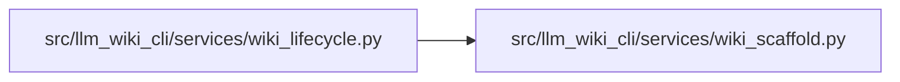

# wiki_scaffold Module

**Path:** `src/llm_wiki_cli/services/wiki_scaffold.py`

## Description

Canonical bytes for a pristine wiki scaffold.

Bootstrap may replace the pristine scaffold content during first adoption. Any
other content under the target wiki directory belongs to an existing or partial
wiki and must be handled by sync or migration instead.

## Imports

| Source | Symbols |
|--------|---------|
| `__future__` | `annotations` |

## Local dependency map

<!-- Auto-generated local dependency summary. Do not edit by hand. -->

### Internal neighbors

| Direction | Module |
|---|---|
| Inbound | [wiki_lifecycle](../modules/wiki_lifecycle.md) |
