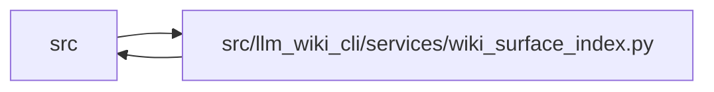

# wiki_surface_index Module

**Path:** `src/llm_wiki_cli/services/wiki_surface_index.py`

## Description

Machine-readable index for generated wiki surfaces.

## Imports

| Source | Symbols |
|--------|---------|
| `.io` | `write_bytes_atomic` |
| `.paths` | `normalize_source_path` |
| `.validation` | `normalize_optional_portable_relative_path` |
| `.wiki_media` | `build_asset_index`, `is_assets_path`, `iter_markdown_link_targets`, `normalize_markdown_link_target` |
| `.wiki_surface` | `PageKind`, `WikiSurfaceError`, `WikiSurfacePage`, `collect_wiki_pages`, `iter_page_kinds` |
| `__future__` | `annotations` |
| `dataclasses` | `dataclass` |
| `hashlib` | `hashlib` |
| `json` | `json` |
| `pathlib` | `Path` |
| `re` | `re` |
| `typing` | `Any`, `Mapping`, `Optional`, `Sequence`, `Union` |
| `urllib.parse` | `unquote` |

## Local dependency map

<!-- Auto-generated local dependency summary. Do not edit by hand. -->

> Module-level dependencies exceed the generated-diagram limits, so the diagram and table below group them by top-level package. Counts report the number of module neighbors in each package.

### Internal neighbors

| Direction | Module |
|---|---|
| Inbound | `src` (21) |
| Outbound | `src` (5) |

> All 26 module neighbor(s) are summarized by package because the module-level view exceeds the 12-node limit.

## Classes

| Class | Line | Bases | Description |
|-------|------|-------|-------------|
| [SurfaceIndexEvaluation](../entities/SurfaceIndexEvaluation.md) | 39 | — | One collected canonical-page view reused by projection builders. |

## Functions

| Function | Signature | Decorators | Description |
|----------|-----------|------------|-------------|
| `build_surface_index` | `(wiki_dir: Union[str, Path], inventory: Mapping[str, Mapping[str, Any]], *, src_dir: Union[str, Path] = '.', entity_page_cache: Optional[Mapping[tuple[str, str], str]] = None, entity_occurrence_page_cache: Optional[Mapping[tuple[str, str, int], str]] = None, module_page_map: Optional[Mapping[str, str]] = None, entry_points: Optional[Sequence[Mapping[str, Any]]] = None, workflow_entries: Optional[Sequence[Mapping[str, Any]]] = None, page_source_overrides: Optional[Mapping[str, Optional[str]]] = None) -> dict[str, Any]` | — | Build the deterministic wiki surface index payload. |
| `evaluate_surface_index` | `(wiki_dir: Union[str, Path], inventory: Mapping[str, Mapping[str, Any]], *, src_dir: Union[str, Path] = '.', entity_page_cache: Optional[Mapping[tuple[str, str], str]] = None, entity_occurrence_page_cache: Optional[Mapping[tuple[str, str, int], str]] = None, module_page_map: Optional[Mapping[str, str]] = None, entry_points: Optional[Sequence[Mapping[str, Any]]] = None, workflow_entries: Optional[Sequence[Mapping[str, Any]]] = None, page_source_overrides: Optional[Mapping[str, Optional[str]]] = None) -> SurfaceIndexEvaluation` | — | Collect pages/assets once and build exact surface-index v1 bytes. |
| `write_surface_index` | `(wiki_dir: Union[str, Path], inventory: Mapping[str, Mapping[str, Any]], *, src_dir: Union[str, Path] = '.', entity_page_cache: Optional[Mapping[tuple[str, str], str]] = None, entity_occurrence_page_cache: Optional[Mapping[tuple[str, str, int], str]] = None, module_page_map: Optional[Mapping[str, str]] = None, entry_points: Optional[Sequence[Mapping[str, Any]]] = None, workflow_entries: Optional[Sequence[Mapping[str, Any]]] = None, page_source_overrides: Optional[Mapping[str, Optional[str]]] = None) -> tuple[Path, str]` | — | Write the surface index artifact and return ``(path, state)``. |
| `_read_page_content` | `(pages: list[WikiSurfacePage]) -> dict[str, str]` | — | — |
| `_page_entries` | `(pages: list[WikiSurfacePage], content_by_path: Mapping[str, str], sources: Mapping[tuple[PageKind, str], Optional[str]], src_root: Path, *, page_source_overrides: Optional[Mapping[str, Optional[str]]] = None) -> list[dict[str, Any]]` | — | — |
| `_validated_page_source_overrides` | `(pages: Sequence[WikiSurfacePage], overrides: Optional[Mapping[str, Optional[str]]], src_root: Path) -> dict[str, Optional[str]]` | — | Validate explicit source mappings for already active canonical pages. |
| `_source_maps` | `(inventory: Mapping[str, Mapping[str, Any]], src_root: Path, *, entity_page_cache: Optional[Mapping[tuple[str, str], str]], entity_occurrence_page_cache: Optional[Mapping[tuple[str, str, int], str]], module_page_map: Optional[Mapping[str, str]], entry_points: Optional[Sequence[Mapping[str, Any]]], workflow_entries: Optional[Sequence[Mapping[str, Any]]]) -> dict[tuple[PageKind, str], Optional[str]]` | — | — |
| `_flow_entries` | `(pages: list[WikiSurfacePage], entry_points: Sequence[Mapping[str, Any]], src_root: Path) -> list[dict[str, Any]]` | — | — |
| `_counts` | `(page_entries: Sequence[Mapping[str, Any]]) -> dict[str, Any]` | — | — |
| `_outgoing_internal_links` | `(page: WikiSurfacePage, content: str, canonical_by_path: Mapping[Path, str]) -> list[str]` | — | — |
| `_resolve_internal_target` | `(page: WikiSurfacePage, raw_link: str, canonical_by_path: Mapping[Path, str]) -> Optional[str]` | — | — |
| `_source_path_from_markdown` | `(content: str, src_root: Path) -> Optional[str]` | — | — |
| `_safe_source_path` | `(value: object, src_root: Path) -> Optional[str]` | — | Normalize observational source metadata, retaining only portable output. |
| `_markdown_title` | `(content: str, fallback: str) -> str` | — | — |
| `_inventory_fingerprint` | `(inventory: Mapping[str, Mapping[str, Any]], src_root: Path) -> list[dict[str, Any]]` | — | — |
| `_stable_hash` | `(payload: Mapping[str, Any]) -> str` | — | — |
