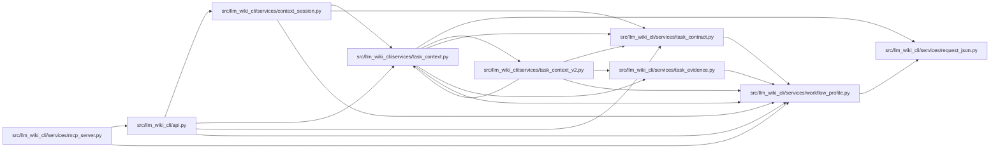

# workflow_profile Module

**Path:** `src/llm_wiki_cli/services/workflow_profile.py`

## Description

Normalizes explicitly supplied workflow settings within immutable host ceilings. Profiles can narrow permitted scope and resource use, but cannot select roots, load tokenizer paths, prepare helpers or authorize execution. Native availability, freshness preference and semantic judgment retain distinct meanings.

## Imports

| Source | Symbols |
|--------|---------|
| `.request_json` | `load_request` |
| `__future__` | `annotations` |
| `collections.abc` | `Mapping` |
| `dataclasses` | `dataclass`, `fields` |
| `hashlib` | `hashlib` |
| `json` | `json` |
| `pathlib` | `Path` |
| `typing` | `Any` |

## Local dependency map

<!-- Auto-generated local dependency summary. Do not edit by hand. -->

### Internal neighbors

| Direction | Module |
|---|---|
| Inbound | [api](../modules/api.md) |
| Inbound | [context_session](../modules/context_session.md) |
| Inbound | [mcp_server](../modules/mcp_server.md) |
| Inbound | [task_context](../modules/task_context.md) |
| Inbound | [task_context_v2](../modules/task_context_v2.md) |
| Inbound | [task_contract](../modules/task_contract.md) |
| Inbound | [task_evidence](../modules/task_evidence.md) |
| Outbound | [request_json](../modules/request_json.md) |

## Classes

| Class | Line | Bases | Description |
|-------|------|-------|-------------|
| [WorkflowRequestError](../entities/WorkflowRequestError.md) | 28 | `ValueError` | A workflow request is invalid before any workspace access. |
| [WorkflowPolicy](../entities/WorkflowPolicy.md) | 92 | — | Trusted host ceilings; profiles and task data can only narrow these. |
| [WorkflowProfile](../entities/WorkflowProfile.md) | 113 | — | Immutable explicit settings; each payload access returns detached data. |

## Functions

| Function | Signature | Decorators | Description |
|----------|-----------|------------|-------------|
| `canonical_json` | `(value: Any) -> bytes` | — | — |
| `content_id` | `(domain: str, value: Any) -> str` | — | — |
| `bounded_int` | `(value: object, field: str, maximum: int, *, minimum: int = 1) -> int` | — | — |
| `bounded_text` | `(value: object, field: str, maximum: int = 4096, *, empty: bool = False) -> str` | — | — |
| `exact_fields` | `(value: object, allowed: set[str], field: str) -> dict[str, Any]` | — | — |
| `_settings` | `(value: object) -> dict[str, Any]` | — | — |
| `normalize_profile` | `(profile: WorkflowProfile \| Mapping[str, Any] \| None = None, *, policy: WorkflowPolicy \| None = None, overrides: Mapping[str, Any] \| None = None) -> WorkflowProfile` | — | — |
| `load_profile` | `(path: str \| Path, *, policy: WorkflowPolicy \| None = None) -> WorkflowProfile` | — | Load only the explicitly named profile file; no ambient discovery. |