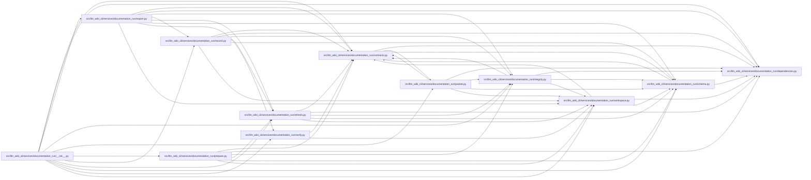

# workspace Module

**Path:** `src/llm_wiki_cli/services/documentation_run/workspace.py`

## Description

Documentation-run workspace services.

## Imports

| Source | Symbols |
|--------|---------|
| `.contracts` | `*` |
| `.dependencies` | `*` |
| `.schema` | `*` |
| `__future__` | `annotations` |

## Local dependency map

<!-- Auto-generated local dependency summary. Do not edit by hand. -->

> Diagram shows 55 of 60 local dependency edges; 5 omitted to keep the visualization within the generated-diagram limits. Complete inbound and outbound dependencies remain in the tables below.

### Internal neighbors

| Direction | Module |
|---|---|
| Inbound | [documentation_run___init__](../modules/documentation_run___init__.md) |
| Inbound | [export](../modules/export.md) |
| Inbound | [integrity](../modules/integrity.md) |
| Inbound | [packet](../modules/packet.md) |
| Inbound | [prepare](../modules/prepare.md) |
| Inbound | [record](../modules/record.md) |
| Inbound | [refresh](../modules/refresh.md) |
| Inbound | [verify](../modules/verify.md) |
| Outbound | [documentation_run_contracts](../modules/documentation_run_contracts.md) |
| Outbound | [documentation_run_dependencies](../modules/documentation_run_dependencies.md) |
| Outbound | [documentation_run_schema](../modules/documentation_run_schema.md) |

## Functions

| Function | Signature | Decorators | Description |
|----------|-----------|------------|-------------|
| `documentation_run_path` | `(workspace: str \| Path) -> Path` | — | — |
| `load_documentation_run` | `(workspace: str \| Path) -> DocumentationRun` | — | — |
| `save_documentation_run` | `(workspace: str \| Path, run: DocumentationRun) -> DocumentationRun` | — | — |
| `transition_documentation_run` | `(run: DocumentationRun, target_state: str, *, resume_state: str \| None = None) -> DocumentationRun` | — | — |
| `get_documentation_run_status` | `(workspace: str \| Path) -> DocumentationRunStatus` | — | — |
| `_uses_windows_guarded_path_writes` | `() -> bool` | — | — |
| `_archive_timestamp` | `() -> str` | — | — |
| `_resolve_workspace_root_argument` | `(workspace: str \| Path) -> Path` | — | Resolve a workspace without accepting a redirected root argument. |
| `_create_workspace_layout` | `(workspace_root: Path, *, initial_transaction: _InitialPrepareTransaction \| None = None, existing_root_identity: tuple[int, int, int] \| None = None) -> None` | — | — |
| `_assert_existing_workspace_layout_safe` | `(workspace_root: Path) -> None` | — | Reject pre-existing redirects before the lifecycle performs any write. |
| `_assert_new_documentation_workspace_empty` | `(workspace_root: Path) -> tuple[int, int, int] \| None` | — | Require a pristine root before creating a new lifecycle trust boundary. |
| `_assert_workspace_output_tree_safe` | `(workspace_root: Path, relative_root: str) -> None` | — | Reject redirects and special files anywhere in lifecycle-owned outputs. |
| `_assert_workspace_control_tree_safe` | `(workspace_root: Path) -> None` | — | Reject links, reparse points, and special files in run control state. |
| `_assert_safe_workspace_directory` | `(workspace_root: Path, directory: Path, relative: str) -> None` | — | — |
| `_write_runtime_policy` | `(workspace_root: Path, policy: DocumentationMutationPolicy) -> None` | — | — |
| `_portable_source_selection_identity` | `(portable_policy: Mapping[str, Any]) -> dict[str, str] \| None` | — | Strictly decode the documentation run's optional selection identity. |
| `_resolve_bound_source_selection` | `(source_root: Path, portable_policy: Mapping[str, Any]) -> SourceSelectionPolicy \| None` | — | Resolve the exact policy recorded by a prepared documentation run. |
| `_bound_source_selection_argument` | `(portable_policy: Mapping[str, Any]) -> str \| None` | — | Return the pinned repository-relative selection path for a run. |
| `_build_bound_source_snapshot` | `(source_root: Path, portable_policy: Mapping[str, Any], *, include_tests: Iterable[str] \| None = None) -> SourceSnapshot` | — | Capture selected run inputs while rejecting policy drift and fallback. |
| `_capture_bound_source_baseline` | `(source_root: Path, portable_policy: Mapping[str, Any], *, source_snapshot: SourceSnapshot \| None = None) -> TreeBaseline` | — | Preserve the broad legacy baseline when no selection is configured. |
| `_compare_bound_source_baseline` | `(baseline: TreeBaseline, source_root: Path, portable_policy: Mapping[str, Any]) -> IntegrityDifference` | — | Compare with the capture mode bound into the documentation run. |
| `_capture_bound_source_plugin_baseline` | `(source_root: Path) -> TreeBaseline` | — | — |
| `_compare_bound_source_plugin_baseline` | `(baseline: TreeBaseline, source_root: Path) -> IntegrityDifference` | — | — |
| `_portable_bootstrap_summary` | `(summary: Mapping[str, Any], *, workspace_root: Path) -> dict[str, Any]` | — | — |
| `_workspace_path` | `(workspace_root: Path, relative: str) -> Path` | — | — |
| `_stage_event_path` | `(workspace_root: Path, stage: str, *, attempt: int, event: str) -> Path` | — | — |
| `_read_json` | `(path: Path) -> dict[str, Any]` | — | — |
| `_load_bound_runtime_policy` | `(workspace_root: Path, run: DocumentationRun, *, verify_source_selection: bool = True) -> dict[str, Path \| None]` | — | Bind machine-local roots back to the validated portable run policy. |
| `_write_json` | `(path: Path, payload: Mapping[str, Any]) -> None` | — | — |
| `_control_workspace_root` | `(path: Path) -> Path` | — | — |
| `_write_workspace_text` | `(workspace_root: Path, path: Path, text: str) -> None` | — | Write after validating the workspace allowlist and every existing parent. |
| `_supports_descriptor_bound_workspace_writes` | `() -> bool` | — | — |
| `_directory_identity` | `(path: Path) -> tuple[int, int, int]` | — | — |
| `_write_descriptor_bound_workspace_text` | `(workspace_root: Path, target: Path, text: str) -> None` | — | Atomically replace a file relative to a pinned, no-follow parent fd. |
| `_fsync_directory_after_replace` | `(directory_fd: int) -> bool` | — | Flush renamed directory metadata when the mounted filesystem supports it. |
| `_assert_open_parent_within_workspace` | `(workspace_root: Path, parent: Path, opened_identity: os.stat_result) -> None` | — | — |
| `_assert_relative_write_target_regular` | `(parent_fd: int, name: str) -> None` | — | — |
