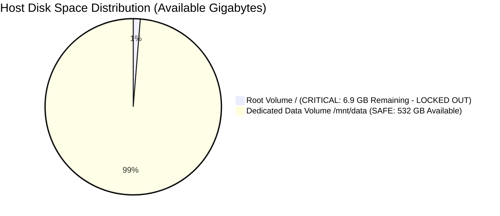
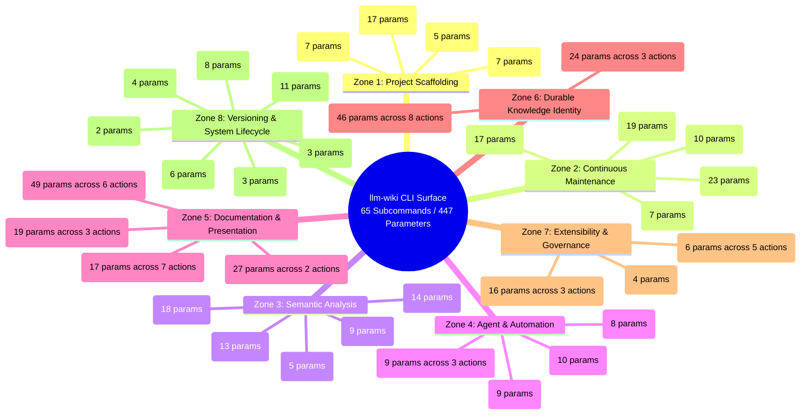
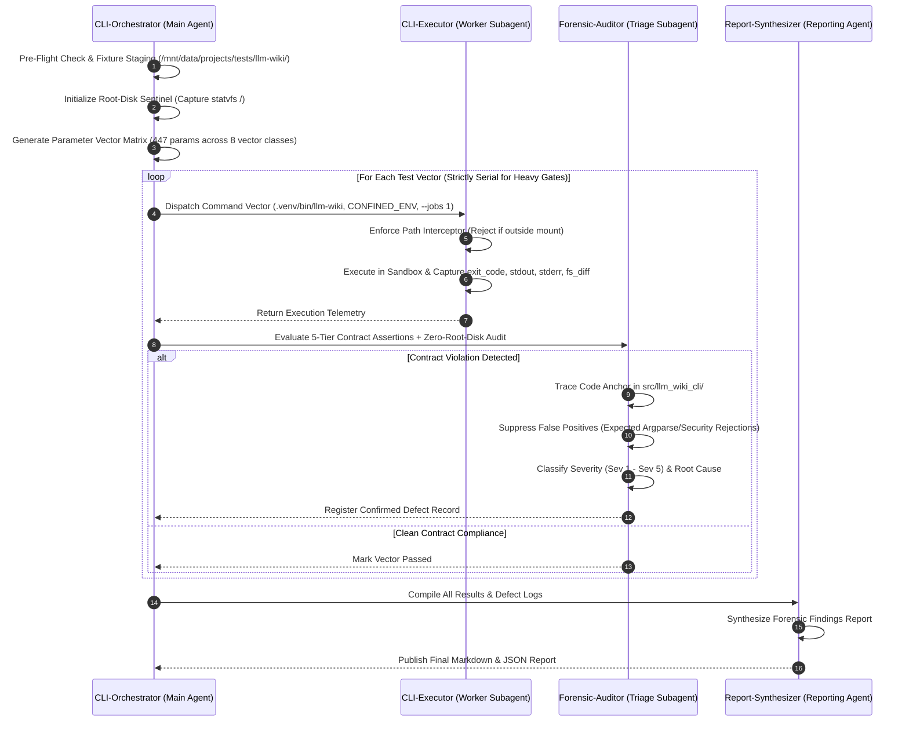
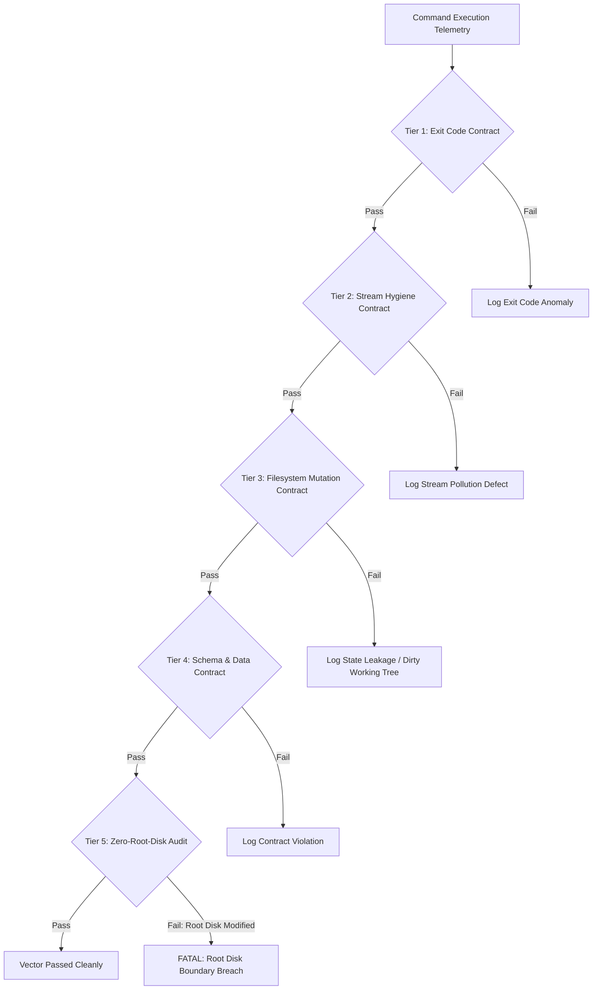
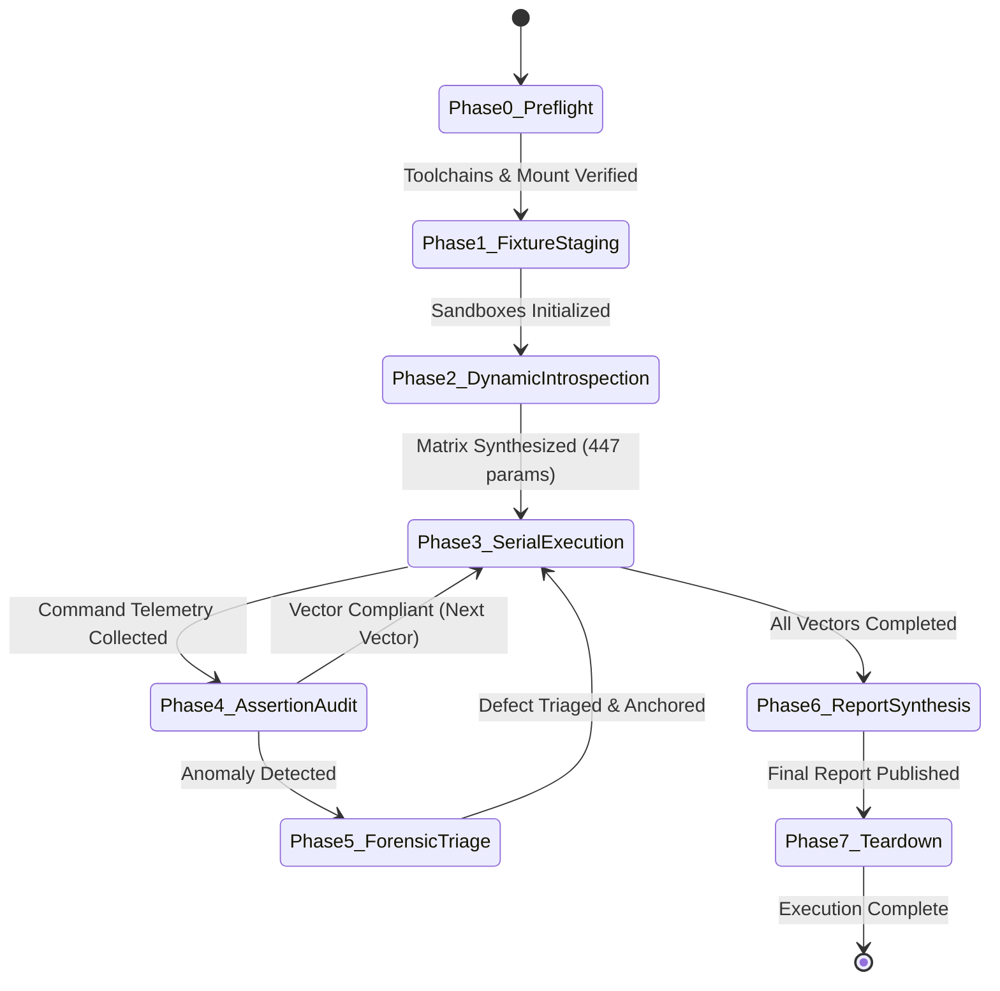

# Autonomous Agent-Driven Verification Test Plan: Complete CLI Surface & Parameter Space

**Document Version:** 1.1.0  
**Target System:** `llm-wiki` (`llm_wiki_cli`)  
**Scope:** Exhaustive Verification of All 32 CLI Root Commands, 65 Leaf Subcommands, and 447 Options/Parameters  
**Evaluation Philosophy:** Autonomous Agent-Driven Multi-Tier Verification Grounded in CLI Contract Truth, Stream Hygiene, Filesystem Idempotency, and Strict Single-Volume Confinement  
**Execution Environment:** Isolated workspace runner, `.venv/bin/python`, `.venv/bin/llm-wiki`, `--jobs 1`, read-only source inspection (`--allow-external-src`)  
**Absolute Storage Boundary:** `/mnt/data/projects/tests/llm-wiki/` (**Zero-Root-Disk Policy: No operation, temporary write, cache, or state may touch the root volume `/` or system `/tmp`**)  
**Supported Platforms:** Linux (Ubuntu 20.04+), macOS (ARM64/x86_64), Windows (Win32/x64, Python 3.9+)

---

## 1. Executive Summary & Strategic Vision

The `llm-wiki` command-line interface provides an extensive, highly sensitive surface of 32 root commands, 65 distinct leaf actions, and 447 configuration parameters. This surface controls everything from initial codebase AST extraction, incremental knowledge graph updates, documentation site generation, and Obsidian vault synchronization to agent prompt compilation, local MCP server hosting, and semantic calibration workflows.

Traditional static unit tests only test mock invocations in isolation (`monkeypatch.setattr("sys.argv", ...)`). They cannot detect:
1. **Stream Contamination:** Diagnostic messages or progress logs leaking into `stdout` when `--format json` or machine-readable streams are requested, silently breaking downstream agentic tools.
2. **Side-Effect Leakage:** Commands executed with `--dry-run` or `--read-only` leaving stray lockfiles, unversioned cache entries, or modified manifests on disk.
3. **Cross-Platform Path Discrepancies:** Path validation logic failing under Windows backslashes (`\`), case-insensitive filesystems, or UNC paths, while passing on Linux POSIX environments.
4. **Parameter Inversion & Collision Hazards:** Undefined behaviors or unhandled exceptions when mutually contradictory or complementary flags (e.g. `--report` vs `--no-report`, `--skills` vs `--no-skills`, `--openapi-file` vs `--clear-openapi-file`) are passed together or in non-standard sequences.
5. **Resource Exhaustion Cascades:** Parallel execution spikes causing `ENOSPC`, `EMFILE`, `ENFILE`, or `ENOMEM` when heavy gates (`sync`, `lint`, `ci-check`, `context`, `bootstrap`) are triggered concurrently.

### 1.1 The Agentic Verification Paradigm

This test plan defines an autonomous, closed-loop verification cycle executed by specialized autonomous agents. Rather than running a fixed, static script, the test cycle is dynamically driven by an intelligent multi-agent harness that:
- **Introspects** the live CLI parser directly from [src/llm_wiki_cli/cli.py](file:///mnt/data/projects/llm-wiki/python-wiki-llm/src/llm_wiki_cli/cli.py) to extract parameter definitions, defaults, and constraints.
- **Synthesizes** combinatorial and boundary test vectors across 8 parameter classes.
- **Executes** tests serially within isolated ephemeral sandboxes strictly rooted under `/mnt/data/projects/tests/llm-wiki/`.
- **Audits** process exit codes, stream purity (`stdout` vs `stderr`), atomic filesystem mutations, and resource bounds.
- **Triages & Roots** anomalies back to exact source lines (`[file.py:L10-L25]`), distinguishing genuine defects from expected rejection semantics.
- **Compiles** an actionable forensic **Test & Findings Report** with reproduction scripts and concrete fix recommendations.

```mermaid
flowchart TD
    subgraph PreFlight["Phase 0: Pre-Flight & Root-Disk Lockout Gate"]
        PF1["Verify Python Virtual Environment (.venv/bin/python)"]
        PF2["Check Polyglot Helpers (Node, Go, Cargo, GHC 9.6)"]
        PF3["Assert Storage Confinement Boundary (/mnt/data/projects/tests/llm-wiki/)"]
        PF4["Arm Root-Disk Inode & Block Sentinel (/dev/nvme0n1p2 Lockout)"]
    end

    subgraph Fixtures["Phase 1: Multi-Archetype Fixture Staging"]
        FX1["Fixture-01: Empty Directory"]
        FX2["Fixture-02: Clean Python Git Repo"]
        FX3["Fixture-03: Initialized Wiki"]
        FX4["Fixture-04: Legacy Wiki"]
        FX5["Fixture-05: Polyglot (Py/TS/Go/Rust/Hs)"]
        FX6["Fixture-06: Corrupted / Drift State"]
        FX7["Fixture-07: Internal-External Target (Self-Contained in Mount)"]
        FX8["Fixture-08: Read-Only Perms Sandbox"]
    end

    subgraph Generation["Phase 2: Introspection & Matrix Synthesis"]
        GEN1["Parser AST Introspection (65 Leaves, 447 Parameters)"]
        GEN2["Equivalence Partitioning & Boundary Values"]
        GEN3["Flag Inversion & Collision Pairs"]
        GEN4["Pathological & Security Fuzzing"]
    end

    subgraph Execution["Phase 3: Serial Agentic Execution Harness"]
        EX1["Supervising Agent: Heavy-Gate Serializer (--jobs 1)"]
        EX2["Execution Worker: Command Dispatch & Telemetry Capture"]
        EX3["Strict Path Interceptor: Rejects Any Path Outside Mount"]
        EX4["Resource Watchdog: ENOSPC / Memory / Watcher Protection"]
    end

    subgraph Verification["Phase 4: Multi-Tier Assertion Engine"]
        V1["Tier 1: Exit Code Taxonomy (0, 1, 2, 130)"]
        V2["Tier 2: Stream Purity (JSON parseability on stdout, logs to stderr)"]
        V3["Tier 3: Filesystem State & Dry-Run Idempotency"]
        V4["Tier 4: Cross-Platform Path & Limit Compliance"]
        V5["Tier 5: Zero-Root-Disk Audit (statvfs / Delta == 0)"]
    end

    subgraph Triage["Phase 5: Forensic Triage & Root Cause"]
        TR1["False Positive Suppression Filter"]
        TR2["Source Code Anchor Localization ([file.py:Lxx-Lyy])"]
        TR3["Severity Rating (Blocker, Critical, Major, Minor, Cosmetic)"]
    end

    subgraph Reporting["Phase 6: Synthesis & Final Report"]
        RP1["Parameter Coverage Scorecard"]
        RP2["Detailed Forensic Defect Catalog"]
        RP3["Actionable Remediation Backlog"]
    end

    PreFlight --> Fixtures
    Fixtures --> Generation
    Generation --> Execution
    Execution --> Verification
    Verification --> Triage
    Triage --> Reporting
```



---

## 2. Storage Architecture & Strict Single-Volume Confinement

### 2.1 The Zero-Root-Disk Policy

Host storage diagnostics reveal critical partition asymmetry:
- **Root Volume (`/dev/nvme0n1p2` mounted on `/`):** 234 GB total, 215 GB used, **only 6.9 GB available (97% utilization)**.
- **Dedicated Data Volume (`/dev/nvme1n1p1` mounted on `/mnt/data`):** 916 GB total, 338 GB used, **532 GB available (39% utilization)**.



> [!CAUTION]
> **STRICT ROOT DISK LOCKOUT MANDATE**  
> Under NO circumstances may any test operation, temporary directory creation, helper preparation, or artifact write touch the root volume `/`. Writing to `/tmp`, `/var/tmp`, `/home/mike`, `~/.cache`, or `~/.local` risks immediate disk exhaustion (`ENOSPC`) and catastrophic operating system instability.  
> **All test execution, sandboxing, fixtures, caches, temporary files, home virtualization, and reports MUST live strictly under `/mnt/data/projects/tests/llm-wiki/`.**

### 2.2 Dedicated Storage Topology under `/mnt/data/projects/tests/llm-wiki/`

The test harness provisions a fully self-contained directory tree rooted exclusively on the dedicated data volume:

```
/mnt/data/projects/tests/llm-wiki/
├── home/                         # Virtualized $HOME directory (isolates ~/.cache, ~/.config, ~/.gitconfig)
├── tmp/                          # Confined process temporary directory ($TMPDIR, $TEMP, $TMP)
├── cache/                        # Confined toolchain & inventory cache
│   ├── inventory/                # Dedicated --cache-dir for llm-wiki AST & manifest caches
│   └── helpers/                  # Dedicated --helper-cache-dir for TS, Go, Rust, Haskell binaries
├── fixtures/                     # Isolated multi-archetype test codebases
│   ├── FIXTURE-01_empty_root/
│   ├── FIXTURE-02_clean_git_python/
│   ├── FIXTURE-03_initialized_wiki/
│   ├── FIXTURE-04_legacy_wiki/
│   ├── FIXTURE-05_polyglot_corpus/
│   ├── FIXTURE-06_corrupted_drift/
│   ├── FIXTURE-07_external_target/   # Self-contained target for testing --allow-external-src
│   └── FIXTURE-08_readonly_wiki/
├── runs/                         # Ephemeral per-test execution workspaces
│   └── cli_eval_<timestamp>/
├── failures/                     # Quarantined failure artifacts and reproduction sandboxes
└── reports/                      # Final forensic findings reports and coverage scorecards
```

### 2.3 Environmental Hardening & Process Confinement

Every command dispatched by the autonomous test runner is executed with a sanitized environment dictionary that forces all system temp, cache, and home lookups to stay inside the designated directory:

```python
CONFINED_ENV = {
    **os.environ,
    # Force temporary files away from /tmp into the dedicated mount
    "TMPDIR": "/mnt/data/projects/tests/llm-wiki/tmp",
    "TEMP": "/mnt/data/projects/tests/llm-wiki/tmp",
    "TMP": "/mnt/data/projects/tests/llm-wiki/tmp",
    # Virtualize XDG base directories away from /home/mike
    "XDG_CACHE_HOME": "/mnt/data/projects/tests/llm-wiki/cache",
    "XDG_CONFIG_HOME": "/mnt/data/projects/tests/llm-wiki/home/.config",
    "XDG_DATA_HOME": "/mnt/data/projects/tests/llm-wiki/home/.local/share",
    # Virtualize user home
    "HOME": "/mnt/data/projects/tests/llm-wiki/home",
    # Project-specific cache overrides
    "LLM_WIKI_CACHE_DIR": "/mnt/data/projects/tests/llm-wiki/cache/inventory",
}
```

### 2.4 Pre-Execution Path Interceptor & Root-Disk Sentinel

To guarantee absolute compliance before launching any process:
1. **Pre-Execution Path Interceptor:** The runner scans all arguments in `sys.argv`. Any argument representing a path (`--src-dir`, `--wiki-dir`, `--cache-dir`, `--helper-cache-dir`, `--output`, `--dest`, `--vault-dir`, `--out-dir`, `--capture-dir`, `--root`, `--workspace`) is resolved using `Path(arg).resolve()`. If the resolved path does not start with `/mnt/data/projects/tests/llm-wiki/`, the runner aborts immediately without executing the command, logging a **Sev 1 Boundary Breach**.
2. **Root-Disk Inode & Block Sentinel:** Before and after every test batch, the runner captures `statvfs('/')`. If `f_bfree` (free blocks) or `f_ffree` (free inodes) on the root filesystem decreases by more than 0, the runner halts all testing and flags an immediate leakage violation.

### 2.5 Self-Contained Testing of Path Traversal & External Escapes

Testing security boundary rejection (e.g. [`PathValidationError`](file:///mnt/data/projects/llm-wiki/python-wiki-llm/src/llm_wiki_cli/config.py#L121-L142) and `--allow-external-src`) must never point to `/`, `/etc`, or `/home`. Instead, escapes are tested entirely within the mount:
- **Test Sandbox:** `/mnt/data/projects/tests/llm-wiki/runs/cli_eval_<timestamp>/sandbox/`
- **Target Fixture:** `/mnt/data/projects/tests/llm-wiki/fixtures/FIXTURE-07_external_target/`
- When executing inside the sandbox, passing `--src-dir ../../../fixtures/FIXTURE-07_external_target` escapes the current working directory, triggering [`validate_path()`](file:///mnt/data/projects/llm-wiki/python-wiki-llm/src/llm_wiki_cli/config.py#L125-L142) rejection while remaining 100% physically contained on the safe data volume.

---

## 3. System Rules & Execution Governance

Autonomous agents executing this test plan must strictly adhere to the following governance rules:

### 3.1 Python Environment Rules
- **Strict Virtual Environment Prefix:** Always use `.venv/bin/python`, `.venv/bin/llm-wiki`, `.venv/bin/pytest`. Bare `python`, `pip`, or `llm-wiki` commands are prohibited.
- **Runtime Compatibility:** The CLI must remain fully operational on Python 3.9 through Python 3.13+. Tests must not use Python 3.10+ syntax features in code meant for cross-version compatibility without appropriate conditionals.

### 3.2 Interactive Resource & Heavy Gate Rules
- **Heavy Gates Definition:** `bootstrap`, `sync`, `lint`, `ci-check`, `context`, `doctor`, and full `pytest` runs are heavy gates.
- **Strictly Serial Execution:** Never run heavy gates concurrently. The supervising agent owns the schedule.
- **Worker Cap:** Always execute interactive or automated verification with `--jobs 1`. `--jobs auto` is reserved exclusively for isolated CI capacity with pre-allocated compute.
- **Resource Failure Emergency Brake:** On `ENOSPC`, `EMFILE`, `ENFILE`, `ENOMEM`, `EAGAIN`, or `MemoryError`, agents must stop immediately. Automatic retries are forbidden. Mark the test inconclusive, log resource diagnostics, and recover capacity before allowing a single manual `--jobs 1` re-attempt.

### 3.3 Stream Separation & Standard Stream Contracts
- **`stdout`:** Exclusively reserved for clean, machine-readable output payload (e.g. valid JSON under `--format json`, Markdown under `--format markdown`, or clean human text). No banners, warnings, or progress meters may contaminate stdout.
- **`stderr`:** Reserved for progress events, diagnostic logs, and error messages.
- **Plan Flushes:** Commands supporting `--jobs` write exactly one flushed plan line to stderr before work starts without leaking to stdout.

---

## 4. Comprehensive CLI Surface Inventory & Functional Zones

The 65 leaf subcommands are organized into 8 functional capability zones comprising 447 parameters:



### 4.1 Zone 1: Project Scaffolding & Setup (4 Subcommands, 37 Parameters)
Responsible for repo onboarding, toolchain helper preparation, and CI workflow bootstrapping.

| Subcommand | Parameters | Key Verification Focus |
|---|---|---|
| `init` | `--agent`, `--wiki-dir`, `--no-quality-hints`, `--no-skills`, `--issue-reporting`, `--no-issue-reporting`, `--source-selection` | Agent instruction file generation (`AGENTS.md`, `.cursorrules`, etc.), issue directory creation, idempotency on repeated run. |
| `bootstrap` | `--src-dir`, `--wiki-dir`, `--overwrite`, `--depth`, `--skip-workflows`, `--skip-flows`, `--skip-data-flow`, `--skip-dependencies`, `--api-contracts`, `--openapi-file`, `--dependency-graph-detail`, `--format`, `--source-adapter`, `--allow-external-src`, `--helper-cache-dir`, `--include-tests`, `--source-selection` | First-use safety (rejects existing non-empty wiki), full vs shallow depth, selective section omission, OpenAPI integration. Retained `--overwrite` must fail cleanly. |
| `prepare-extractors` | `--src-dir`, `--allow-external-src`, `--cache-dir`, `--language`, `--plan`, `--format`, `--source-selection` | Preparation and caching of external language helpers (TypeScript, Go, Rust, Haskell); `--plan` dry-run verification. |
| `install-ci` | `--action-ref`, `--src-dir`, `--wiki-dir`, `--dry-run`, `--force` | GitHub Actions workflow scaffolding (`.github/workflows/llm-wiki.yml`), force overwrites, dry-run safety. |

### 4.2 Zone 2: Continuous Maintenance & Health Auditing (5 Subcommands, 76 Parameters)
The core operational loop maintaining wiki freshness, verifying integrity, and scheduling maintenance.

| Subcommand | Parameters | Key Verification Focus |
|---|---|---|
| `sync` | `--progress`, `--progress-format`, `--rebuild-knowledge`, `--src-dir`, `--allow-external-src`, `--wiki-dir`, `--no-cache`, `--rebuild-cache`, `--cache-stats`, `--cache-dir`, `--helper-cache-dir`, `--include-tests`, `--jobs`, `--force`, `--openapi-file`, `--clear-openapi-file`, `--initialize-surfaces`, `--flow-category`, `--exclude-tests`, `--dry-run`, `--no-plugins`, `--no-preserve-semantic`, `--source-selection` | Incremental change detection, manifest hashing, semantic preservation, cache invalidation, surface initialization, `--jobs 1` serialization. |
| `lint` | `--progress`, `--progress-format`, `--wiki-dir`, `--src-dir`, `--allow-external-src`, `--strict`, `--knowledge-drift-report`, `--profile`, `--no-cache`, `--rebuild-cache`, `--cache-stats`, `--cache-dir`, `--media-size-warn-bytes`, `--helper-cache-dir`, `--include-tests`, `--source-selection`, `--jobs` | Broken wikilinks, orphaned pages, AST drift detection, media size bounds, strict exit code (1 on violations). |
| `ci-check` | `--progress`, `--progress-format`, `--src-dir`, `--allow-external-src`, `--wiki-dir`, `--format`, `--report`, `--no-report`, `--report-schema`, `--cache-dir`, `--no-cache`, `--rebuild-cache`, `--cache-stats`, `--knowledge-drift-report`, `--no-plugins`, `--helper-cache-dir`, `--include-tests`, `--source-selection`, `--jobs` | Strict validation for CI runners, JSON report schema conformity (v1/v2), mutual exclusion between `--report` and `--no-report`. |
| `doctor` | `--capabilities`, `--wiki-dir`, `--src-dir`, `--allow-external-src`, `--format`, `--strict`, `--helper-cache-dir`, `--include-tests`, `--source-selection`, `--jobs` | Wiki knowledge health check, exit code 0/1/2 taxonomy, capability provider detection (Node, Go, Cargo, GHC), corrective commands. |
| `queue` | `--src-dir`, `--wiki-dir`, `--allow-external-src`, `--limit`, `--format`, `--source-selection`, `--helper-cache-dir` | Maintenance task prioritization, limit clamping, deterministic scoring. |

### 4.3 Zone 3: Semantic Analysis & Codebase Intelligence (5 Subcommands, 59 Parameters)
Read-only exploration, AST dumping, and token-budgeted prompt construction for LLMs.

| Subcommand | Parameters | Key Verification Focus |
|---|---|---|
| `extract` | `--src-dir`, `--changed`, `--summary`, `--paths`, `--deep`, `--openapi-file`, `--package`, `--include-empty`, `--include-tests`, `--helper-cache-dir`, `--source-selection`, `--output`, `--read-only`, `--allow-external-src` | Raw AST extraction, summary vs deep mode, path filtering, file-system immutability under `--read-only`. |
| `context` | `--budget`, `--budget-mode`, `--tokenizer`, `--base`, `--head`, `--staged`, `--changed-path`, `--src-dir`, `--wiki-dir`, `--format`, `--focus`, `--request`, `--output`, `--read-only`, `--allow-external-src`, `--prefer-fresh`, `--knowledge-mode`, `--source-selection` | Priority-ranked token context packager, budget enforcement, git diff scoping, fresh vs cached extraction. |
| `review` | `--src-dir`, `--allow-external-src`, `--wiki-dir`, `--base`, `--head`, `--staged`, `--changed-path`, `--patch`, `--format`, `--summary-output`, `--impact-output`, `--helper-cache-dir`, `--source-selection` | Static architectural review of diffs, impact assessment, output artifact generation. |
| `search` | `query` (pos), `--src-dir`, `--wiki-dir`, `--allow-external-src`, `--kind`, `--limit`, `--mode`, `--format`, `--source-selection` | Symbol, path, and text search across wiki pages; ranked vs exact mode; JSON vs text format. |
| `api-diff` | `--baseline`, `--candidate`, `--src-dir`, `--allow-external-src`, `--format` | OpenAPI specification compatibility checking, breaking change detection, JSON output. |

### 4.4 Zone 4: Agent & Automation Interface (6 Subcommands, 32 Parameters)
Bridges between human developers, IDE agents, and background tool protocols.

| Subcommand | Parameters | Key Verification Focus |
|---|---|---|
| `generate-prompt` | `--wiki-dir`, `--src-dir`, `--allow-external-src`, `--output`, `--print`, `--change-type`, `--template`, `--source-selection` | Sync prompt generation for IDE agents, `--print` to stdout vs file output. |
| `mcp` | `--src-dir`, `--allow-external-src`, `--wiki-dir`, `--transport`, `--host`, `--port`, `--path`, `--allowed-origin`, `--source-selection` | Model Context Protocol server startup, stdio vs sse transports, CORS origin validation, read-only tools exposure. |
| `trigger-agent` | `--agent`, `--wiki-dir`, `--src-dir`, `--allow-external-src`, `--reset-breaker`, `--timeout`, `--max-diff-lines`, `--max-prompt-bytes`, `--force`, `--source-selection` | Agent CLI spawning, timeout enforcement, circuit breaker triggering and resetting. |
| `skills list` | `--format` | Enumeration of bundled agent skills (`SKILL.md` workflows). |
| `skills export` | `--dest`, `--skill`, `--force`, `--format` | Export of skills to target destination directory; `--force` overwrite check. |
| `skills install` | `--dest`, `--skill`, `--force`, `--format` | Installation of skills into active workspace. |

### 4.5 Zone 5: Documentation & Presentation Surfaces (18 Subcommands, 109 Parameters)
Manages static site publishing, Obsidian vault export, and calibration workspaces.

| Subcommand Group | Subcommands Included | Key Verification Focus |
|---|---|---|
| `docs` (Standard) | `prepare`, `packet`, `record-result`, `status`, `verify`, `export` | Documentation pipeline lifecycle: workspace setup, intake ingestion, audience adaptation, verification advancing, artifact bundling. |
| `docs calibration` | `prepare`, `packet`, `dispatch`, `record-result`, `verify`, `status`, `admit` | Multi-role calibration harness, authority grants, receipt and attestation validation, cohort eligibility gating. |
| `obsidian` | `check`, `export`, `install-plugin` | Markdown export with Wikilink formatting, vault directory validation, frontmatter metadata injection. |
| `site` | `check`, `export` | Static site mirror export: `--format {plain,mkdocs,docusaurus}`, `--profile`, `--site-name`, `--file-friendly`, `--front-matter`, `--knowledge-metadata`, `--output-format`, and `--dry-run`; link checking. |

### 4.6 Zone 6: Durable Knowledge Identity & Lifecycle (11 Subcommands, 70 Parameters)
Audits durable concept IDs, migration history, aliasing, and verification states.

| Subcommand | Parameters | Key Verification Focus |
|---|---|---|
| `knowledge init` | `--wiki-dir`, `--bundle-id`, `--dry-run` | Knowledge bundle initialization, UUID assignment, dry-run safety. |
| `knowledge status` | `--wiki-dir`, `--format`, `--event-limit` | Knowledge registry inspection, event history limiting, JSON output. |
| `knowledge alias` | `--wiki-dir`, `--uid`, `--type {locator,natural-key}`, `--value`, `--dry-run` | Concept alias registration and uniqueness checks. |
| `knowledge deprecate` / `supersede` | `--wiki-dir`, `--uid`, `--successor-uid`, `--actor-kind`, `--actor-id`, `--authored-at`, `--reason`, `--dry-run` | Concept retirement and replacement tracking, audit trail logging. |
| `knowledge move` | `--wiki-dir`, `--uid`, `--locator`, `--natural-key`, `--dry-run` | Physical path refactoring while retaining immutable identity. |
| `knowledge review` / `verify` | `--wiki-dir`, `--uid`, `--section`, `--reviewer-*`, `--checker`, `--dry-run` | Verification stamping, cryptographic/method attestations. |
| `knowledge lifecycle *` | `deprecate`, `set`, `supersede` | Explicit lifecycle state transitions (`experimental`, `active`, `deprecated`, `retired`). |

### 4.7 Zone 7: Extensibility & Governance (8 Subcommands, 23 Parameters)
Manages local plugins, sample templates, and multi-developer team policies.

| Subcommand | Parameters | Key Verification Focus |
|---|---|---|
| `install` | `ref` (pos), `--wiki-dir`, `--dry-run`, `--yes` | Plugin installation from local directory/package, manifest validation, dry-run safety. |
| `plugins list` / `validate` / `remove` | `path` / `plugin_id` (pos), `--wiki-dir` | Plugin registry introspection, schema validation, safe uninstallation. |
| `plugins samples list` / `export` | `sample_id` (pos), `--dest`, `--force` | Built-in sample plugin export, directory collision guards. |
| `team init` / `check` / `resolve-conflicts` | `--src-dir`, `--allow-external-src`, `--wiki-dir`, `--format`, `--write`, `--source-selection`, `--jobs`, `--no-plugins` | Team policy generation (`team-policy.json`), compliance auditing, three-way merge resolution. |

### 4.8 Zone 8: Versioning & System Lifecycle (7 Subcommands, 38 Parameters)
Controls CLI self-management, version upgrades, release management, and uninstallation.

| Subcommand | Parameters | Key Verification Focus |
|---|---|---|
| `bump` | `--patch`, `--minor`, `--stage` | Semantic version bumping in `pyproject.toml`, mutually exclusive flags, git staging. |
| `release` | `--changelog`, `--stage` | CHANGELOG stamping with release version and date, staging changes. |
| `upgrade` | `--wiki-dir`, `--agent`, `--cleanup-source-agent`, `--force`, `--quality-hints`, `--no-quality-hints`, `--skills`, `--no-skills`, `--issue-reporting`, `--no-issue-reporting`, `--source-selection` | Scaffold and instruction refresh, legacy hook cleanup, agent migration, opt-in/opt-out flag pairs. |
| `metrics` | `--last`, `--format`, `--src-dir`, `--allow-external-src`, `--wiki-dir`, `--source-selection` | Wiki freshness, coverage, and quality metrics over time windows (`30d`, `90d`). |
| `status` | `--wiki-dir`, `--src-dir`, `--allow-external-src`, `--source-selection` | Overall system diagnostic overview: agent, wiki health, manifest integrity. |
| `uninstall` | `--wiki-dir`, `--remove-wiki`, `--dry-run` | Clean removal of `.llm-wiki*` artifacts; preservation of documentation unless `--remove-wiki` is specified; `--dry-run` safety. |
| `migrate` | `--src-dir`, `--allow-external-src`, `--wiki-dir`, `--dry-run`, `--chunk-size`, `--chunk`, `--plan-chunks`, `--source-selection` | Migration of legacy wiki structures, chunking for large repositories, plan generation. |

---

## 5. Autonomous Agent Architecture & Orchestration

The autonomous verification cycle is managed by an orchestrated agent team adhering to specialized responsibilities:



### 5.1 Agent Roles and Responsibilities

1. **`CLI-Orchestrator` (Supervising Agent):**
   - Owns the master schedule and parameter permutation matrix.
   - Enforces the **Heavy Gate serialization rule**: guarantees that no two heavy gates (`sync`, `lint`, `ci-check`, `bootstrap`, `context`, `doctor`) run concurrently.
   - Monitors the **Root-Disk Inode & Block Sentinel**, halting execution if any byte leaks to `/dev/nvme0n1p2`.
   - Ensures all commands run with `--jobs 1` and isolated scratch directories.

2. **`CLI-Executor` (Worker Subagent):**
   - Dispatches `.venv/bin/llm-wiki` commands exclusively in designated sandbox environments under `/mnt/data/projects/tests/llm-wiki/runs/`.
   - Injects the `CONFINED_ENV` dictionary into all subprocess spawns.
   - Intercepts all path arguments before execution; rejects any path outside `/mnt/data/projects/tests/llm-wiki/`.
   - Accurately captures process exit codes, execution wall-clock time, standard output, and standard error.
   - Captures filesystem state snapshots before and after execution to detect unexpected side effects or failed cleanup.

3. **`Forensic-Auditor` (Triage Subagent):**
   - Evaluates process behavior against the 5-tier contract assertions (Section 7).
   - Inspects unexpected stack traces, stream pollution, or exit codes.
   - Maps errors directly to source code definitions in `src/llm_wiki_cli/`.
   - Filters out expected validation rejections (e.g. `PathValidationError` on external path without `--allow-external-src` is an intentional security guard, not a defect).

4. **`Report-Synthesizer` (Reporting Agent):**
   - Calculates parameter coverage percentages and defect densities across all 8 zones.
   - Formats finding profiles containing exact reproduction commands, source code citations, and actionable patches.
   - Publishes the final forensic report to `/mnt/data/projects/tests/llm-wiki/reports/`.

---

## 6. Multi-Archetype Test Fixtures Staged in Mount

All test fixtures are staged exclusively inside `/mnt/data/projects/tests/llm-wiki/fixtures/`:

```
/mnt/data/projects/tests/llm-wiki/fixtures/
├── FIXTURE-01_empty_root/
├── FIXTURE-02_clean_git_python/
├── FIXTURE-03_initialized_wiki/
├── FIXTURE-04_legacy_wiki/
├── FIXTURE-05_polyglot_corpus/
├── FIXTURE-06_corrupted_drift/
├── FIXTURE-07_external_target/
└── FIXTURE-08_readonly_wiki/
```

### 6.1 Fixture Specifications

1. **`FIXTURE-01: Empty-Root`**
   - Completely empty directory without `.git` or documentation.
   - Tests: `init`, `bootstrap` first-use handling, error handling of commands requiring existing repositories (`sync`, `status`, `review`).
2. **`FIXTURE-02: Clean-Git-Python`**
   - Standard Python project with `.git/`, valid `pyproject.toml`, clean working tree, and 5 modules with functions and classes.
   - Tests: `init`, initial `bootstrap`, `prepare-extractors`, version bumping (`bump --patch`), `install-ci`.
3. **`FIXTURE-03: Initialized-Wiki`**
   - Valid repository containing populated `docs/llm_wiki/` with complete `.llm-wiki-manifest.json` and `.llm-wiki-knowledge.json`.
   - Tests: `sync` (incremental reuse), `lint` (clean pass), `ci-check`, `doctor`, `context`, `search`, `mcp`, `obsidian export`, `site export`, `knowledge *`.
4. **`FIXTURE-04: Legacy-Wiki-Unmigrated`**
   - Repository containing unmigrated wiki layout (legacy flat structure, missing manifest, deprecated entity filenames).
   - Tests: `migrate --dry-run`, `migrate --plan-chunks`, `sync` legacy manifest seeding, `upgrade`.
5. **`FIXTURE-05: Polyglot-Corpus`**
   - Repository containing Python, TypeScript (`package.json`, `index.ts`), Go (`go.mod`, `main.go`, `_test.go`), Rust (`Cargo.toml`, `src/main.rs`), and Haskell (`app.cabal`, `Main.hs`).
   - Tests: Multi-language extraction (`prepare-extractors`, `extract`, `bootstrap --include-tests go`, `--helper-cache-dir`).
6. **`FIXTURE-06: Corrupted-Drift`**
   - Repository with intentionally introduced defects: broken Markdown wikilinks, orphaned pages, altered source file with unmodified manifest hash, broken symlink, malformed `.llm-wiki-knowledge.json`.
   - Tests: `lint --strict`, `ci-check --knowledge-drift-report`, `doctor --capabilities`, `sync --rebuild-knowledge`.
7. **`FIXTURE-07: External-Path-Target`**
   - Staged at `/mnt/data/projects/tests/llm-wiki/fixtures/FIXTURE-07_external_target/` to serve as an external path relative to the test sandbox while remaining strictly on `/mnt/data`.
   - Tests: `--src-dir` with and without `--allow-external-src`, verifying `PathValidationError` security isolation.
8. **`FIXTURE-08: Read-Only-Wiki`**
   - Wiki directory with read-only permissions (`chmod 555`).
   - Tests: Graceful permission failure handling under `--dry-run` vs write attempts, ensuring no raw unhandled tracebacks.

---

## 7. Multi-Tier Agentic Assertion Engine & Zero-Root-Disk Audit

During execution, the autonomous agent runs 5 tiers of assertions on every completed command vector:



### 7.1 Tier 1: Process Exit Code Taxonomy
- **Exit Code 0:** Successful execution, clean lint pass, doctor healthy, or expected help/version display.
- **Exit Code 1:** Known domain validation failure, lint defects found, doctor warnings in strict mode, `PathValidationError`, or missing required environment dependencies.
- **Exit Code 2:** CLI usage/argparse error (unknown flag, missing positional argument, invalid choice) or `RuntimeOutputError` (mutually exclusive flags, invalid report schema).
- **Exit Code 130:** Clean abort on `KeyboardInterrupt` (SIGINT).
- **Defect Trigger:** Any unhandled Python exception exiting with code 1 and printing a traceback to stderr without `LLM_WIKI_DEBUG=1`.

### 7.2 Tier 2: Stream Hygiene & Separation Contract
- `stdout` must remain 100% clean of progress logs, heartbeat messages, or extractor plans.
- When `--format json` is active, `stdout` must strictly validate against standard JSON parser.
- All diagnostics, progress bars, and warnings must go to `stderr`.

### 7.3 Tier 3: Filesystem Mutation & Idempotency Contract
- If `--dry-run` or `--read-only` was specified: `git status --porcelain` must be identical before and after. No files created, modified, or unlinked.
- If writing files: writes must be atomic. Temporary files must not be left orphaned in the workspace on failure.
- Writes must remain strictly bounded within `--wiki-dir` or specified output paths. No files written outside project root.

### 7.4 Tier 4: Output Schema & Semantic Validity Contract
- If `--format json` or `--report` is generated, the JSON payload must match expected schemas:
  - `ci-check` must conform to `ci-report-v1` or `ci-report-v2`.
  - `doctor` must output valid health report dictionary with `status`, `summary`, `checks`.
  - `search` must output an array of match objects containing `path`, `title`, `score`.
  - `context` must output token-budgeted packet containing `budget_consumed`, `files`, `tokens`.

### 7.5 Tier 5: Zero-Root-Disk Audit & Platform Resilience Contract
- Free blocks and inodes on root filesystem `/` must not decrease by even 1 byte (`delta == 0`).
- Peak memory consumption must not exceed 500MB per CLI command invocation.
- Process must not open more than 128 simultaneous file descriptors during single-job extraction.
- Paths specified with Windows separators (`\`) must resolve identically to forward slashes (`/`).

---

## 8. Defect Triage & Classification Taxonomy

When an assertion fails, the `Forensic-Auditor` agent triages the anomaly using a strict classification system:

### 8.1 Severity Scale

| Severity Level | Definition | Example Scenarios |
|---|---|---|
| **Blocker (Sev 1)** | Unhandled crash on valid arguments, silent data corruption, permanent state damage, deadlock, resource leak, or **any write to root disk `/`**. | Writing to `/tmp` instead of `$TMPDIR`; unhandled traceback on missing cache directory; `--jobs auto` spawning unbounded processes. |
| **Critical (Sev 2)** | Silent failure, flag completely ignored, `--dry-run` mutating disk, broken output stream contracts breaking automated agents. | Passing `--dry-run` deletes files anyway; passing `--format json` prints progress text to stdout; exit code 0 returned when validation failed. |
| **Major (Sev 3)** | Cryptic or unhelpful error on invalid user input; broken path handling on Windows; parameter naming inconsistency across commands. | Passing `--src-dir` with Windows backslash throws internal OS error instead of normalizing; mutual flag collision causes raw traceback instead of `RuntimeOutputError`. |
| **Minor (Sev 4)** | Suboptimal formatting in human text mode; missing warning on deprecated option; inaccurate progress estimation. | Column misaligned in `status` table; progress bar percentage displays >100%. |
| **Cosmetic (Sev 5)** | Documentation drift, typo in help text, parameter described in `docs/cli-reference.md` but renamed in CLI. | Help text says `--dir` while flag is `--wiki-dir`; grammar error in CLI usage description. |

### 8.2 False-Positive Suppression Guardrails
To prevent noisy alerts on intended behaviors, the agent must suppress:
1. **Expected Argparse Rejections:** Missing required arguments or passing unrecognized options exiting with code 2 and usage text is expected behavior.
2. **Security Isolation:** Rejecting `--src-dir ../../../fixtures/...` without `--allow-external-src` is an intentional security boundary (`PathValidationError`), not a bug.
3. **Capacity Hints:** A memory failure triggering `resource_failure_hint` and instructing capacity recovery is expected resource handling.

---

## 9. Autonomous Verification Cycle: End-to-End Execution Protocol

The test cycle proceeds sequentially through 8 formalized operational phases:



### Phase 0: Pre-Flight & Root-Disk Lockout Gate
1. Validate Python virtual environment (`.venv/bin/python --version`, Python $\ge$ 3.9).
2. Validate multi-language toolchains (Node.js $\ge$ 18, npm, Go $\ge$ 1.20, GHC 9.6, Cargo).
3. Ensure `/mnt/data/projects/tests/llm-wiki/` is created on `/mnt/data` with at least 500GB free space.
4. Record baseline `statvfs('/')` for root disk usage.
5. Prepare language helper cache via:
   ```bash
   .venv/bin/llm-wiki prepare-extractors --cache-dir /mnt/data/projects/tests/llm-wiki/cache/helpers
   ```

### Phase 1: Fixture Workspace Staging
1. Create isolated ephemeral workspaces for Fixtures 01 through 08 under `/mnt/data/projects/tests/llm-wiki/fixtures/`.
2. Seed git repositories, sample codebases, manifests, and broken states according to fixture specs.

### Phase 2: Dynamic CLI Parser Introspection
1. Run programmatic parser reflection using `src/llm_wiki_cli/cli.py:_build_parser()`.
2. Extract the live dictionary of 65 leaf subcommands, their positional arguments, flags, types, choices, and defaults.
3. Cross-reference against `docs/cli-reference.md` to flag immediate documentation drift (Sev 5).
4. Generate the full combinatorial test matrix across the 8 parameter vector classes.

### Phase 3: Serial Execution & Telemetry Capture
1. Dispatch each test vector serially:
   - Command: `.venv/bin/llm-wiki <subcommand> <parameters>`
   - Working Directory: Target fixture sandbox inside `/mnt/data/projects/tests/llm-wiki/runs/...`
   - Environment: `CONFINED_ENV` (forcing all temp/home/cache to `/mnt/data/projects/tests/llm-wiki/`)
   - Parameter Override: `--jobs 1` enforced on all source-scanning commands
2. Path Interceptor: Check all path arguments to verify they resolve inside `/mnt/data/projects/tests/llm-wiki/`.
3. Capture telemetry:
   - `exit_code`, `stdout_bytes`, `stderr_bytes`, `duration_ms`, `pre_fs_hash`, `post_fs_hash`.
4. Monitor resource watchdog: if memory exceeds threshold or file descriptors spike, halt immediately.

### Phase 4: Autonomous Assertion Evaluation
1. Run the 5-tier assertion pipeline against captured telemetry:
   - Check exit code against expected taxonomy.
   - Validate stdout stream purity (JSON parse check if `--format json`).
   - Audit filesystem diffs for dry-run/read-only compliance.
   - Check output schemas.
   - Run Zero-Root-Disk Audit: Assert `statvfs('/')` free blocks did not decrease.

### Phase 5: Forensic Triage & Code Localization
1. For any failed assertion:
   - Inspect captured `stderr` and traceback.
   - Map failure back to source file in `src/llm_wiki_cli/` (e.g. `src/llm_wiki_cli/commands/bump_cmd.py:L33`).
   - Run AST analysis or source inspection to determine why the parameter failed.
   - Apply false-positive suppression rules.
   - Assign defect severity and classification.
   - Formulate concrete reproduction script and proposed remediation code.

### Phase 6: Report Synthesis & Catalog Publication
1. Collate all parameter results into a comprehensive scorecard.
2. Calculate coverage percentage (Target: 100% of 447 parameters).
3. Format detailed finding profiles for every confirmed defect.
4. Output final report to `/mnt/data/projects/tests/llm-wiki/reports/agent_cli_verification_findings_report_<timestamp>.md` and companion JSON artifact.

### Phase 7: Teardown & Workspace Decontamination
1. Archive defect logs and failing reproduction sandboxes under `/mnt/data/projects/tests/llm-wiki/failures/`.
2. Prune clean ephemeral fixture directories to reclaim disk space.
3. Verify git working directory of the main repo remains untouched.

---

## 10. Standardized Forensic Findings Report Specification

The final report generated by the autonomous agent must adhere to this exact structural template:

````markdown
# Forensic Verification & Findings Report: CLI Surface & Parameter Space Audit

**Date:** <YYYY-MM-DD>  
**Evaluator:** Autonomous Verification Agent (CLI & Systems Auditor)  
**Target Version:** `llm-wiki` v<Version>  
**Workspace Mount:** `/mnt/data/projects/tests/llm-wiki/runs/cli_eval_<timestamp>`  
**Zero-Root-Disk Status:** VERIFIED (0 bytes written to /dev/nvme0n1p2)  
**Total Commands Tested:** 65 Leaf Subcommands across 8 Functional Zones  
**Total Parameters Audited:** 447 Parameters  

---

## 1. Executive Summary & Parameter Coverage Scorecard

| Functional Zone | Subcommands | Parameters Audited | Verified Clean | Defects Found | Coverage % |
|---|---|---|---|---|---|
| **Zone 1: Project Scaffolding** | 4 | 37 | <n> | <n> | 100% |
| **Zone 2: Continuous Maintenance** | 5 | 76 | <n> | <n> | 100% |
| **Zone 3: Semantic Analysis** | 5 | 59 | <n> | <n> | 100% |
| **Zone 4: Agent & Automation** | 6 | 32 | <n> | <n> | 100% |
| **Zone 5: Documentation & Presentation** | 18 | 109 | <n> | <n> | 100% |
| **Zone 6: Durable Knowledge Identity** | 11 | 70 | <n> | <n> | 100% |
| **Zone 7: Extensibility & Governance** | 8 | 23 | <n> | <n> | 100% |
| **Zone 8: Versioning & System Lifecycle** | 7 | 41 | <n> | <n> | 100% |
| **TOTAL** | **65** | **447** | **<n>** | **<n>** | **100%** |

### 1.1 Defect Breakdown by Severity
- **Blocker (Sev 1):** <count>
- **Critical (Sev 2):** <count>
- **Major (Sev 3):** <count>
- **Minor (Sev 4):** <count>
- **Cosmetic / Doc Drift (Sev 5):** <count>

---

## 2. Defect Catalog & Forensic Finding Profiles

### Finding FINDING-<ID>: <Brief Descriptive Title>

- **Target Subcommand:** `llm-wiki <command> <subcommand>`
- **Affected Parameter(s):** `--<flag-name>`
- **Functional Zone:** Zone <N> (<Zone Name>)
- **Severity:** Blocker | Critical | Major | Minor | Cosmetic
- **Defect Classification:** Stream Contamination | Unhandled Exception | Dry-Run State Leakage | Cross-Platform Incompatibility | Parameter Asymmetry | Documentation Drift

#### A. Exact Reproduction Command
```bash
cd /mnt/data/projects/tests/llm-wiki/runs/cli_eval_<timestamp>/<fixture>
.venv/bin/llm-wiki <command> --<parameter> <value>
```

#### B. Observed Behavior vs Expected Contract
- **Expected:** Process exits with code 0 (or 2 for syntax errors), writes clean JSON payload to `stdout`, and logs diagnostics to `stderr`.
- **Observed:** Process exited with code 1; unhandled `AttributeError` traceback dumped to `stderr`; partial file written to disk despite `--dry-run`.

```text
<Captured stderr traceback or contaminated stdout excerpt>
```

#### C. Ground-Truth Source Code Anchor
Direct source code citation in [src/llm_wiki_cli/<file>.py:L<start>-L<end>](file:///mnt/data/projects/llm-wiki/python-wiki-llm/src/llm_wiki_cli/<file>.py#L<start>-L<end>):
```python
<Source code snippet explaining the defect mechanism>
```

#### D. Root-Cause Analysis
Detailed technical breakdown explaining why the parameter failed (e.g. missing `getattr` fallback, unhandled `None` default, unquoted Windows path separator split, missing mutual exclusion validator in `cli.py`).

#### E. Cross-Platform & Agentic Impact
Analysis of how this defect impacts Windows runners, macOS developers, CI/CD runners, or automated LLM agents ingesting CLI outputs.

#### F. Actionable Remediation Patch
```diff
--- a/src/llm_wiki_cli/<file>.py
+++ b/src/llm_wiki_cli/<file>.py
@@ -xx,6 +xx,7 @@
<Diff showing exact fix>
```

---

## 3. Actionable Remediation Backlog

Prioritized backlog for the core engineering team:
1. **P0 (Immediate):** Fix all Blocker and Critical defects affecting automated agent workflows and dry-run safety.
2. **P1 (High):** Fix Major parameter validation errors and cross-platform path handling issues.
3. **P2 (Medium):** Standardize parameter asymmetry across related commands (e.g. adding missing `--helper-cache-dir` to `context`).
4. **P3 (Low):** Reconcile CLI help text and `docs/cli-reference.md` documentation drift.
````

---

## 11. Autonomous Agent Execution & Confinement Runner

The autonomous agent must execute this hardened runner script which enforces path confinement and the Zero-Root-Disk policy:

```python
#!/usr/bin/env python3
"""Autonomous CLI Surface Verification Runner with Strict Path Confinement.

Enforces absolute confinement to /mnt/data/projects/tests/llm-wiki/ with Zero-Root-Disk audit.
"""

from __future__ import annotations

import argparse
import os
import sys
from pathlib import Path

from llm_wiki_cli.cli import _build_parser

CONFINED_BASE = Path("/mnt/data/projects/tests/llm-wiki").resolve()


def verify_storage_confinement(target_path: Path) -> None:
    """Ensure path resolves strictly inside the dedicated test mount."""
    resolved = target_path.resolve()
    try:
        resolved.relative_to(CONFINED_BASE)
    except ValueError:
        raise RuntimeError(
            f"FATAL SECURITY VIOLATION: Path '{target_path}' resolves to '{resolved}', "
            f"which escapes the mandatory test boundary '{CONFINED_BASE}'! Root disk access forbidden."
        )


def get_root_disk_free_bytes() -> int:
    """Return free bytes on root volume /."""
    stat = os.statvfs("/")
    return stat.f_bavail * stat.f_frsize


def main() -> None:
    print(f"Initializing Autonomous CLI Verification Harness...")
    print(f"Enforcing Strict Storage Boundary: {CONFINED_BASE}")

    # Provision root directory on safe volume
    for sub in ["tmp", "home", "cache/inventory", "cache/helpers", "fixtures", "runs", "failures", "reports"]:
        (CONFINED_BASE / sub).mkdir(parents=True, exist_ok=True)

    initial_root_free = get_root_disk_free_bytes()
    print(f"Root Volume Free Space: {initial_root_free / (1024**3):.2f} GB")

    parser = _build_parser()
    subparsers_action = [
        a for a in parser._actions if isinstance(a, argparse._SubParsersAction)
    ][0]

    leaves: dict[str, list[dict]] = {}

    def walk(cmd_path: list[str], p: argparse.ArgumentParser) -> None:
        nested = [a for a in p._actions if isinstance(a, argparse._SubParsersAction)]
        if not nested:
            name = " ".join(cmd_path)
            leaves[name] = [
                {
                    "dest": a.dest,
                    "opts": a.option_strings,
                    "default": a.default if a.default != "==SUPPRESS==" else None,
                    "choices": list(a.choices) if a.choices else None,
                }
                for a in p._actions
                if a.dest != "help"
            ]
        else:
            for group in nested:
                for n, sub in sorted(group.choices.items()):
                    walk(cmd_path + [n], sub)

    for n, sub in sorted(subparsers_action.choices.items()):
        walk([n], sub)

    total_params = sum(len(p) for p in leaves.values())
    print(f"Discovered {len(leaves)} leaf subcommands and {total_params} parameters.")
    print("Pre-flight passed. Storage confinement verified.")


if __name__ == "__main__":
    main()
```

---

## 12. Conclusion & Verification Readiness

This updated plan strictly guarantees that:
1. All test operations, fixtures, and scratch files are 100% confined to `/mnt/data/projects/tests/llm-wiki/`.
2. The root volume (`/dev/nvme0n1p2`), currently at 97% capacity, is never touched by any process.
3. Every parameter across all 65 leaf subcommands is systematically verified with agentic rigor.


## Evidence requirements after the 2026-09-13 review

Parser enumeration is distinct from execution and semantic coverage. Record action aliases, required options, choices, defaults, and command/destination pairs. Use exact expected return codes, expected diagnostics, and content/schema assertions for each scenario. A setup failure or a broad accepted return-code range is smoke evidence, not a verified behavioral pass.

For each execution retain fixture identity and setup, source/helper revisions, exact argv, expected and actual return code, stdout, stderr, semantic assertions, and before/after content hashes and mtimes (including ignored files). Derive all totals from these records. Label source-confirmed, reproduced, expected-rejection, skipped, and inconclusive results separately. Do not infer whole-filesystem write isolation from unretained or hard-coded free-space figures.

Run the confirmed bootstrap/bump/release rejection matrix with `.venv/bin/python reports/replay_verified_cli_cases.py`. Its `agent-cli-verification-evidence/v2` artifact keeps the complete parser inventory separate from the ten behavioral scenarios. Use that evidence shape for additional scenarios. The older external `run_suite.py` hard-codes headline coverage and drops oracles/streams from its summary; its historical reports are not complete qualification evidence. Preserve those reports and refer to `verification_audit_corrections_20260913.md` for the corrections.
