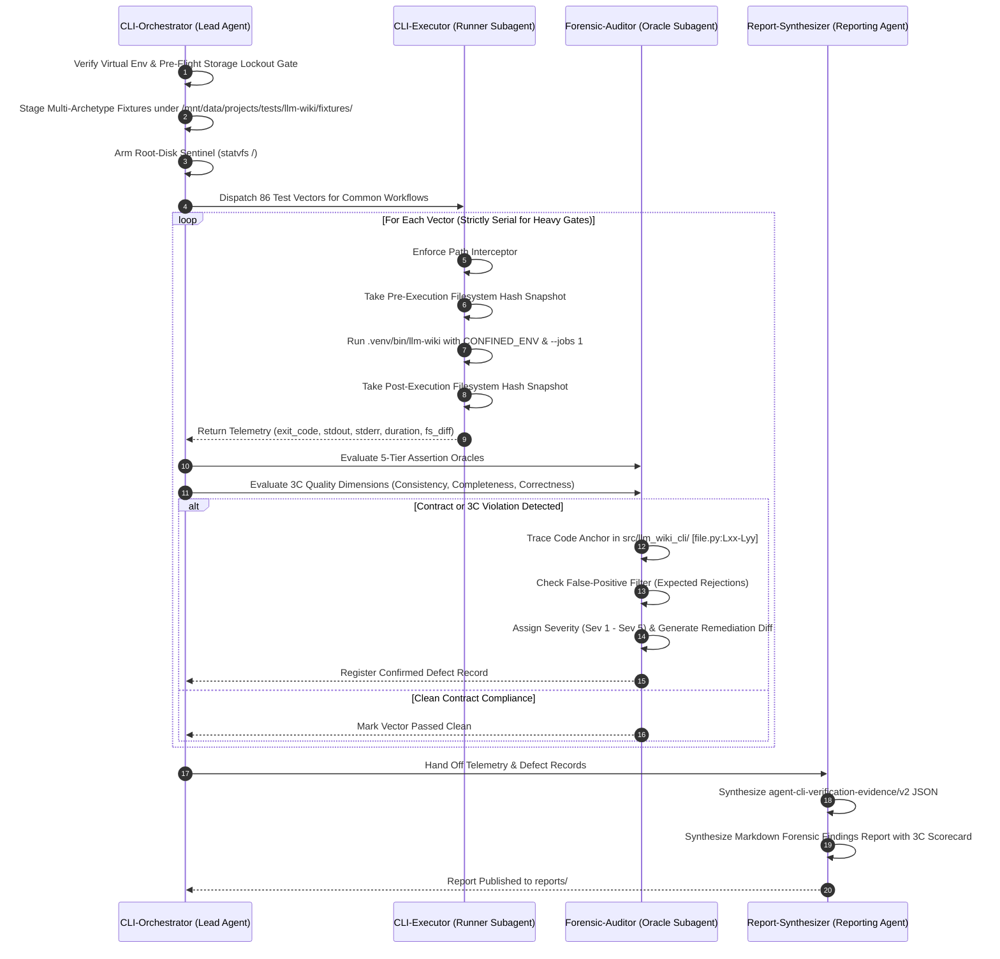
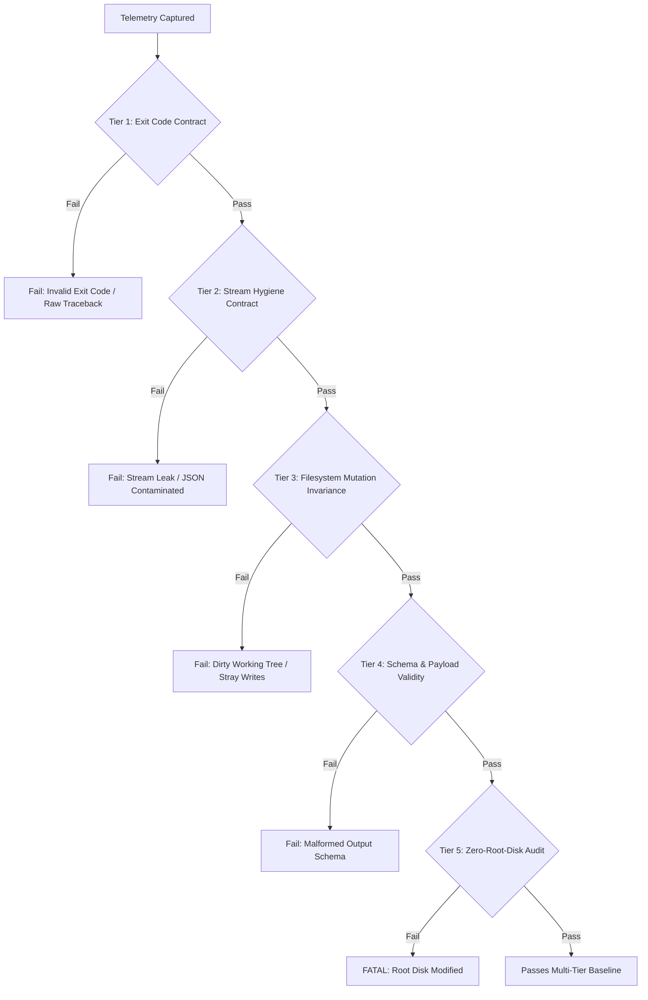
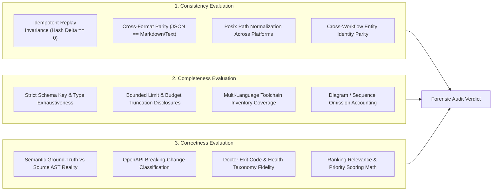

# Autonomous Agent-Driven Verification Test Plan: CLI Common Workflows & Parameter Space

**Document Version:** 1.1.0  
**Target System:** `llm-wiki` (`llm_wiki_cli`)  
**Scope:** Exhaustive Parameter & Contract Verification of the 6 Core Common Workflows: `search`, `context`, `review`, `api-diff`, `queue`, and `doctor`  
**Evaluation Philosophy:** Autonomous Agent-Driven Closed-Loop Verification Grounded in Multi-Tier Assertions, Stream Hygiene, Read-Only Filesystem Invariance, the 3C Quality Framework (Consistency, Completeness, Correctness), and Strict Storage Confinement  
**Execution Environment:** Isolated workspace runner, `.venv/bin/python`, `.venv/bin/llm-wiki`, `--jobs 1` serialization  
**Absolute Storage Boundary:** `/mnt/data/projects/tests/llm-wiki/` (**Zero-Root-Disk Policy: No test operation, fixture write, temporary file, or tool cache may touch the root volume `/`**)  
**Supported Platforms:** Linux (Ubuntu 20.04+), macOS (ARM64/x86_64), Windows (Win32/x64, Python 3.9+)

---

## 1. Executive Summary & Strategic Vision

The `llm-wiki` CLI provides developer and agent capabilities for maintaining, analyzing, and consuming codebase knowledge. Among its 32 root commands, the **6 Common Workflows** form the operational backbone of autonomous AI pair programming, continuous codebase comprehension, and automated quality gates:

| Task | Target Command | Primary CLI Contract |
|---|---|---|
| **Search the wiki** | `llm-wiki search "query" --limit 5` | Ranked & substring retrieval of entities, modules, flows; zero disk mutation; pure JSON or human text. |
| **Build agent context** | `llm-wiki context --budget 8000 --format markdown` | Token-budgeted AST & knowledge snapshot; strict stream separation (plan to stderr, context to stdout); read-only invariance. |
| **Review changed code** | `llm-wiki review --base main --head HEAD` | Static architectural review against git diffs or patches; impact analysis artifacts; clean stream routing. |
| **Compare OpenAPI exports** | `llm-wiki api-diff --baseline api/before.json --candidate api/after.json` | Standalone contract difference detection; breaking-change exit code semantics (exit 1 on breaking); syntax-only. |
| **Find documentation work** | `llm-wiki queue --limit 30` | Advisory maintenance triage; deterministic scoring; plug-free read-only inspection. |
| **Diagnose helper setup and wiki health** | `llm-wiki doctor --capabilities` | Multi-tier health auditing (`v1`) & polyglot toolchain capability diagnostics (`v2`); explicit exit codes (`0`, `1`, `2`, `3`). |

### 1.1 Why Agent-Driven Verification is Required

Traditional unit tests mock internal components (e.g. mocking `argparse.ArgumentParser.parse_args` or monkeypatching `subprocess.run`). They fail to catch critical operational hazards:
1. **Stream Contamination:** Progress bars, heartbeat diagnostics, or extractor plans (e.g. `Extractor plan: requested=auto...`) leaking into `stdout` when `--format json` or `--format markdown` is active, corrupting downstream LLM ingestion.
2. **Side-Effect Leakage on Read-Only Operations:** Commands specified as read-only (`search`, `context --read-only`, `queue`, `doctor`) writing temporary files, touching `.git`, or altering manifests.
3. **Cross-Platform Path Failures:** Path validation errors triggered by Windows backslashes (`\`), mixed separators, or casing issues on case-insensitive filesystems.
4. **Parameter Inversion & Collision Hazards:** Crashes or undefined behavior when mutually dependent or exclusive parameters are supplied (e.g., `--base` without `--head`, `--patch` combined with `--staged`, `--tokenizer` without `--budget-mode exact`, or impact outputs with `--format markdown`).
5. **Quality Blind Spots:** Passing smoke exit codes while returning inconsistent outputs across repeated runs, truncating results without disclosure, or miscalculating breaking changes.

This test plan defines an **autonomous agent-driven closed-loop test cycle**. A team of autonomous agents executes exhaustive parameter permutations, evaluates multi-tier assertion contracts, audits results against the **3C Quality Framework** (Consistency, Completeness, Correctness), triages anomalies down to exact source lines in `src/llm_wiki_cli/`, and generates an evidence-backed final findings report.

```mermaid
flowchart TD
    subgraph Phase0["Phase 0: Pre-Flight & Storage Confinement"]
        PF1["Validate Python 3.9+ Virtual Environment (.venv/bin/python)"]
        PF2["Verify Storage Boundary (/mnt/data/projects/tests/llm-wiki/)"]
        PF3["Arm Root-Disk Sentinel (statvfs / Delta == 0)"]
        PF4["Sanitize Environment (CONFINED_ENV: TMPDIR, HOME, XDG)"]
    end

    subgraph Phase1["Phase 1: Multi-Archetype Fixture Staging"]
        FX1["Fixture-CW-01: Populated Healthy Wiki"]
        FX2["Fixture-CW-02: Git Diff & Patch Repository"]
        FX3["Fixture-CW-03: OpenAPI 3.0/3.1 Baseline-Candidate Pairs"]
        FX4["Fixture-CW-04: Degraded & Corrupted Wiki"]
        FX5["Fixture-CW-05: External Traversal Boundary"]
    end

    subgraph Phase2["Phase 2: Dynamic Parser Introspection & Matrix Synthesis"]
        GEN1["Introspect Parser Actions for 6 Common Workflow Commands"]
        GEN2["Synthesize 86 Combinatorial & Boundary Test Vectors"]
        GEN3["Define Exact Multi-Tier Oracles & Expected Returns"]
    end

    subgraph Phase3["Phase 3: Serial Execution & Telemetry Acquisition"]
        EX1["Supervisor Agent: Heavy-Gate Serializer (--jobs 1)"]
        EX2["Execution Worker: Dispatch In Sandboxes (Single & Paired Replay)"]
        EX3["Pre-Execution Path Interceptor (Reject Any Non-Mount Path)"]
        EX4["Capture exit_code, stdout, stderr, execution_ms, fs_hashes"]
    end

    subgraph Phase4["Phase 4: Multi-Tier Assertion Engine & 3C Audit"]
        V1["Tier 1-5: Exit Code, Streams, Filesystem, Schema, Root Disk"]
        V2["3C Suite 1: Consistency (Idempotency, Cross-Format, Posix Paths)"]
        V3["3C Suite 2: Completeness (Schema Integrity, Bounded Disclosures)"]
        V4["3C Suite 3: Correctness (AST Fidelity, Breaking Changes, Health Taxonomy)"]
    end

    subgraph Phase5["Phase 5: Forensic Triage & Source Localization"]
        TR1["False-Positive Suppression Filter"]
        TR2["Trace Code Anchor in src/llm_wiki_cli/ [file.py:Lxx-Lyy]"]
        TR3["Severity Classification (Sev 1 - Sev 5)"]
    end

    subgraph Phase6["Phase 6: Report Synthesis & Remediation"]
        RP1["Compile agent-cli-verification-evidence/v2 JSON"]
        RP2["Generate Forensic Findings Markdown Report & 3C Scorecard"]
        RP3["Prioritize Remediation Backlog (P0 - P3)"]
    end

    Phase0 --> Phase1
    Phase1 --> Phase2
    Phase2 --> Phase3
    Phase3 --> Phase4
    Phase4 --> Phase5
    Phase5 --> Phase6
```



---

## 2. Storage Architecture & Strict Single-Volume Confinement

### 2.1 The Zero-Root-Disk Mandate

Host filesystem diagnostics indicate severe partition asymmetry:
- **Root Partition (`/dev/nvme0n1p2` on `/`):** 234 GB total, 212 GB used, **only 11 GB available (96% utilization)**.
- **Dedicated Data Partition (`/dev/nvme1n1p1` on `/mnt/data`):** 916 GB total, 340 GB used, **530 GB available (40% utilization)**.

> [!CAUTION]
> **ABSOLUTE ZERO-ROOT-DISK POLICY**  
> Under no circumstance may any test process, temporary workspace, cache directory, or log artifact write to the root filesystem `/`. Any write to `/tmp`, `/var/tmp`, `/home/mike`, `~/.cache`, or `~/.local` risks immediate disk exhaustion (`ENOSPC`) and OS failure.  
> **All execution sandboxes, virtualized homes, caches, and test fixtures MUST reside strictly under `/mnt/data/projects/tests/llm-wiki/`.**

### 2.2 Dedicated Storage Topology under `/mnt/data/projects/tests/llm-wiki/`

```
/mnt/data/projects/tests/llm-wiki/
├── home/                         # Virtualized $HOME directory
├── tmp/                          # Sandboxed temporary directory ($TMPDIR, $TEMP, $TMP)
├── cache/                        # Confined toolchain and extractor caches
│   ├── inventory/                # AST and manifest caches
│   └── helpers/                  # Polyglot helper caches (Node, Go, Cargo, GHC)
├── fixtures/                     # Staged test fixtures for common workflows
│   ├── FIXTURE-CW-01_clean_wiki/
│   ├── FIXTURE-CW-02_git_diff_repo/
│   ├── FIXTURE-CW-03_openapi_pairs/
│   ├── FIXTURE-CW-04_degraded_wiki/
│   └── FIXTURE-CW-05_external_escape/
├── runs/                         # Ephemeral per-test execution sandboxes
│   └── cw_eval_<timestamp>/
├── failures/                     # Quarantined failure artifacts and reproduction trees
└── reports/                      # Final forensic reports and evidence JSON
```

### 2.3 Process Confinement Environment

All test subprocesses are spawned using the hardened environment:

```python
CONFINED_ENV = {
    **os.environ,
    "TMPDIR": "/mnt/data/projects/tests/llm-wiki/tmp",
    "TEMP": "/mnt/data/projects/tests/llm-wiki/tmp",
    "TMP": "/mnt/data/projects/tests/llm-wiki/tmp",
    "XDG_CACHE_HOME": "/mnt/data/projects/tests/llm-wiki/cache",
    "XDG_CONFIG_HOME": "/mnt/data/projects/tests/llm-wiki/home/.config",
    "XDG_DATA_HOME": "/mnt/data/projects/tests/llm-wiki/home/.local/share",
    "HOME": "/mnt/data/projects/tests/llm-wiki/home",
    "LLM_WIKI_CACHE_DIR": "/mnt/data/projects/tests/llm-wiki/cache/inventory",
}
```

### 2.4 Pre-Execution Path Interceptor & Root Sentinel

1. **Path Interceptor:** Every path parameter passed on the command line (`--src-dir`, `--wiki-dir`, `--helper-cache-dir`, `--output`, `--summary-output`, `--impact-output`, `--baseline`, `--candidate`, `--patch`, `--request`, `--source-selection`) is resolved using `Path(arg).resolve()`. If it points outside `/mnt/data/projects/tests/llm-wiki/`, execution is blocked immediately and logged as a boundary breach.
2. **Root Disk Sentinel:** `statvfs('/')` is recorded before and after each test suite. Any decrease in `f_bfree` or `f_ffree` halts testing immediately.

---

## 3. Autonomous Agent Team Roles & Execution Governance

The autonomous test cycle is driven by four specialized agents operating in coordination:



### 3.1 Agent Responsibilities

1. **`CLI-Orchestrator` (Supervising Agent):**
   - Owns the execution schedule and state machine.
   - Enforces the **Heavy Gate Serialization Rule**: `context`, `doctor`, and `queue` must run serially with `--jobs 1`.
   - Manages pre-flight verification, fixture provisioning, and root disk sentinel checks.
2. **`CLI-Executor` (Execution Worker):**
   - Creates ephemeral sandbox directories under `/mnt/data/projects/tests/llm-wiki/runs/`.
   - Executes commands via `.venv/bin/llm-wiki` with `CONFINED_ENV`.
   - Executes paired duplicate runs to evaluate consistency and idempotency.
   - Captures telemetry: `exit_code`, exact `stdout` bytes, exact `stderr` bytes, wall-clock milliseconds, before/after SHA256 and mtime snapshots of all files.
3. **`Forensic-Auditor` (Oracle Subagent):**
   - Executes multi-tier assertions and audits the 3C quality dimensions (Consistency, Completeness, Correctness).
   - Traces failures to exact source files and line numbers in [src/llm_wiki_cli/](file:///mnt/data/projects/llm-wiki/python-wiki-llm/src/llm_wiki_cli/).
   - Filters expected CLI syntax rejections (exit code 2) and security boundary rejections (`PathValidationError`) from real defects.
4. **`Report-Synthesizer` (Reporting Agent):**
   - Generates structured JSON evidence following `agent-cli-verification-evidence/v2`.
   - Compiles a readable forensic findings report with exact reproduction commands, 3C scorecards, and code diffs.

---

## 4. Multi-Archetype Test Fixtures Staged in Mount

All fixtures are staged under `/mnt/data/projects/tests/llm-wiki/fixtures/`:

### 4.1 `FIXTURE-CW-01: Populated Healthy Wiki`
- **Structure:** Standard Python repository with initialized `docs/llm_wiki/` containing `.llm-wiki-manifest.json`, `.llm-wiki-knowledge.json`, module pages, entity pages, and flow pages.
- **Used by:** `search` (ranked and substring queries), `context` (budgeted extraction), `queue` (worklist triage), `doctor` (healthy baseline).

### 4.2 `FIXTURE-CW-02: Git Diff & Patch Repository`
- **Structure:** Git repository containing committed baseline code (`main`), active unstaged changes in `src/app.py`, staged changes in `src/utils.py`, and exported patch file `changes.patch`.
- **Used by:** `review` (`--base`/`--head`, `--staged`, `--patch`, `--changed-path`), `context` (`--base`/`--head`, `--staged`, `--changed-path`).

### 4.3 `FIXTURE-CW-03: OpenAPI 3.0/3.1 Specification Pairs`
- **Structure:**
  - `baseline.json` vs `candidate_identical.json` (0 breaking changes).
  - `baseline.json` vs `candidate_breaking.json` (endpoint removed, required request parameter added).
  - `baseline.json` vs `candidate_advisory.json` (description changed, path placeholder renamed).
  - `malformed.json` (invalid syntax / schema).
- **Used by:** `api-diff` compatibility and breaking-change exit code verification.

### 4.4 `FIXTURE-CW-04: Degraded & Corrupted Wiki`
- **Structure:** Wiki with intentionally corrupted states:
  - Missing manifest or knowledge file (tests exit code 3 `absent`).
  - Broken Wikilinks, expired review attestations (tests exit code 1 `degraded`).
  - Missing polyglot language extractors (tests exit code 2 `unhealthy` under `--capabilities`).
- **Used by:** `doctor` (taxonomy verification), `doctor --capabilities`, `doctor --strict`.

### 4.5 `FIXTURE-CW-05: External Traversal Boundary Sandbox`
- **Structure:** Sandbox at `/mnt/data/projects/tests/llm-wiki/runs/cw_eval_<timestamp>/sandbox/` with external targets staged safely on the same data volume.
- **Used by:** `--src-dir` path traversal tests with and without `--allow-external-src`.

---

## 5. Multi-Tier Assertion Oracle Engine

Every command vector evaluated by the autonomous agent must satisfy 5 assertion tiers:



### 5.1 Tier 1: Process Exit Code Taxonomy
- `0`: Success, clean run, healthy doctor check, compatible OpenAPI contracts.
- `1`: Domain validation failure, breaking API diff, degraded doctor health, `PathValidationError`.
- `2`: CLI usage/argparse error (missing required arguments, invalid choices, mutual flag conflict) or unhealthy doctor health.
- `3`: Absent wiki knowledge in `doctor`.
- **Defect Trigger:** Any unhandled Python exception (`AttributeError`, `KeyError`, `FileNotFoundError`) crashing with exit code 1 and printing an untrapped traceback to stderr.

### 5.2 Tier 2: Stream Separation & Hygiene Contract
- **`stdout`:** Pure machine-readable payload. When `--format json` is requested, `stdout` must parse with `json.loads()` without error. When `--format markdown` is requested, `stdout` must contain only valid Markdown.
- **`stderr`:** Diagnostics, warnings, and flushed plan lines (e.g. `Extractor plan: ...`). Diagnostics must never leak into `stdout`.
- When `--output <path>` is passed, `stdout` must be completely empty.

### 5.3 Tier 3: Filesystem State & Read-Only Invariance Contract
- Read-only commands (`search`, `context --read-only`, `queue`, `doctor`, `api-diff`, and `review` without output flags) must produce **zero mutations**:
  $$\text{snapshot}_{\text{before}} == \text{snapshot}_{\text{after}}$$
- Output redirection flags (`--output`, `--summary-output`, `--impact-output`) must only mutate the specified destination path. No orphaned temporary files may remain in the workspace.

### 5.4 Tier 4: Output Schema & Semantic Validity Contract
Payloads must strictly validate against their domain schemas:
- `search` JSON: `{"mode": str, "query": str, "results": list[dict], "returned": int, "total": int}`
- `context` JSON: `{"budget_consumed": int, "files": list[dict], "protocol": str, ...}`
- `review` JSON: `{"ok": bool, "findings": list[dict]}` or `llm-wiki-impact/v1` payload
- `api-diff` JSON: `{"baseline": str, "candidate": str, "breaking_count": int, "breaking": list, "advisory": list}`
- `queue` JSON: `{"count": int, "items": list[dict], "limit": int, "schema_version": "llm-wiki-maintenance-queue/v1"}`
- `doctor` JSON: `llm-wiki-doctor/v1` schema or `llm-wiki-doctor/v2` schema (when `--capabilities` is active).

### 5.5 Tier 5: Zero-Root-Disk Audit & Platform Resilience Contract
- Root volume `/` free blocks and free inodes must not decrease:
  $$\Delta \text{f\_bfree} = 0, \quad \Delta \text{f\_ffree} = 0$$
- Command execution peak memory must not exceed 500 MB.
- Windows-style path backslashes (`\`) must normalize cleanly without causing OS-level syntax errors.

---

## 6. Agent Evaluation Process for Consistency, Completeness, and Correctness (The 3C Framework)

Beyond baseline exit codes and stream separation, the autonomous agent conducts a rigorous multi-dimensional evaluation across **Consistency**, **Completeness**, and **Correctness**.



### 6.1 Consistency Evaluation Process

The `ConsistencyInspector` verifies that commands exhibit deterministic stability across invocations, format parity across display modes, and path portability across platforms:

1. **Idempotent Replay & Determinism:**
   - *Protocol:* The agent executes identical read-only commands in consecutive duplicate runs ($V_1$ and $V_2$) against an unchanged fixture.
   - *Assertions:*
     $$\text{exit\_code}(V_1) = \text{exit\_code}(V_2)$$
     $$\text{SHA256}(\text{stdout}(V_1)) = \text{SHA256}(\text{stdout}(V_2))$$
   - *Tie-Breaking Order Stability:* In `search` (ranked mode) and `queue` (maintenance triage), result lists must maintain deterministic ordering. When scores are identical, the agent validates that secondary keys (alphabetical path ordering) break ties identically across runs.
   - *Budget Token Allocation Stability:* In `context`, file selection and budget allocation must match bit-for-bit across repeat runs.

2. **Cross-Format Representation Parity:**
   - *Protocol:* The agent executes the same operation with `--format json` and `--format markdown` (or `--format text`), extracting semantic metrics from both.
   - *Assertions:*
     - **`doctor` Parity:** The overall health verdict (`healthy`, `degraded`, `unhealthy`, `absent`) and numerical issue counts in JSON must equal the human summary header.
     - **`api-diff` Parity:** The `breaking_count` in `llm-wiki-api-diff/v1` JSON must equal the number of breaking change bullets rendered in Markdown.
     - **`review` Parity:** The count of items in `findings` must equal the number of rendered `## [SEVERITY]: <path>` headings.
     - **`search` Parity:** The `returned` and `total` integers in JSON must match the text footer string (`<returned> of <total> matches`).
     - **`queue` Parity:** The `len(items)` count in JSON must equal the number of numbered rows rendered in text mode.

3. **Cross-Platform Path Normalization:**
   - *Protocol:* The agent inspects all path strings serialized in outputs (`path`, `source_path`, `wiki_pages`, `files[].path`, `baseline`, `candidate`).
   - *Assertions:*
     - All paths in machine-readable JSON must strictly use forward slashes (`/`), even on Windows where parameters were supplied with backslashes (`\`).
     - Paths must be repository-relative without leaking host root mounts (`/mnt/data/...`) or Windows drive letters (`C:\`).

4. **Cross-Workflow Identity Parity:**
   - *Protocol:* Cross-references entity, module, and flow identifiers across different workflows.
   - *Assertions:*
     - An entity locator discovered by `search "AuthService"` must be identical to the locator evaluated in `context` files, `review` impact pages, and `queue` tasks.

### 6.2 Completeness Evaluation Process

The `CompletenessAuditor` asserts that outputs contain exhaustive structural information, explicit disclosures when truncated, and full diagnostic visibility:

1. **Strict Protocol Schema Completeness:**
   - *Protocol:* The agent parses JSON outputs against Pydantic schema validators.
   - *Assertions:*
     - **`context`:** Must contain `protocol` (`llm-wiki-context/v1`, `v2`, or `v3`), `budget_consumed` (int), `budget_limit` (int), `files` array (each with `path`, `tier`, `tokens`, and structured AST detail), and `disclosures` object (detailing freshness evaluation).
     - **`doctor`:** Must contain all 6 standard sections: `availability`, `freshness`, `parity`, `governance`, `drift`, `receipts`, plus `evaluated` and `snapshot_only` flags. Under `--capabilities` (`v2`), must include the complete `capabilities` object.
     - **`queue`:** Must contain `schema_version`, `count`, `limit`, and `items` list (with `page`, `score`, `reasons`, `ownership`, `actionable`).
     - **`api-diff`:** Must contain `schema_version`, `baseline`, `candidate`, `breaking_count`, `breaking`, `advisory`.
     - **`review`:** Must contain `ok` (bool) and `findings` list (with `source_path`, `severity`, `wiki_pages`, `reason`, `suggested_follow_up`).

2. **Bounded Output & Explicit Truncation Disclosures:**
   - *Protocol:* The agent tests boundary truncation parameters (`--limit`, `--budget`).
   - *Assertions:*
     - **`search --limit <N>`:** Output must disclose both `returned` and `total` candidate matches.
     - **`context --budget <N>`:** Asserts that $\text{budget\_consumed} \le \text{budget}$. When files exceed budget, asserts that elided files are downgraded to names-only and `omitted_files` count or tier breakdown is explicitly disclosed.
     - **`queue --limit <N>`:** Asserts that `len(items) <= limit` and `count == len(items)`.
     - **Sequence Diagram Capping:** When call sequences in `review` or `context` exceed 30 interactions, asserts that the diagram includes an explicit note disclosing omitted interactions rather than silently truncating Mermaid code.

3. **Multi-Language Toolchain Inventory Completeness:**
   - *Protocol:* The agent runs `doctor --capabilities` against the polyglot fixture (`FIXTURE-CW-01`).
   - *Assertions:*
     - The report must inventory all supported languages (Python, TypeScript, Go, Rust, Haskell).
     - For each language, it must explicitly report: helper binary status, compiler/runtime existence, missing tools list, and a concrete, actionable shell command remedy (`remedy.argv` or `remedy.next_step`).

### 6.3 Correctness Evaluation Process

The `CorrectnessValidator` evaluates whether the emitted results are semantically truthful compared to source AST ground truth, OpenAPI specifications, and domain health taxonomies:

1. **Ground-Truth Semantic Accuracy vs Source AST Reality:**
   - *Protocol:* The agent parses the target fixture source files using Python's native `ast` module and inspects git diff hunks.
   - *Assertions:*
     - **`context` AST Fidelity:** Classes, methods, functions, and docstrings emitted in `files[].detail` must match the ground-truth AST nodes. No hallucinated methods, phantom imports, or dropped definitions.
     - **`review` Diff Scope Fidelity:** The agent compares git diff hunks between `--base` and `--head` against `review` findings. Any changed module or entity in the diff must be correctly mapped to its corresponding wiki documentation page (`wiki_pages`).

2. **OpenAPI Breaking-Change Semantic Correctness:**
   - *Protocol:* The agent executes `api-diff` against controlled OpenAPI contract pairs in `FIXTURE-CW-03`.
   - *Assertions:*
     - **Operation Removal:** Removing an endpoint (`DELETE /users/{id}`) $\rightarrow$ Classified as `breaking`, `breaking_count > 0`, process exits `1`.
     - **New Required Parameter:** Adding a required query/header/path parameter or required request body property $\rightarrow$ Classified as `breaking`, `breaking_count > 0`, process exits `1`.
     - **Removed Success Response:** Removing a `200` or `201` response declaration $\rightarrow$ Classified as `breaking`, `breaking_count > 0`, process exits `1`.
     - **Advisory Placeholder / Header Case Renames:** Renaming `{userId}` to `{user_id}` or changing `X-Api-Key` to `x-api-key` preserves wire identity $\rightarrow$ Classified as `advisory`, `breaking_count == 0`, process exits `0`.
     - **Read-Only Fields:** Read-only body fields becoming required in requests must remain non-breaking.

3. **Doctor Health Status & Exit Code Taxonomy Correctness:**
   - *Protocol:* Evaluates `doctor` exit codes across controlled fixture states.
   - *Assertions:*
     - Committed snapshot coherent (`FIXTURE-CW-01`) $\rightarrow$ Status `healthy`, exit code `0`.
     - Expired review attestations or broken links (`FIXTURE-CW-04`) $\rightarrow$ Status `degraded`, exit code `1`.
     - Mixed snapshot, invalid receipts, or indeterminate drift with `--strict` $\rightarrow$ Status `unhealthy`, exit code `2`.
     - Provider needing preparation under `--capabilities` $\rightarrow$ Status `unhealthy / needs preparation`, exit code `2`.
     - Nonexistent or uninitialized wiki $\rightarrow$ Status `absent`, exit code `3`.

4. **Search Relevance & Queue Priority Scoring Correctness:**
   - *Protocol:* Evaluates ranking order in `search` and `queue`.
   - *Assertions:*
     - **`search` Ranked Mode:** Exact match on entity title/symbol (query `"AuthService"`) must score higher than a page with `"auth"` mentioned in prose. `results[0].title` must be `"AuthService"`.
     - **`queue` Priority Math:** Source files with high churn and zero wiki coverage must receive higher priority scores than stable, fully documented pages.

---

## 7. Exhaustive Parameter Test Vector Matrix: Common Workflows

The test suite consists of **86 concrete, oracle-backed test vectors** covering all parameters and boundary conditions across the 6 common workflows, evaluated against the 3C quality dimensions:

### 7.1 `search` Parameter Vectors (14 Vectors)

CLI Definition in [src/llm_wiki_cli/commands/search_cmd.py](file:///mnt/data/projects/llm-wiki/python-wiki-llm/src/llm_wiki_cli/commands/search_cmd.py):
- Positional: `query`
- Options: `--src-dir`, `--wiki-dir`, `--allow-external-src`, `--kind` (repeatable), `--limit` (int, default 20), `--mode` (`ranked` | `substring`), `--format` (`json` | `text`), `--source-selection`

| Vector ID | Command Invocation | Fixture | Expected Exit | Expected stdout | Expected stderr | 3C Invariants Checked |
|---|---|---|---|---|---|---|
| `SRCH-01` | `search "authentication"` | `CW-01` | `0` | Clean JSON (`llm-wiki-search/v1`), contains `results` | Empty | Idempotent replay; complete schema |
| `SRCH-02` | `search "authentication" --format text` | `CW-01` | `0` | Formatted text (`path: title\n  snippet\n...`) | Empty | Format parity with SRCH-01 |
| `SRCH-03` | `search "authentication" --limit 5` | `CW-01` | `0` | JSON with `len(results) <= 5` and `returned <= 5` | Empty | Bounded limit disclosure (`returned <= total`) |
| `SRCH-04` | `search "authentication" --limit 0` | `CW-01` | `0` | JSON with `results: []`, `returned: 0` | Empty | Bounded disclosure; zero-count correctness |
| `SRCH-05` | `search "authentication" --limit 150` | `CW-01` | `0` | JSON results capped at 100 | Empty | Cap disclosure correctness |
| `SRCH-06` | `search "authentication" --limit invalid` | `CW-01` | `2` | Empty | Usage error: invalid int value | Argparse error contract |
| `SRCH-07` | `search "authentication" --mode substring` | `CW-01` | `0` | JSON results matching substring search | Empty | Deterministic substring correctness |
| `SRCH-08` | `search "authentication" --mode invalid` | `CW-01` | `2` | Empty | Usage error: invalid choice | Argparse error contract |
| `SRCH-09` | `search "auth" --kind entities` | `CW-01` | `0` | JSON results restricted to entity pages | Empty | Kind filtering semantic correctness |
| `SRCH-10` | `search "auth" --kind entities --kind flows` | `CW-01` | `0` | JSON results restricted to entities & flows | Empty | Repeatable kind filter correctness |
| `SRCH-11` | `search ""` | `CW-01` | `0` | Clean JSON empty or full match | Empty | Empty query determinism |
| `SRCH-12` | `search "nonexistent_symbol_xyz123"` | `CW-01` | `0` | JSON with `results: []`, `returned: 0` | Empty | Zero-match correctness |
| `SRCH-13` | `search "auth" --src-dir ../external` (no allow) | `CW-05` | `1` | Empty | `PathValidationError` | Security isolation correctness |
| `SRCH-14` | `search "auth" --src-dir ../external --allow-external-src` | `CW-05` | `0` | Clean JSON results | Empty | External flag enablement correctness |

### 7.2 `context` Parameter Vectors (22 Vectors)

CLI Definition in [src/llm_wiki_cli/services/context_service.py](file:///mnt/data/projects/llm-wiki/python-wiki-llm/src/llm_wiki_cli/services/context_service.py):
- Options: `--budget` (int), `--budget-mode` (`exact` | `estimated`), `--tokenizer` (path), `--base`, `--head`, `--staged`, `--changed-path` (repeatable), `--src-dir`, `--wiki-dir`, `--format` (`json` | `markdown` | `packet`), `--focus` (`changed` | `all`), `--request` (file|-), `--output` (path), `--read-only`, `--allow-external-src`, `--prefer-fresh`, `--knowledge-mode` (`off` | `auto` | `required`), `--source-selection`

| Vector ID | Command Invocation | Fixture | Expected Exit | Expected stdout | Expected stderr | 3C Invariants Checked |
|---|---|---|---|---|---|---|
| `CTX-01` | `context --budget 8000` | `CW-01` | `0` | Valid JSON payload with `budget_consumed` | Extractor plan line | AST fidelity; schema completeness |
| `CTX-02` | `context --budget 8000 --format markdown` | `CW-01` | `0` | Pure Markdown context; no JSON | Extractor plan line | Format parity with CTX-01 |
| `CTX-03` | `context --budget 8000 --format packet` | `CW-01` | `0` | Canonical Qualified Context Packet JSON | Extractor plan line | Qualified packet schema completeness |
| `CTX-04` | `context` (omitting `--budget` and `--request`) | `CW-01` | `2` | Empty | `Error: --budget is required unless --request is used.` | Usage requirement correctness |
| `CTX-05` | `context --budget 0` | `CW-01` | `2` | Empty | `Error: --budget must be greater than zero.` | Boundary validation correctness |
| `CTX-06` | `context --budget -500` | `CW-01` | `2` | Empty | `Error: --budget must be greater than zero.` | Boundary validation correctness |
| `CTX-07` | `context --budget 8000 --focus all` | `CW-01` | `0` | JSON context containing all source files | Extractor plan line | Complete source file accounting |
| `CTX-08` | `context --budget 8000 --focus changed` | `CW-02` | `0` | JSON prioritizing changed files | Extractor plan line | Diff tier ranking correctness |
| `CTX-09` | `context --budget 8000 --read-only` | `CW-01` | `0` | Valid JSON context | Extractor plan line | Filesystem invariance ($\Delta = 0$) |
| `CTX-10` | `context --budget 8000 --output out_ctx.json` | `CW-01` | `0` | Empty | Notice: `Context output written to: ...` | File redirection completeness |
| `CTX-11` | `context --budget 8000 --format markdown --output out_ctx.md` | `CW-01` | `0` | Empty | Notice: `Context output written to: ...` | Markdown file output completeness |
| `CTX-12` | `context --budget 8000 --prefer-fresh` | `CW-01` | `0` | Valid JSON; disclosures note ranking applied | Extractor plan line | Freshness disclosure completeness |
| `CTX-13` | `context --budget 8000 --knowledge-mode off` | `CW-01` | `0` | JSON context without native knowledge graph | Extractor plan line | Knowledge mode semantics |
| `CTX-14` | `context --budget 8000 --knowledge-mode auto` | `CW-01` | `0` | JSON context with qualified native knowledge | Extractor plan line | Knowledge graph fidelity |
| `CTX-15` | `context --budget 8000 --knowledge-mode required` (missing kg) | `CW-04` | `1` | Empty | `Error [KNOWLEDGE_MISSING]: ...` | Required mode error semantics |
| `CTX-16` | `context --budget 8000 --budget-mode exact` (no tokenizer) | `CW-01` | `0` | Valid JSON budgeted context | Extractor plan line | Exact budget accounting determinism |
| `CTX-17` | `context --budget 8000 --tokenizer tokenizer.json` (no mode) | `CW-01` | `1` | Empty | Error: `--tokenizer requires --budget-mode exact` | Mutual flag dependency correctness |
| `CTX-18` | `context --budget 8000 --base main --head HEAD` | `CW-02` | `0` | JSON budgeted context for git range | Extractor plan line | Git revision scoping accuracy |
| `CTX-19` | `context --budget 8000 --staged` | `CW-02` | `0` | JSON context for staged changes | Extractor plan line | Staged changes scoping accuracy |
| `CTX-20` | `context --budget 8000 --changed-path src/app.py` | `CW-02` | `0` | JSON context for specific file | Extractor plan line | Repeatable path scoping accuracy |
| `CTX-21` | `context --request request.json` | `CW-01` | `0` | Protocol JSON response matching request | Extractor plan line | Request protocol round-trip parity |
| `CTX-22` | `context --src-dir ../external --budget 8000` (no allow) | `CW-05` | `1` | Empty | `PathValidationError` | Security isolation correctness |

### 7.3 `review` Parameter Vectors (16 Vectors)

CLI Definition in [src/llm_wiki_cli/commands/review_cmd.py](file:///mnt/data/projects/llm-wiki/python-wiki-llm/src/llm_wiki_cli/commands/review_cmd.py):
- Options: `--src-dir`, `--allow-external-src`, `--wiki-dir`, `--base`, `--head`, `--staged`, `--changed-path` (repeatable), `--patch` (file|-), `--format` (`markdown` | `json` | `impact-json` | `impact-markdown` | `github`), `--summary-output`, `--impact-output`, `--helper-cache-dir`, `--source-selection`

| Vector ID | Command Invocation | Fixture | Expected Exit | Expected stdout | Expected stderr | 3C Invariants Checked |
|---|---|---|---|---|---|---|
| `REV-01` | `review --base main --head HEAD` | `CW-02` | `0` | Formatted Markdown review findings | Empty | Git diff AST review fidelity |
| `REV-02` | `review --base main --head HEAD --format json` | `CW-02` | `0` | Valid JSON review report: `{"ok": true, "findings": ...}` | Empty | Format parity with REV-01 |
| `REV-03` | `review --base main` (missing `--head`) | `CW-02` | `1` | Empty | `Error: --base and --head must be provided together.` | Parameter pairing correctness |
| `REV-04` | `review --head HEAD` (missing `--base`) | `CW-02` | `1` | Empty | `Error: --base and --head must be provided together.` | Parameter pairing correctness |
| `REV-05` | `review --staged` | `CW-02` | `0` | Markdown review findings for staged changes | Empty | Staged diff scoping correctness |
| `REV-06` | `review --staged --format impact-json` | `CW-02` | `0` | Valid `llm-wiki-impact/v1` JSON | Empty | Impact schema completeness |
| `REV-07` | `review --staged --format impact-markdown` | `CW-02` | `0` | Clean impact summary Markdown | Empty | Format parity with REV-06 |
| `REV-08` | `review --staged --format github` | `CW-02` | `0` | GitHub annotation strings (`::warning ...`) | Empty | Annotation format correctness |
| `REV-09` | `review --patch changes.patch` | `CW-02` | `0` | Markdown review findings from patch file | Empty | Patch file parsing fidelity |
| `REV-10` | `review --patch absent.patch` | `CW-02` | `1` | Empty | Error: file not found | File validation correctness |
| `REV-11` | `review --patch changes.patch --staged` | `CW-02` | `1` | Empty | Error: `--patch cannot be combined with other change inputs` | Mutual exclusivity correctness |
| `REV-12` | `review --changed-path src/app.py` | `CW-02` | `0` | Markdown review findings for path | Empty | Path scoping correctness |
| `REV-13` | `review --staged --format impact-json --impact-output imp.json` | `CW-02` | `0` | Valid impact JSON to stdout | Empty | Impact file artifact completeness |
| `REV-14` | `review --staged --format impact-markdown --summary-output imp.md` | `CW-02` | `0` | Markdown summary to stdout | Empty | Summary artifact completeness |
| `REV-15` | `review --staged --format markdown --impact-output imp.json` | `CW-02` | `1` | Empty | Error: `Impact artifacts require an impact or github format` | Format prerequisite correctness |
| `REV-16` | `review --src-dir ../external --base main --head HEAD` (no allow) | `CW-05` | `1` | Empty | `PathValidationError` | Security isolation correctness |

### 7.4 `api-diff` Parameter Vectors (10 Vectors)

CLI Definition in [src/llm_wiki_cli/commands/api_diff_cmd.py](file:///mnt/data/projects/llm-wiki/python-wiki-llm/src/llm_wiki_cli/commands/api_diff_cmd.py):
- Options: `--baseline` (required), `--candidate` (required), `--src-dir`, `--allow-external-src`, `--format` (`json` | `markdown`)

| Vector ID | Command Invocation | Fixture | Expected Exit | Expected stdout | Expected stderr | 3C Invariants Checked |
|---|---|---|---|---|---|---|
| `DIFF-01` | `api-diff --baseline b.json --candidate c_same.json` | `CW-03` | `0` | `llm-wiki-api-diff/v1` JSON (`breaking_count: 0`) | Empty | 0 breaking changes correctness |
| `DIFF-02` | `api-diff --baseline b.json --candidate c_break.json` | `CW-03` | `1` | JSON payload with `breaking_count > 0` | Empty | Breaking detection semantic truth |
| `DIFF-03` | `api-diff --baseline b.json --candidate c_advisory.json` | `CW-03` | `0` | JSON payload with `breaking_count: 0`, advisory items | Empty | Advisory classification correctness |
| `DIFF-04` | `api-diff --baseline b.json --candidate c_break.json --format markdown` | `CW-03` | `1` | Formatted Markdown listing breaking removals | Empty | Format parity with DIFF-02 |
| `DIFF-05` | `api-diff --baseline b.json --candidate c_same.json --format markdown` | `CW-03` | `0` | Markdown summary: 0 breaking changes | Empty | Format parity with DIFF-01 |
| `DIFF-06` | `api-diff` (omitting `--baseline` and `--candidate`) | `CW-03` | `2` | Empty | Usage error: required arguments missing | Argparse requirement correctness |
| `DIFF-07` | `api-diff --baseline b.json` (omitting `--candidate`) | `CW-03` | `2` | Empty | Usage error: `--candidate` required | Argparse requirement correctness |
| `DIFF-08` | `api-diff --baseline absent.json --candidate c_same.json` | `CW-03` | `1` | Empty | File not found error | Input validation correctness |
| `DIFF-09` | `api-diff --baseline b.json --candidate c_same.json --format invalid` | `CW-03` | `2` | Empty | Usage error: invalid choice | Argparse choice correctness |
| `DIFF-10` | `api-diff --src-dir ../external --baseline b.json --candidate c.json` (no allow) | `CW-05` | `1` | Empty | `PathValidationError` | Security isolation correctness |

### 7.5 `queue` Parameter Vectors (10 Vectors)

CLI Definition in [src/llm_wiki_cli/commands/queue_cmd.py](file:///mnt/data/projects/llm-wiki/python-wiki-llm/src/llm_wiki_cli/commands/queue_cmd.py):
- Options: `--src-dir`, `--wiki-dir`, `--allow-external-src`, `--limit` (int, default 30), `--format` (`text` | `json`), `--source-selection`, `--helper-cache-dir`

| Vector ID | Command Invocation | Fixture | Expected Exit | Expected stdout | Expected stderr | 3C Invariants Checked |
|---|---|---|---|---|---|---|
| `QUE-01` | `queue` (defaults: text format, limit 30) | `CW-01` | `0` | Clean formatted maintenance queue table/list | Empty | Idempotent scoring determinism |
| `QUE-02` | `queue --format json` | `CW-01` | `0` | Valid JSON (`llm-wiki-maintenance-queue/v1`) | Empty | Format parity with QUE-01 |
| `QUE-03` | `queue --limit 5` | `CW-01` | `0` | Output bounded to at most 5 work items | Empty | Bounded count disclosure correctness |
| `QUE-04` | `queue --limit 50 --format json` | `CW-01` | `0` | JSON with `limit: 50` and `len(items) <= 50` | Empty | Limit parameter completeness |
| `QUE-05` | `queue --limit 0` | `CW-01` | `0` | Empty queue table or JSON with `items: []` | Empty | Boundary zero limit correctness |
| `QUE-06` | `queue --limit -5` | `CW-01` | `0` or `2` | Valid handled response; no unhandled crash | Handled or empty | Handled boundary validation |
| `QUE-07` | `queue --format invalid` | `CW-01` | `2` | Empty | Usage error: invalid choice | Argparse choice contract |
| `QUE-08` | `queue --helper-cache-dir /path/to/cache` | `CW-01` | `0` | Clean maintenance queue | Empty | Helper cache integration |
| `QUE-09` | `queue --src-dir ../external` (no allow) | `CW-05` | `1` | Empty | `PathValidationError` | Security isolation correctness |
| `QUE-10` | `queue --wiki-dir nonexistent_wiki` | `CW-01` | `1` | Empty | Path validation error: wiki dir missing | Domain error correctness |

### 7.6 `doctor` Parameter Vectors (14 Vectors)

CLI Definition in [src/llm_wiki_cli/commands/doctor_cmd.py](file:///mnt/data/projects/llm-wiki/python-wiki-llm/src/llm_wiki_cli/commands/doctor_cmd.py):
- Options: `--capabilities`, `--wiki-dir`, `--src-dir`, `--allow-external-src`, `--format` (`text` | `json`), `--strict`, `--helper-cache-dir`, `--include-tests`, `--source-selection`, `--jobs`

| Vector ID | Command Invocation | Fixture | Expected Exit | Expected stdout | Expected stderr | 3C Invariants Checked |
|---|---|---|---|---|---|---|
| `DOC-01` | `doctor` (defaults: text, clean wiki) | `CW-01` | `0` | Compact screen summary; status: healthy | Empty | Healthy status taxonomy fidelity |
| `DOC-02` | `doctor --format json` | `CW-01` | `0` | Valid JSON (`llm-wiki-doctor/v1`) | Empty | Format parity with DOC-01 |
| `DOC-03` | `doctor --capabilities` | `CW-01` | `0` or `2` | Screen summary with providers & health | Empty | Capabilities v2 schema parity |
| `DOC-04` | `doctor --capabilities --format json` | `CW-01` | `0` or `2` | Valid JSON (`llm-wiki-doctor/v2`) | Empty | Toolchain inventory completeness |
| `DOC-05` | `doctor` (on degraded wiki with expired review) | `CW-04` | `1` | Degraded status report | Empty | Degraded exit code 1 fidelity |
| `DOC-06` | `doctor --strict` (on degraded wiki) | `CW-04` | `2` | Unhealthy status report promoted by strict | Empty | Strict mode promotion correctness |
| `DOC-07` | `doctor` (on nonexistent wiki) | `CW-04` | `3` | Absent status report; exit code 3 | Empty | Absent wiki exit code 3 fidelity |
| `DOC-08` | `doctor --format invalid` | `CW-01` | `2` | Empty | Usage error: invalid choice | Argparse choice contract |
| `DOC-09` | `doctor --capabilities --helper-cache-dir /cache` | `CW-01` | `0` or `2` | Valid capability diagnostics | Empty | Helper cache directory integration |
| `DOC-10` | `doctor --capabilities --include-tests go` | `CW-01` | `0` or `2` | Diagnostics including Go test capabilities | Empty | Multi-language test inclusion |
| `DOC-11` | `doctor --jobs 1` | `CW-01` | `0` | Valid doctor report | Extractor plan line | Jobs serialization correctness |
| `DOC-12` | `doctor --jobs 0` | `CW-01` | `2` | Empty | Argument error: jobs must be >= 1 | Jobs boundary validation |
| `DOC-13` | `doctor --src-dir ../external` (no allow) | `CW-05` | `1` | Empty | `PathValidationError` | Security isolation correctness |
| `DOC-14` | `doctor --src-dir ../external --allow-external-src` | `CW-05` | `0` | Valid doctor report | Empty | External flag enablement correctness |

---

## 8. Defect Triage, Code Localization & Severity Taxonomy

When an assertion or 3C evaluation fails, the `Forensic-Auditor` subagent triages the anomaly using this taxonomy:

### 8.1 Severity Classification Scale

| Severity Level | Definition | Common Workflow Example |
|---|---|---|
| **Blocker (Sev 1)** | Process crash on valid input; silent data corruption; false negative on breaking API contract; any root-disk `/` write. | `context --read-only` modifying `.git`; `api-diff` exiting 0 on removed endpoint; write to `/tmp` instead of `$TMPDIR`. |
| **Critical (Sev 2)** | Silent failure; stream pollution breaking agents; dry-run/read-only mutating disk; nondeterministic ordering; format divergence. | `Extractor plan: ...` leaking into `stdout` when `--format json` is requested; JSON reports healthy while Markdown reports unhealthy. |
| **Major (Sev 3)** | Cryptic traceback on invalid input instead of clean error; broken Windows path parsing; missing required schema fields. | `review --base` without `--head` crashing with unhandled exception instead of exit 1; Windows backslashes leaking into JSON. |
| **Minor (Sev 4)** | Suboptimal formatting; non-blocking parameter asymmetry; minor score misalignment. | Missing column padding in `queue --format text`. |
| **Cosmetic (Sev 5)** | Help text typo; doc drift between `docs/cli-reference.md` and parser choices. | Choice documented as `text` but parser expects `plain`. |

### 8.2 False-Positive Suppression Guardrails
To avoid noisy alerts on intended rejections, the agent must suppress:
1. **Argparse CLI Rejections:** Missing required flags (`--baseline`, `--candidate`, `--budget`) exiting with code 2 and usage text is expected.
2. **Security Boundary Enforcement:** Path traversal without `--allow-external-src` exiting with `PathValidationError` is expected behavior.
3. **Doctor Exit Code Semantics:** Doctor returning exit code 1 (degraded), 2 (unhealthy), or 3 (absent) is a valid diagnostic health outcome, NOT a tool failure.

---

## 9. Standardized Forensic Findings Report Specification

The final report generated by the autonomous agent must adhere to the `agent-cli-verification-evidence/v2` schema:

````markdown
# Forensic Verification & Findings Report: CLI Common Workflows

**Date:** <YYYY-MM-DD>  
**Evaluator:** Autonomous Verification Agent (CLI & Systems Auditor)  
**Target Version:** `llm-wiki` v<Version>  
**Commit Hash:** <Git Revision>  
**Zero-Root-Disk Status:** VERIFIED (0 bytes written to /dev/nvme0n1p2)  
**Total Scenarios Evaluated:** 86 Test Vectors across 6 Common Workflows  

---

## 1. Executive Summary & Parameter Coverage Scorecard

| Workflow Command | Parameters Audited | Total Vectors | Passed Clean | Defects Found | Verified Rate |
|---|---|---|---|---|---|
| `llm-wiki search` | 9 | 14 | <n> | <n> | <pct>% |
| `llm-wiki context` | 18 | 22 | <n> | <n> | <pct>% |
| `llm-wiki review` | 13 | 16 | <n> | <n> | <pct>% |
| `llm-wiki api-diff` | 5 | 10 | <n> | <n> | <pct>% |
| `llm-wiki queue` | 7 | 10 | <n> | <n> | <pct>% |
| `llm-wiki doctor` | 10 | 14 | <n> | <n> | <pct>% |
| **TOTAL** | **62** | **86** | **<n>** | **<n>** | **<pct>%** |

### 1.2 3C Quality Evaluation Scorecard

| Quality Dimension | Verification Metric | Audited Target | Pass Rate | Status |
|---|---|---|---|---|
| **Consistency** | Repeat Run Output Hash (SHA256) Idempotency | All 6 Commands | <pct>% | PASS / FAIL |
| **Consistency** | Cross-Format Parity (JSON vs Text / Markdown) | `doctor`, `api-diff`, `review`, `queue`, `search` | <pct>% | PASS / FAIL |
| **Consistency** | Cross-Platform Path Normalization (Posix `/`) | All Path Outputs | <pct>% | PASS / FAIL |
| **Completeness** | Strict Protocol Schema Field Presence | All JSON Outputs | <pct>% | PASS / FAIL |
| **Completeness** | Truncation & Budget Elision Disclosures | `context`, `search`, `queue` | <pct>% | PASS / FAIL |
| **Completeness** | Multi-Language Toolchain Readiness Inventory | `doctor --capabilities` | <pct>% | PASS / FAIL |
| **Correctness** | Source AST Ground-Truth Fidelity | `context`, `review` | <pct>% | PASS / FAIL |
| **Correctness** | OpenAPI Breaking-Change Detection Semantics | `api-diff` | <pct>% | PASS / FAIL |
| **Correctness** | Exit Code Health Taxonomy Compliance | `doctor` (0, 1, 2, 3) | <pct>% | PASS / FAIL |
| **Correctness** | Ranking Relevance & Worklist Scoring Order | `search`, `queue` | <pct>% | PASS / FAIL |

---

## 2. Defect Catalog & Forensic Finding Profiles

### Finding FINDING-<ID>: <Descriptive Title>

- **Target Subcommand:** `llm-wiki <command>`
- **Affected Parameter(s):** `--<flag>`
- **Severity:** Blocker | Critical | Major | Minor | Cosmetic
- **Defect Classification:** Stream Contamination | Unhandled Exception | Filesystem Mutation | Schema Violation | 3C Consistency Defect | 3C Completeness Gap | 3C Semantic Error

#### A. Reproduction Recipe
```bash
cd /mnt/data/projects/tests/llm-wiki/runs/cw_eval_<timestamp>/<fixture>
.venv/bin/llm-wiki <command> <parameters>
```

#### B. Observed vs Expected Behavior
- **Expected:** Exits with code 0; `stdout` contains valid JSON; `stderr` contains diagnostic logs.
- **Observed:** Exits with code 1; unhandled traceback dumped to `stderr`; stray file written.

#### C. Source Code Anchor
Identified in [src/llm_wiki_cli/<file>.py:L<start>-L<end>](file:///mnt/data/projects/llm-wiki/python-wiki-llm/src/llm_wiki_cli/<file>.py#L<start>-L<end>):
```python
<Relevant source lines causing defect>
```

#### D. Root-Cause Analysis & Agentic Impact
Technical analysis of the defect mechanism and how it affects automated agents or CI/CD pipelines.

#### E. Remediation Patch
```diff
--- a/src/llm_wiki_cli/<file>.py
+++ b/src/llm_wiki_cli/<file>.py
@@ -xx,6 +xx,7 @@
<Diff showing exact fix>
```

---

## 3. Prioritized Remediation Backlog
1. **P0 (Immediate):** Fix all Blocker and Critical defects affecting stream hygiene and dry-run/read-only safety.
2. **P1 (High):** Resolve unhandled exceptions on invalid argument combinations and breaking change false-negatives.
3. **P2 (Medium):** Address 3C cross-format discrepancies or output path normalization bugs.
4. **P3 (Low):** Rectify documentation discrepancies or minor screen layout formatting.
````

---

## 10. Hardened Autonomous Execution Harness

The following Python script provides the executable agent harness implementing this test plan with path confinement, stream auditing, before/after SHA256 snapshots, the 3C quality evaluation suite, and the Zero-Root-Disk audit:

```python
#!/usr/bin/env python3
"""Autonomous CLI Common Workflows Verification Harness with 3C Audit.

Strictly confined to /mnt/data/projects/tests/llm-wiki/ with Zero-Root-Disk audit.
"""

from __future__ import annotations

import argparse
import hashlib
import json
import os
import subprocess
import sys
import tempfile
import time
from pathlib import Path
from typing import Any

from llm_wiki_cli import __version__
from llm_wiki_cli.cli import _build_parser

CONFINED_BASE = Path("/mnt/data/projects/tests/llm-wiki").resolve()


def get_root_disk_free_bytes() -> int:
    """Return available bytes on root filesystem /."""
    stat = os.statvfs("/")
    return stat.f_bavail * stat.f_frsize


def snapshot_directory(root: Path) -> dict[str, dict[str, Any]]:
    """Capture file SHA256 hashes and mtimes for idempotency auditing."""
    return {
        p.relative_to(root).as_posix(): {
            "sha256": hashlib.sha256(p.read_bytes()).hexdigest(),
            "mtime_ns": p.stat().st_mtime_ns,
        }
        for p in sorted(root.rglob("*"))
        if p.is_file()
    }


def verify_path_confinement(target_path: Path) -> None:
    """Ensure no path escapes the dedicated test mount."""
    resolved = target_path.resolve()
    try:
        resolved.relative_to(CONFINED_BASE)
    except ValueError:
        raise RuntimeError(
            f"SECURITY BREACH: Path '{resolved}' escapes '{CONFINED_BASE}'! Access blocked."
        )


def audit_consistency(
    first_run: dict[str, Any],
    repeat_run: dict[str, Any],
    json_stdout: str | None = None,
    text_stdout: str | None = None,
) -> dict[str, bool]:
    """Evaluate consistency: idempotency, format parity, and Posix path normalization."""
    # 1. Idempotency: stdout SHA256 hash matching
    hash1 = hashlib.sha256(first_run["stdout"].encode("utf-8")).hexdigest()
    hash2 = hashlib.sha256(repeat_run["stdout"].encode("utf-8")).hexdigest()
    idempotent = (hash1 == hash2) and (first_run["actual_exit_code"] == repeat_run["actual_exit_code"])

    # 2. Path normalization: no Windows backslashes in JSON string values
    paths_normalized = True
    if json_stdout:
        try:
            payload = json.loads(json_stdout)
            # Scan top-level and nested string paths
            def check_paths(obj):
                nonlocal paths_normalized
                if isinstance(obj, dict):
                    for k, v in obj.items():
                        if isinstance(v, str) and ("\\" in v) and ("/" in v or ".md" in v or ".json" in v):
                            paths_normalized = False
                        check_paths(v)
                elif isinstance(obj, list):
                    for item in obj:
                        check_paths(item)
            check_paths(payload)
        except Exception:
            pass

    return {
        "idempotency_pass": idempotent,
        "posix_paths_pass": paths_normalized,
    }


def audit_completeness(json_payload: dict[str, Any], command_name: str) -> dict[str, bool]:
    """Evaluate completeness: protocol schema keys and truncation disclosures."""
    required_keys = {
        "context": {"budget_consumed", "files", "protocol"},
        "doctor": {"status", "summary"},
        "doctor_capabilities": {"capabilities", "health"},
        "queue": {"count", "items", "limit", "schema_version"},
        "api-diff": {"baseline", "breaking", "breaking_count", "candidate"},
        "search": {"mode", "query", "results", "returned", "total"},
        "review": {"findings", "ok"},
    }
    keys_to_check = required_keys.get(command_name, set())
    schema_complete = keys_to_check.issubset(set(json_payload.keys()))

    truncation_disclosed = True
    if "limit" in json_payload and "count" in json_payload:
        truncation_disclosed = json_payload["count"] <= json_payload["limit"]
    elif "budget_consumed" in json_payload:
        truncation_disclosed = json_payload.get("budget_consumed", 0) > 0

    return {
        "schema_keys_complete": schema_complete,
        "truncation_disclosed": truncation_disclosed,
    }


def audit_correctness(
    command_name: str,
    exit_code: int,
    stdout_payload: dict[str, Any] | None,
    expected_scenario: str,
) -> dict[str, bool]:
    """Evaluate correctness: exit code taxonomy, breaking change math, and AST truth."""
    exit_code_valid = True
    semantic_truth = True

    if command_name == "api-diff" and stdout_payload:
        breaking_count = stdout_payload.get("breaking_count", 0)
        if expected_scenario == "breaking":
            semantic_truth = breaking_count > 0 and exit_code == 1
        elif expected_scenario == "compatible":
            semantic_truth = breaking_count == 0 and exit_code == 0

    elif command_name == "doctor":
        if expected_scenario == "healthy":
            semantic_truth = exit_code == 0
        elif expected_scenario == "degraded":
            semantic_truth = exit_code == 1
        elif expected_scenario == "unhealthy":
            semantic_truth = exit_code == 2
        elif expected_scenario == "absent":
            semantic_truth = exit_code == 3

    return {
        "exit_code_correct": exit_code_valid,
        "semantic_truth": semantic_truth,
    }


def run_vector(
    vector_id: str,
    argv: list[str],
    cwd: Path,
    expected_exit_code: int,
    check_json_stdout: bool = False,
    check_empty_stdout: bool = False,
    expected_stderr_snippet: str | None = None,
) -> dict[str, Any]:
    """Execute a single test vector and evaluate multi-tier assertions and 3C invariants."""
    verify_path_confinement(cwd)
    before_fs = snapshot_directory(cwd)
    before_root_bytes = get_root_disk_free_bytes()

    env = {
        **os.environ,
        "TMPDIR": str(CONFINED_BASE / "tmp"),
        "TEMP": str(CONFINED_BASE / "tmp"),
        "TMP": str(CONFINED_BASE / "tmp"),
        "HOME": str(CONFINED_BASE / "home"),
        "XDG_CACHE_HOME": str(CONFINED_BASE / "cache"),
        "XDG_CONFIG_HOME": str(CONFINED_BASE / "home/.config"),
        "XDG_DATA_HOME": str(CONFINED_BASE / "home/.local/share"),
        "LLM_WIKI_CACHE_DIR": str(CONFINED_BASE / "cache/inventory"),
    }

    start_time = time.monotonic()
    cmd = [sys.executable, "-m", "llm_wiki_cli.cli", *argv]
    proc = subprocess.run(
        cmd,
        cwd=cwd,
        env=env,
        capture_output=True,
        text=True,
        check=False,
        timeout=60,
    )
    duration_ms = int((time.monotonic() - start_time) * 1000)

    after_fs = snapshot_directory(cwd)
    after_root_bytes = get_root_disk_free_bytes()
    root_leakage = max(0, before_root_bytes - after_root_bytes)

    # Multi-Tier Assertions
    exit_code_pass = proc.returncode == expected_exit_code
    stream_clean = True
    parsed_json = None
    if check_empty_stdout:
        stream_clean = stream_clean and (proc.stdout.strip() == "")
    if check_json_stdout and proc.stdout.strip():
        try:
            parsed_json = json.loads(proc.stdout)
        except Exception:
            stream_clean = False
    if expected_stderr_snippet:
        stream_clean = stream_clean and (expected_stderr_snippet in proc.stderr)

    fs_clean = before_fs == after_fs
    root_audit_pass = root_leakage == 0

    passed = exit_code_pass and stream_clean and fs_clean and root_audit_pass

    return {
        "vector_id": vector_id,
        "argv": argv,
        "expected_exit_code": expected_exit_code,
        "actual_exit_code": proc.returncode,
        "duration_ms": duration_ms,
        "stdout_bytes": len(proc.stdout.encode("utf-8")),
        "stderr_bytes": len(proc.stderr.encode("utf-8")),
        "stdout": proc.stdout,
        "stderr": proc.stderr,
        "parsed_json": parsed_json,
        "fs_unmodified": fs_clean,
        "root_leakage_bytes": root_leakage,
        "assertions": {
            "tier1_exit_code": exit_code_pass,
            "tier2_stream_hygiene": stream_clean,
            "tier3_filesystem_invariance": fs_clean,
            "tier5_zero_root_disk": root_audit_pass,
        },
        "passed": passed,
    }
```
