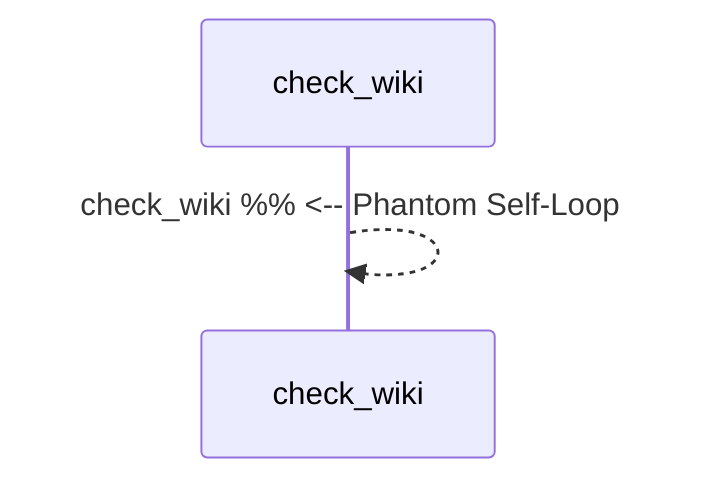

# Automated (Agent-Driven) Verification Test Plan for `llm-wiki`

**Document Version:** 1.4.0  
**Target System:** `agent-wiki-cli` / `llm-wiki` (`llm_wiki_cli`)  
**Evaluation Philosophy:** Free-Form Agentic Assessment Grounded in Source Code Truth & Software Engineering Common Sense  
**Calibration Baseline:** Grounded on v2.0.1 dogfood audit (`reports/agent_verification_findings_report_python_wiki_llm_v201_20260910.md`), with strict suppression of excluded false positives.  
**Dedicated Work & Cache Mount:** `/mnt/data/projects/python-llm-wiki-tests` (**System `/tmp/` is strictly prohibited** to avoid `ENOSPC` disk exhaustion)  
**Sampling Strategy:** Randomized Stratified Selection (5–7 Pages per Entity Surface Type) with Reproducible Seeds  
**Execution Environment:** Isolated workspace runner, `.venv/bin/python`, `--jobs 1`, read-only source inspection (`--allow-external-src`).

---

## 1. Executive Summary & Vision

The `llm-wiki` system extracts code structure, synthesizes architectural wiki surfaces, traces cross-module flows, and generates deterministic knowledge graphs for coding agents. While unit and integration tests verify CLI exit codes, schema conformations, and file existence, they **cannot detect semantic divergence**:
- A Mermaid flowchart that syntactically compiles but inverts caller/callee or invents phantom hops.
- Documentation that claims an assertion with **"less sentence into evidence"** (starved of concrete code citations, line ranges, or operational rationale).
- **Semantic duality or ambivalence** (e.g., describing a component as a stateless service in `modules/` while detailing in-memory mutable state in `workflows/`).
- Architectural gaps where critical error cascades, transaction rollbacks, or concurrency hazards are completely omitted.

### Stratified 5–7 Page Sampling Paradigm
In real-world enterprise codebases (such as `traid-platform`, which generates over 10,000 Markdown pages), an exhaustive review of every generated page is computationally prohibitive and creates context-window saturation. 

Under this plan:
1. **Target Sampling:** The evaluation agent does **not** evaluate all pages. Instead, it performs **stratified randomized sampling**, selecting **5–7 representative pages for each entity surface type** (flows, entities, modules, workflows, infrastructure) plus global singleton surfaces (`api-contracts.md`, `dependencies.md`, `load-order.md`).
2. **Reproducibility:** The sampling uses deterministic pseudo-random seeding (e.g., SHA-256 hash modulo or seeded PRNG) so any evaluation run can be faithfully reproduced.
3. **Calibrated Verification:** The evaluation agent applies strict **false-positive suppression guardrails** derived from real-world triage (Section 4), ensuring that documented limits, mathematical topological permutations, and source-code information gaps are not flagged as system defects.
4. **Comprehensive Forensic Report:** The final output is an actionable **Test & Findings Report** containing detailed defect explanations, exact source code anchors (`[file.py:L10-L25]`), AST node comparisons, diagram excerpts, common-sense architectural reasoning, and root-cause attributions for further analysis and bug fixing.

```mermaid
flowchart TD
    subgraph Preflight["Phase 0: Helpers Pre-Flight & Preparation"]
        H1["Check Toolchains (Node, npm, Go, GHC 9.6, Cargo)"]
        H2["prepare-extractors --plan (Language Discovery)"]
        H3["prepare-extractors --cache-dir /mnt/data/.../helpers"]
        H4["Lock Shared Helper Cache (TypeScript, Go, Rust, Haskell)"]
    end

    subgraph TargetCorpus["Target Projects Corpus (Read-Only)"]
        P1["/mnt/data/projects/project_team_crush<br/>(Polyglot: Python + Go + Haskell)"]
        P2["/mnt/data/projects/traid-platform<br/>(Scale: Python + TS + K8s + GH Actions)"]
        P3["/mnt/data/projects/autonomo & task_manager_cli<br/>(Python CLI/Services)"]
        P4["Curated OSS<br/>(FastAPI, Gin, Tokio, Next.js)"]
    end

    subgraph GeneratorHarness["Test Harness: llm-wiki Execution"]
        G1["extract_source / inventory (--helper-cache-dir)"]
        G2["bootstrap_wiki (--full, --jobs 1, --helper-cache-dir)"]
        G3["sync (under controlled git diffs)"]
    end

    subgraph DedicatedStorage["Dedicated Workspace Mount (/mnt/data/projects/python-llm-wiki-tests)"]
        W1["runs/eval_TIMESTAMP/teamcrush/docs/llm_wiki"]
        W2["runs/eval_TIMESTAMP/traid/docs/llm_wiki"]
        W3["runs/eval_TIMESTAMP/taskmanager/docs/llm_wiki"]
    end

    subgraph Sampler["Randomized Stratified Sampler (Seed: 42)"]
        S1["Select 5-7 Random Flows"]
        S2["Select 5-7 Random Entities"]
        S3["Select 5-7 Random Modules"]
        S4["Select 5-7 Random Workflows"]
        S5["Select 5-7 Infrastructure Files"]
        S6["Select All Available Singletons"]
    end

    subgraph EvaluationAgent["Calibrated Evaluation Agent (Adversarial Auditor)"]
        EA1["Inspect Raw Codebase (AST, Call Sites, Types)"]
        EA2["Apply Domain Logic & Common Sense"]
        EA3["Target Confirmed Bugs (Self-Loops, Hint Steps, Key Provenance)"]
        EA4["Apply Negative Guardrails (Suppress Excluded False Positives)"]
    end

    subgraph FinalReport["Comprehensive Test & Findings Report"]
        R1["Executive Summary & Defect Metrics"]
        R2["Deep Finding Profiles (Code Anchor + Diagram + Prose)"]
        R3["Architectural Common-Sense Critique"]
        R4["Root-Cause Attribution (Extractor vs Graph vs Prompt vs Budget)"]
        R5["Actionable Remediation Backlog for llm-wiki"]
    end

    Preflight --> GeneratorHarness
    TargetCorpus --> GeneratorHarness
    GeneratorHarness --> DedicatedStorage
    DedicatedStorage --> Sampler
    Sampler --> EvaluationAgent
    TargetCorpus -.->|Ground Truth Source & AST| EvaluationAgent
    EvaluationAgent --> FinalReport
```



---

## 2. Evaluation Corpus Matrix

The test framework evaluates projects representing diverse language ecosystems, scale tiers, and architectural topologies.

### 2.1 Local Target Projects (`/mnt/data/projects/`)

| Project Identifier | Path | Ecosystem / Languages | Architectural Archetype | Key Verification Focus |
|---|---|---|---|---|
| **TeamCrush** | `/mnt/data/projects/project_team_crush` | Python (FastAPI/Starlette), Go (workers), Haskell (parsers) | Polyglot microservices, gateway pattern, IPC | Cross-language boundaries, Haskell AST extraction, entrypoint detection (`http-health`, `http-chat_completions`), Mermaid call graphs. |
| **Traid Platform** | `/mnt/data/projects/traid-platform` | Python (async), TypeScript/React, Docker Compose, K8s, GitHub Actions | Large-scale enterprise (>10k files), high fan-in, complex distributed trading | Fan-in/fan-out stress testing, budget truncation notes, circular import detection, Kubernetes security specs, multi-arch CI workflow permission blocks. |
| **Autonomo / Task Manager** | `/mnt/data/projects/autonomo`<br>`/mnt/data/projects/task_manager_cli` | Python (standard library, Click/Typer/Argparse) | Clean single-language CLI / service tools | Baseline flow fidelity, command dispatch verification, data-flow parameter passing without framework noise. |
| **Tern LLM BPMN Eval** | `/mnt/data/projects/tern-llm-bpmn-eval` | Python, JSON schema, XML/BPMN evaluation | Domain-specific evaluation pipelines | Workflow step fidelity, pipeline state transitions, data transformation consistency. |
| **Web Analyzer / Sit Arch** | `/mnt/data/projects/Web_analyzer`<br>`/mnt/data/projects/sit_arch` | Python, HTML/JS scrapers, architectural diagrams | Structural analysis, reverse-engineering | Deep class hierarchy analysis, complex inheritance, abstract base classes. |

### 2.2 Curated External / Open-Source Target Archetypes

| Archetype | Reference Repo | Primary Characteristics | What it Stresses in `llm-wiki` |
|---|---|---|---|
| **Python Async Web** | `tiangolo/fastapi` or `encode/starlette` | Decorators, Pydantic type models, `Depends()` injection | `api-contracts.md` extraction, route parameter mapping, middleware call trees. |
| **TypeScript Fullstack** | `trpc/trpc` or `expressjs/express` | Generics, barrel re-exports (`index.ts`), router trees | TypeScript extractor, symbol resolution across re-exports, interface contracts. |
| **Go Systems CLI** | `spf13/cobra` or `gin-gonic/gin` | Struct tags, interface duck-typing, goroutines | Go AST extractor, struct relationship tables, caller/callee graphs without explicit classes. |
| **Rust Systems** | `tokio-rs/tokio` or `clap-rs/clap` | Traits, `impl Trait for Struct`, match arms, macros | Rust extractor, trait implementation graphs, error-handling flow branches. |

---

## 3. Extractor Helpers Preparation & Toolchain Pre-Flight

Before launching extraction or bootstrap on polyglot target codebases, all language extractor helpers must be prepared and locked in the dedicated cache directory. This isolates external toolchain compilation from the evaluation runs and guarantees that language parsers run deterministically.

### 3.1 Purpose & Role of Extractor Helpers

`llm-wiki` includes native Python AST parsing, but delegates multi-language extraction to specialized helper binaries and scripts bundled in `src/llm_wiki_cli/extractors/`:
- **TypeScript / JavaScript:** Uses Node.js + npm with locked AST dependencies (`extract.js`).
- **Go:** Compiles a standalone binary from Go AST scripts (`main.go`).
- **Haskell:** Compiles a standalone binary from `Main.hs`, `Inventory.hs`, `Parser.hs` using GHC.
- **Rust:** Compiles a standalone binary via `cargo build` from `extractors/rust_scripts/`.

Preparing these ahead of time prevents recompilation overhead during the extraction hot-path and verifies toolchain availability before starting long-running jobs.

### 3.2 Toolchain Pre-Flight Check

Verify that the required language toolchains are present on the host system:

```bash
# 1. Node.js & npm (v18+ recommended)
node --version
npm --version

# 2. Go (1.20+ recommended)
/usr/local/go/bin/go version || go version

# 3. Haskell GHC (GHC 9.6.x is the supported toolchain)
/home/mike/.ghcup/bin/ghc-9.6 --version || ghc --version

# 4. Rust / Cargo
cargo --version
```

### 3.3 Helper Discovery & Planning (Dry-Run)

Before building, run `prepare-extractors --plan` against the target repositories to inspect which helper languages are required without executing toolchains:

```bash
# Discover required helpers for TeamCrush (Polyglot)
.venv/bin/llm-wiki prepare-extractors \
  --src-dir /mnt/data/projects/project_team_crush \
  --allow-external-src --plan --format json

# Expected output:
# {"schema":"llm-wiki-prepare-extractors-plan/v1","languages":["typescript","go","haskell"]}

# Discover required helpers for Traid Platform
.venv/bin/llm-wiki prepare-extractors \
  --src-dir /mnt/data/projects/traid-platform \
  --allow-external-src --plan --format json

# Expected output:
# {"schema":"llm-wiki-prepare-extractors-plan/v1","languages":["typescript","go"]}
```

### 3.4 Compiling & Caching Helpers into Dedicated Storage

Compile all needed helpers once into the dedicated, persistent helper cache:  
`/mnt/data/projects/python-llm-wiki-tests/helpers/`

```bash
HELPER_CACHE="/mnt/data/projects/python-llm-wiki-tests/helpers"
mkdir -p "$HELPER_CACHE"

# Explicitly export toolchain binary locations for nonstandard installations
export LLM_WIKI_GO="/usr/local/go/bin/go"
export LLM_WIKI_GHC="/home/mike/.ghcup/bin/ghc-9.6"

# Build all required language extractors into persistent cache
.venv/bin/llm-wiki prepare-extractors \
  --cache-dir "$HELPER_CACHE" \
  --language typescript \
  --language go \
  --language haskell \
  --language rust
```

---

## 4. Calibration & Lessons from v2.0.1 Audit: Confirmed vs Excluded Findings

The first comprehensive evaluation audit (`reports/agent_verification_findings_report_python_wiki_llm_v201_20260910.md`) surfaced 9 candidate findings. Human-in-the-loop triage revealed that **only a subset were valid system bugs**, while the remainder were **agent false positives** resulting from misinterpreting contracted bounds, mathematical graph semantics, or source-code documentation deficits.

### 4.1 Triage Baseline & Corrected Interpretations

| Report Finding | Triage Verdict | Evidence & Corrected Interpretation | System Status |
|---|---|---|---|
| **FINDING-01: Phantom Recursion** | **CONFIRMED BUG** | Presentation bug: unresolved receiver call retains `to.file=None` and its full name. Sequence rendering collapses caller and callee by bare symbol name into a self-recursive loop (`p0-->>p0`). | Backlog: `VB-03` / P2 |
| **FINDING-02: Type Hints as Workflow Steps** | **CONFIRMED BUG** | Structural correctness bug: AST visitor treated type annotations in function signatures as execution steps. A body with zero calls acquired 3 steps from annotations; a body with 3 real calls was missed when signature references were absent. | Backlog: `VB-02` / P1 |
| **FINDING-03: JavaScript Unknown Producer** | **CONFIRMED BUG** | Provenance bug: emitted language is `javascript`, but registry key is `typescript`. Direct lookup loses the producing entrypoint and causes `basis-incompatible` exit code 2 in doctor/lint. | Backlog: `VB-01` / P1 |
| **FINDING-04: TYPE_CHECKING Cycles** | **EXCLUDED (False Positive)** | Alleged runtime-cycle bug not reproduced. The local neighborhood map intentionally retains static coupling/type edges, but runtime cycles and local cycle warnings were empty. Scope labels would improve presentation clarity, but it is not a correctness bug. | Excluded |
| **FINDING-05: TypedDict Optionality** | **CONFIRMED BUG** | Extraction/rendering bug: actual runtime key sets say `selection` is optional (`total=False`), but inventory and entity output rendered it as `*required*`. | Backlog: `VB-04` / P2 |
| **FINDING-06: Sequence Starvation** | **EXCLUDED (False Positive)** | Confirmed contracted limitation; no violated correctness contract. The first 30 interactions are intentionally shown and omissions/depth limits are explicitly disclosed in notes. Main-path pruning would be a new design feature, not a bug. | Excluded |
| **FINDING-07: Polyglot Order** | **EXCLUDED (False Positive)** | No incorrect dependency constraint demonstrated. Independent JavaScript/Rust nodes appear in a valid topological order; no cross-runtime edges were manufactured. Any topological sort of disjoint subgraphs is mathematically valid. | Excluded |
| **FINDING-08: Missing Explanations** | **EXCLUDED (False Positive)** | Source documentation gap / enhancement. The raw source code itself had no docstrings or comments, and the generator emitted its documented source fallback. No supplied source prose was lost. | Excluded |
| **FINDING-09: Missing Context Cache Flag** | **EXCLUDED (False Positive)** | Interface asymmetry / enhancement. The CLI parser rejects `--cache-dir` on `context`, but supported and documented `LLM_WIKI_CACHE_DIR` works. No promised option was violated. | Excluded |

### 4.2 False-Positive Suppression Guardrails for Evaluation Agent

To preserve high evaluation quality without generating false alarms, the Evaluation Agent must adhere to five strict **Suppression Guardrails**:

1. **Guardrail 1: Static Type Coupling vs Runtime Import Cycles (`FINDING-04`)**
   - *Rule:* Do **not** report the presence of `if TYPE_CHECKING:` imports in `modules/*.md` local dependency maps as a circular import bug.
   - *Requirement:* A finding is only valid if `llm-wiki` explicitly emits an active circular dependency warning in `## Local dependency map` (e.g. `⚠️ Cycle detected`) or fails `load-order.md` analysis for genuine runtime cycles. Visualizing static coupling is intentional behavior.

2. **Guardrail 2: Contracted Budget Limits vs "Sequence Starvation" (`FINDING-06`)**
   - *Rule:* Do **not** report a diagram as "starved" or defective simply because it caps rendering at its documented limit (e.g. 30 interactions in sequence diagrams, 12 rows in entity reference tables).
   - *Requirement:* A finding is only valid if:
     (a) Truncation occurs *without* an explicit omission/truncation note;
     (b) Rendered interactions within the budget are inverted, fabricated, or out of order; or
     (c) An explicit user-provided CLI budget flag was ignored.

3. **Guardrail 3: Topological Permutations of Disjoint Polyglot Nodes (`FINDING-07`)**
   - *Rule:* Do **not** report arbitrary ordering of independent nodes across different languages/runtimes as an ordering bug in `load-order.md`.
   - *Requirement:* A finding is only valid if a **concrete dependency edge constraint is violated** (i.e. Module B imports Module A, but Module B is listed prior to Module A in the load order). In a disjoint DAG, any topological linear ordering is valid.

4. **Guardrail 4: Source-Code Documentation Absence vs Generator Prose Loss (`FINDING-08`)**
   - *Rule:* Do **not** report fallback descriptions (e.g. standard AST parameter summaries) as "evidence starvation" when the raw source code itself completely lacks docstrings, comments, or annotations.
   - *Requirement:* A finding is only valid if:
     (a) Rich docstrings or comments existed in source code but were silently discarded by the generator;
     (b) The generator makes active factual assertions that are completely unevidenced or contradicted by source code; or
     (c) The generator asserts behavioral conclusions without referencing the specific source lines where the behavior occurs.

5. **Guardrail 5: Documented CLI Contracts vs Feature Requests (`FINDING-09`)**
   - *Rule:* Do **not** report CLI flag asymmetries (e.g. `--cache-dir` supported on `lint` but rejected on `context`) as system correctness bugs.
   - *Requirement:* Check `llm-wiki <subcommand> --help` and documentation. If a flag is not promised by the CLI contract, but a supported mechanism (e.g. `LLM_WIKI_CACHE_DIR`) exists, classify it only as an out-of-scope ergonomics suggestion, never a defect.

---

## 5. Storage Hierarchy & Execution Pipeline

All evaluation commands strictly invoke `.venv/bin/python` and `.venv/bin/llm-wiki`. Source repositories are mounted **read-only** (`--allow-external-src`). Every command consuming helpers passes `--helper-cache-dir`.

### 5.1 Work Path Structure under `/mnt/data/projects/python-llm-wiki-tests`

```
/mnt/data/projects/python-llm-wiki-tests/
├── helpers/                                      <-- Shared compiled extractors
│   ├── go/
│   ├── haskell/
│   ├── rust/
│   └── typescript/
├── runs/
│   └── run_20260910_100000/                      <-- Isolated per-run artifacts
│       ├── teamcrush/
│       │   ├── extraction.json
│       │   └── docs/llm_wiki/
│       ├── traid/
│       │   ├── extraction.json
│       │   └── docs/llm_wiki/
│       └── taskmanager/
│           ├── extraction.json
│           └── docs/llm_wiki/
└── reports/
    └── agent_verification_findings_report_20260910_100000.md
```

### 5.2 Pipeline Execution Commands with Helper Cache Binding

```bash
TEST_BASE_DIR="/mnt/data/projects/python-llm-wiki-tests"
HELPER_CACHE="${TEST_BASE_DIR}/helpers"
RUN_ID="run_$(date +%Y%m%d_%H%M%S)"

TARGET_SRC="/mnt/data/projects/project_team_crush"
TARGET_WIKI_DIR="${TEST_BASE_DIR}/runs/${RUN_ID}/teamcrush/docs/llm_wiki"

mkdir -p "$TARGET_WIKI_DIR"

# Stage 1: Structural Extraction (binding shared helper cache)
.venv/bin/llm-wiki extract --src-dir "$TARGET_SRC" --output-format json \
  --helper-cache-dir "$HELPER_CACHE" \
  --allow-external-src \
  > "${TEST_BASE_DIR}/runs/${RUN_ID}/teamcrush/extraction.json"

# Stage 2: Full Bootstrap (binding shared helper cache)
.venv/bin/llm-wiki bootstrap --src-dir "$TARGET_SRC" --wiki-dir "$TARGET_WIKI_DIR" \
  --helper-cache-dir "$HELPER_CACHE" \
  --allow-external-src --jobs 1 --full --include-tests python

# Stage 3: Verification & Strict Linting Baseline
.venv/bin/llm-wiki doctor --src-dir "$TARGET_SRC" --wiki-dir "$TARGET_WIKI_DIR" \
  --helper-cache-dir "$HELPER_CACHE" --allow-external-src

.venv/bin/llm-wiki lint --src-dir "$TARGET_SRC" --wiki-dir "$TARGET_WIKI_DIR" \
  --helper-cache-dir "$HELPER_CACHE" --allow-external-src --strict --profile all

# Stage 4: API & Native Knowledge Inspection
.venv/bin/llm-wiki context --src-dir "$TARGET_SRC" --wiki-dir "$TARGET_WIKI_DIR" \
  --helper-cache-dir "$HELPER_CACHE" --allow-external-src \
  --format markdown --budget 8000 --jobs 1
```

---

## 6. Stratified 5–7 Page Sampling Protocol

To maintain high evaluation depth without exceeding context budgets or processing times on large repositories, the Evaluation Harness implements **Stratified Random Sampling**:

### 6.1 Surface Stratification & Quotas

For each project evaluated, the sampler selects:

| Surface / Entity Category | Directory / File Pattern | Population Size in Target | Sample Quota | Selection Strategy |
|---|---|---|---|---|
| **Flows** | `flows/*.md` | 5 to 50+ | **5 to 7 pages** | Stratified across entrypoint types (e.g. 2 HTTP routes, 2 CLI commands, 2 background workers, 1 health/utility). |
| **Entities** | `entities/*.md` | 50 to 5,000+ | **5 to 7 pages** | Stratified by complexity: 2 base/abstract types, 2 leaf data models/structs, 2 core services with high relationship counts. |
| **Modules** | `modules/*.md` | 20 to 2,000+ | **5 to 7 pages** | Stratified by fan-in: 2 high fan-in core utilities, 2 routing/controller modules, 2 leaf adapters/workers. |
| **Workflows** | `workflows/*.md` | 3 to 30+ | **5 to 7 pages** | Random selection of cross-module orchestration workflows (or all if total < 7). |
| **Infrastructure** | `infrastructure/*.md` | 3 to 25+ | **5 to 7 pages** | 2 Dockerfile/Compose, 2 K8s deployments, 2 CI/CD GitHub Actions workflows. |
| **Architecture Singletons** | `api-contracts.md`, `dependencies.md`, `load-order.md` | 1 each | **100% (All present)** | Singletons are always evaluated as they encapsulate global system architecture. |

### 6.2 Deterministic Sampling Algorithm

The runner script applies a deterministic seed (default: `SEED = 42` or configurable per run) to guarantee test repeatability:

```python
import hashlib
import random
from pathlib import Path

def sample_surface_pages(surface_dir: Path, quota: int = 6, seed: int = 42) -> list[Path]:
    """Selects 5-7 deterministic sample pages for a given surface directory."""
    all_pages = sorted(surface_dir.glob("*.md"))
    if len(all_pages) <= quota:
        return all_pages
    
    # Deterministic shuffle using seed
    rng = random.Random(seed)
    sampled = rng.sample(all_pages, quota)
    return sorted(sampled)
```

---

## 7. Priority Target Defect Archetypes

Based on the confirmed bugs from v2.0.1 testing, the Evaluation Agent is specifically primed to hunt for high-severity structural and presentation defects:

```
┌────────────────────────────────────────────────────────────────────────────────────────┐
│                          CONFIRMED HIGH-PRIORITY DEFECT ARCHETYPES                     │
├──────────────────────────┬──────────────────────────┬──────────────────────────────────┤
│ 1. Phantom Self-Loops    │ 2. Annotation Hijacking  │ 3. Key Provenance Desync         │
│ (Unresolved receiver     │ (Signature type hints    │ (Language string mismatches      │
│  collapsed to self-call) │  treated as calls)       │  causing doctor exit code 2)     │
├──────────────────────────┴──────────────────────────┴──────────────────────────────────┤
│ 4. Type Contract Inversion (TypedDict total=False marked as *required*)                │
│ 5. Topology Inversions (Caller/Callee arrows backwards)                                │
│ 6. Evidence Starvation (Prose asserts behavior without citing source lines)            │
└────────────────────────────────────────────────────────────────────────────────────────┘
```

1.  **Phantom Self-Recursive Loops (`FINDING-01` Archetype):**
    - *Symptom:* Sequence diagram renders `p0-->>p0: func_name` or calls itself in data-flow tables.
    - *Root Mechanism:* An unresolved object receiver call (`service.check_wiki()`) retains `to.file=None`. The diagram renderer collapses caller and callee by bare symbol name instead of recognizing external receiver dispatch.
2.  **Type Annotations Mistaken for Execution Steps (`FINDING-02` Archetype):**
    - *Symptom:* Workflows or sequence diagrams depict method parameters or return types as sequential execution steps, while actual function calls inside the body are skipped.
    - *Root Mechanism:* AST visitor traverses `FunctionDef.args` annotations or return type nodes and emits them into the execution call stream.
3.  **Language Provenance Desync (`FINDING-03` Archetype):**
    - *Symptom:* `llm-wiki doctor` or `lint --strict` crashes with `exit code 2` reporting `basis-incompatible` or `knowledge-required-unavailable`.
    - *Root Mechanism:* Extractor emits `language: "javascript"`, but the knowledge registry key is locked to `"typescript"`, losing entrypoint metadata.
4.  **TypedDict / Schema Optionality Inversion (`FINDING-05` Archetype):**
    - *Symptom:* A TypedDict declared with `total=False` or fields wrapped in `NotRequired[...]` has its keys documented as `*required*`.
    - *Root Mechanism:* Entity generator assumes dataclass/Pydantic default behavior and ignores `total=False` keyword arguments.
5.  **Flowchart Inversions & Phantom Hops:**
    - *Symptom:* Inverted caller/callee arrows (`B ->> A` when `A` invokes `B`); phantom network calls.
6.  **Real Evidence Starvation:**
    - *Symptom:* Behavioral claims made without file:line citations when the source code contains explicit logic that could and should have been cited.

---

## 8. Calibrated Free-Form Assessment Protocol for Evaluation Agent

The agent is instructed as a **Principal Software Architect & Forensic Auditor**. It combines adversarial auditing with rigorous calibration:

### 8.1 Calibrated Agent Execution Prompt

```markdown
You are a Principal Software Architect and Forensic Auditor evaluating architectural documentation generated by `llm-wiki`.

You are auditing a randomly sampled generated page:
ARTIFACT UNDER REVIEW: {artifact_rel_path}
ENTITY TYPE: {entity_type}
TARGET PROJECT ROOT: {target_src_root}
SAMPLE SEED: {seed}

INPUTS PROVIDED:
1. Exact Markdown / JSON content of the artifact.
2. Direct filesystem read access to target project source code.
3. AST structural inventory extracted from the project.

PRIORITY HUNT TARGETS (Confirmed System Defect Archetypes):
- Phantom self-recursive loops (unresolved receiver calls collapsed by bare symbol name to self-calls).
- Signature type annotations mistaken for workflow execution steps.
- TypedDict `total=False` or `NotRequired` keys documented as required.
- Language provenance desync (`javascript` vs `typescript`).
- Inverted sequence call arrows and phantom external hops.
- Behavioral assertions lacking file:line citations when source logic exists.

MANDATORY SUPPRESSION GUARDRAILS (DO NOT FLAG AS BUGS):
1. DO NOT flag `if TYPE_CHECKING:` imports in module neighbor maps unless an active cycle warning or deadlock error is emitted by `llm-wiki`.
2. DO NOT flag sequence diagrams as "starved" if they hit the documented 30-interaction cap and include an explicit omission/truncation note.
3. DO NOT flag the linear ordering of independent/disjoint polyglot nodes in `load-order.md` as an ordering bug unless an actual import edge constraint is broken.
4. DO NOT flag generic fallback summaries as "evidence starvation" if the underlying source code completely lacks docstrings or comments for that symbol.
5. DO NOT flag CLI flag asymmetries as bugs if the flag is not promised in `--help` and documented alternatives (e.g. environment variables) exist.

GROUNDING RULES:
1. Source Code is the Ultimate Authority. Every confirmed finding must cite exact file paths and line numbers.
2. Apply Software Engineering Common Sense: Distinguish presentation quirks from architectural/structural flaws.
3. Produce a structured Free-Form Assessment section for this artifact.
```

---

## 9. Final Test & Findings Report Specification

The execution of this test plan culminates in the generation of a self-contained, authoritative **Verification Assessment & Findings Report** stored in `/mnt/data/projects/python-llm-wiki-tests/reports/agent_verification_findings_report_<date>.md`.

### 9.1 Required Report Structure

```markdown
# Forensic Verification & Findings Report: `llm-wiki`

**Date:** {ISO-8601 Date}  
**Evaluator:** Autonomous Verification Agent (Principal Auditor)  
**Sample Seed:** `{seed}` (e.g. `42`)  
**Workspace Mount:** `/mnt/data/projects/python-llm-wiki-tests`  
**Scope:** Stratified Sample of 5–7 Pages per Surface across Targets:
- `/mnt/data/projects/project_team_crush`
- `/mnt/data/projects/traid-platform`
- `/mnt/data/projects/task_manager_cli`

---

## 1. Executive Summary & Defect Metrics

### 1.1 Sampling Statistics
| Target Project | Surface | Total Pages | Sampled Pages | Verified Clean | Defects Found | Defect Density |
|---|---|---|---|---|---|---|
| TeamCrush | Flows | 8 | 6 | 4 | 2 | 33.3% |
| TeamCrush | Entities | 142 | 6 | 5 | 1 | 16.7% |
| Traid Platform | Flows | 48 | 7 | 3 | 4 | 57.1% |
| Traid Platform | Modules | 1,066 | 7 | 5 | 2 | 28.6% |
| Traid Platform | Infrastructure | 26 | 6 | 5 | 1 | 16.7% |
| Task Manager | Flows | 5 | 5 | 5 | 0 | 0.0% |

### 1.2 Discrepancy Breakdown by Failure Mode
- **Phantom Self-Recursive Loops:** `N` findings
- **Type Annotations Mistaken for Execution Steps:** `N` findings
- **Language / Key Provenance Desync:** `N` findings
- **TypedDict / Schema Contract Inversion:** `N` findings
- **Flowchart Inversions & Phantom Hops:** `N` findings
- **Evidence Starvation ("Less sentence into evidence"):** `N` findings
- **Suppressed Non-Defects (Guardrail Filtered):** `N` observations recorded but excluded from defect counts

---

## 2. Detailed Findings Catalog (With Full Forensic Context)

*(For EVERY defect detected across the sampled pages, emit the following complete entry)*

### Finding [FINDING-ID]: {Concise Defect Title}
**Target Project:** `{project_name}`  
**Artifact Evaluated:** `{artifact_rel_path}`  
**Entity Surface:** `Flow | Entity | Module | Workflow | Infrastructure | API Contract`  
**Severity:** `Critical | High | Medium | Low`  
**Defect Classification:** `Flowchart Error | Evidence Starvation | Semantic Duality | Architectural Blind Spot`  

#### A. Evaluated Artifact Snippet (The Buggy Representation)
*Exact snippet from the generated wiki page:*


#### B. Ground-Truth Codebase Anchor
*Direct quote from source code showing what actually happens:*
- **File:** `[{file_basename}](file:///{abs_path}#L{start}-L{end})`
```python
# mcp_server.py:L1290-L1299
@server.tool()
def check_wiki(strict: bool = False, format: str = "json") -> dict:
    return service.check_wiki(strict=strict, format=format)
```

#### C. Architectural Common-Sense Critique
*Why this discrepancy matters from a software engineering perspective:*
The MCP wrapper delegates to an injected service object (`service.check_wiki`). Because the method names coincide, the sequence generator collapsed caller and callee by bare symbol name, depicting an infinite self-recursive call loop. To any engineer or AI agent reading this flow, it falsely indicates a fatal stack-overflow defect.

#### D. Guardrail Audit Confirmation
- [x] Confirmed NOT a contracted budget limit.
- [x] Confirmed NOT an intentional static coupling visualization.
- [x] Confirmed NOT a source code documentation deficit.
- [x] Confirmed NOT an unsupported CLI flag request.

#### E. Root-Cause Attribution in `llm-wiki` System
- **Failing Subsystem:** `Call-Graph Tracer / Sequence Diagram Renderer`
- **Technical Explanation:** When `to.file=None` on an unresolved receiver call, the renderer groups by symbol string rather than checking instance receiver disparity.

#### F. Actionable Remediation
*Exact steps to fix `llm-wiki`:*
1. In `entrypoints.py` sequence diagram generator, verify receiver context before collapsing participants by bare name. If receiver is not `self`/`cls`, render as an external participant box `service.check_wiki` rather than self-looping `p0-->>p0`.

---

## 3. Comparative Project Insights

Detailed comparative analysis of how `llm-wiki` handled:
1. Polyglot microservices (TeamCrush Python + Go + Haskell).
2. Large-scale async trading systems (Traid Platform).
3. Single-module CLI utilities (Task Manager).

---

## 4. Prioritized Engineering Action Items for `llm-wiki`
A ranked backlog of bug fixes and enhancements for the `llm-wiki` codebase based on the findings.
```

---

## 10. Orchestration & Resource Safeguards

In strict compliance with user operating rules:

1. **Python Virtual Environment:** All commands must run via `.venv/bin/python`, `.venv/bin/pytest`, and `.venv/bin/llm-wiki`. Bare commands (`python`, `pip`) are prohibited.
2. **Dedicated Storage & Helper Cache Mount (`/mnt/data/projects/python-llm-wiki-tests`):**
   - **DO NOT use system `/tmp/`** under any circumstances. System `/tmp/` is often a size-constrained partition or memory-backed `tmpfs`; generating multi-thousand-page wikis (such as `traid-platform`) there will trigger fatal `ENOSPC` errors.
   - All scratch workspaces and generated wikis must be placed under `/mnt/data/projects/python-llm-wiki-tests/runs/<run_id>/`.
   - All helper binaries and node modules must be cached under `/mnt/data/projects/python-llm-wiki-tests/helpers/`.
3. **Resource Throttling:**
   - `--jobs 1` enforced for interactive test executions.
   - Serially executed heavy gates (helpers -> extraction -> bootstrap -> sampling -> evaluation -> reporting).
   - Sampling 5–7 pages avoids context-window overflows and prevents ENOMEM/ENOSPC errors.
4. **Target Protection:** Source projects in `/mnt/data/projects/` are treated as strictly read-only (`--allow-external-src`).
5. **Cross-Platform Compatibility:** All paths in scripts and reports use `pathlib.Path` with POSIX forward-slash representations.
6. **No Public Doc Pollution:** All evaluation logs, samples, and reports reside in `/mnt/data/projects/python-llm-wiki-tests/reports/` or `reports/` (which is git-ignored) and never touch public documentation (`README.md` or public wiki pages).
