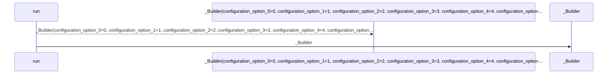
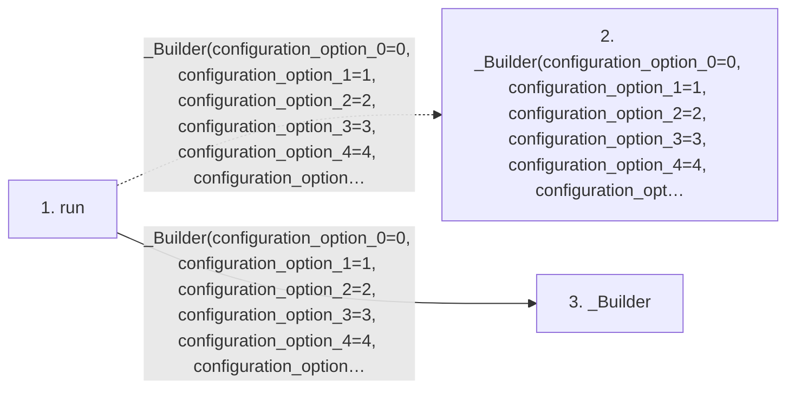

# run

**Entry point:** `run` (`api`)
**Source:** [svc](../modules/svc.md)
**Modules touched:** [svc](../modules/svc.md)

## Call sequence

<!-- Auto-generated from static call edges. Dashed arrows are external or unresolved calls. Reviewed runtime conditions and side effects belong in Behavior. -->

## Data flow

<!-- Auto-generated static analysis. Treat values and boundaries as best-effort hints, not runtime proof. -->

### Step data

| Step | Inputs | Reads | Writes | Returns |
|---|---|---|---|---|
| `run` | - | - | - | `...` |
| `_Builder(configuration_option_0=0, configuration_option_1=1, configuration_option_2=2, configuration_option_3=3, configuration_option_4=4, configuration_option_5=5, configuration_option_6=6, configuration_option_7=7, configuration_option_8=8).build` | - | - | - | - |
| `_Builder` | - | - | - | - |

### Call data

| From | To | Line | Call |
|---|---|---:|---|
| run | _Builder(configuration_option_0=0, configuration_option_1=1, configuration_option_2=2, configuration_option_3=3, configuration_option_4=4, configuration_option_5=5, configuration_option_6=6, configuration_option_7=7, configuration_option_8=8).build | 13 | `_Builder(configuration_option_0=0, configuration_option_1=1, configuration_option_2=2, configuration_option_3=3, configuration_option_4=4, configuration_option_5=5, configuration_option_6=6, configuration_option_7=7, configuration_option_8=8).build(data not statically known)` |
| run | _Builder | 13 | `_Builder(configuration_option_0=0, configuration_option_1=1, configuration_option_2=2, configuration_option_3=3, configuration_option_4=4, configuration_option_5=5, configuration_option_6=6, configuration_option_7=7, configuration_option_8=8)` |

### Boundary effects

*No boundary effects detected.*

### Static analysis gaps

| Kind | Step | Target | Line |
|---|---|---|---:|
| unresolved_call | `run` | `_Builder(configuration_option_0=0, configuration_option_1=1, configuration_option_2=2, configuration_option_3=3, configuration_option_4=4, configuration_option_5=5, configuration_option_6=6, configuration_option_7=7, configuration_option_8=8).build` | 13 |

## Behavior

This flow starts at `run` and is classified as `api`. The generated call and data-flow sections are bounded static projections; runtime conditions and side effects require source-level confirmation.
