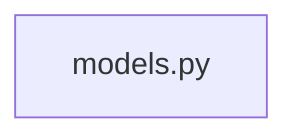

# Dependencies

Internal module dependency graph and external package reconciliation.

## Module graph

<!-- Thick arrows (==>) mark edges inside an import cycle. -->

## Cycles

*No import cycles detected.*

## Fan-in / Fan-out

| Module | Fan-in | Fan-out |
|--------|--------|---------|
| [models](modules/models.md) | 0 | 0 |

## External dependencies

*No external dependencies detected.*

## Notes

_Document dynamic or conditional imports, intentional cycles, and the rationale behind notable dependencies. Replace this placeholder._
